# DQ REVIEW

- 브라우저의 JS 실행 순서 중, HTML 파싱 완료로 DOM 트리 구축 끝났음을 알리는 이벤트, 외부 리소스의 로드 완료 여부와 상관없이 발생하는 것
  - DOMContentLoaded
- 기본 JS는 HTML의 구분 분석을 중지하므로, 효율적인 렌더링을 위해서 사용
  - async : HTML 문서 파싱 처리를 중지 하지 않고, 비동기적으로 스크립트 다운로드, 다운로드가 종료되는 즉시 실행, 실행 시점 파싱 중단, 여러 파일 간 실행 순서 보장 X => 독립 프로그램 실행
  - defer : HTML 파싱, 스크립트 다운로드를 병렬로 처리, 실행은 DOM 트리 구축이 끝난 시점으로 예약, 실행 순서 유지로 초기화 스크립트에 적합 => DOM 조작 가능
- 현재 페이지의 방문 이력 삭제 하지 않고, 새로운 URL로 페이지를 이동하는 Location
  - assign
- JS의 전역 실행 컨텍스트에서 window 객체와 완전히 동일한 참조 대상이 아닌 것
  - this, parent, top, globalthis
- HTML 요소를 구성하는 객체가 제공하는 프로퍼티, add-remove-toggle-contains 메서드를 통해 클래스 문자열을 직접 파싱하지 않고 CSS 클래스를 안전하게 추가-삭제-전환 할 수 있도록 해주는 것
  - classList

# 7

### 이벤트 ( Event )

- 웹 페이지 내에서 발생하는 모든 사용자의 행동

#### 이벤트 핸들러 ( Event Handler )

- 이벤트가 발생했을 때 실행되는 함수
- Thread : 작업자(일꾼), 작업단위
  - call stack
  - 실행 영역 함수
- Multi Thread : 쓰레드 여러개를 쌓아놓은 형태
  - 작업자를 여려명 두고 동시 작업을 진행하기 위해서

1. setTimeout ( 이벤트 핸들러, 지연시간 );  => 이벤트 핸들러 등록 번호를 반환 한다. 
  - 취소시에 등록 번호 사용 => clearTimeout(등록번호);
  - 지연시간은 1000당 1초
  - 비동기 

   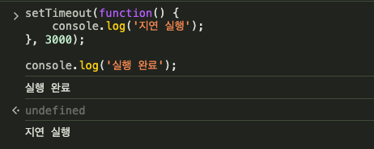

   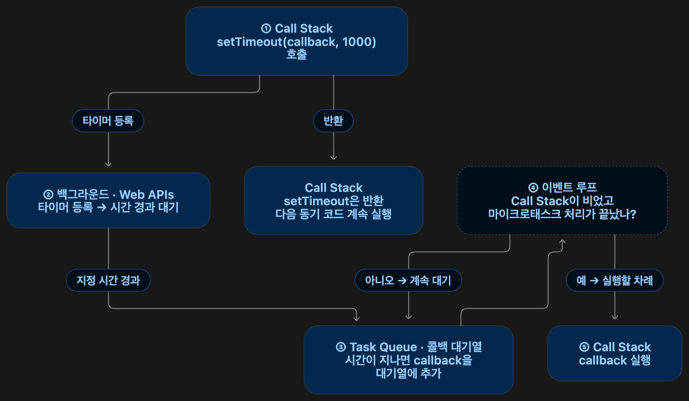

2. setInterval ( 이벤트 핸들러, 지연 시간 );
  - 반복 지연 실행
  - clearInterval( 핸들러 등록 번호 ); => 취소

### 이벤트를 등록하는 방법
- HTML 요소의 이벤트 속성
  - on 이벤트 명
- btnEl2.onclick에 함수의 주소를 대입하는 방식이기 때문에 함수 2개를 선언하면 마지막 함수의 주소만 가질 수 있다.

   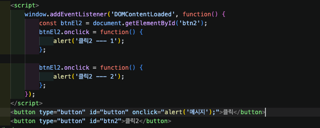

   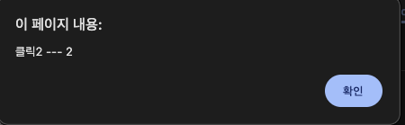

- document.addEventListener( 이벤트 명, 이벤트 핸들러 함수, 캡쳐링 여부[false] )
- 캡처링 -> 이벤트 전파 방향
  - false : 버블링 단계에서 전파 ( 기본값 )
  - true : 캡처링 단계에서 전파


```html
    <script>
        window.addEventListener("DOMContentLoaded", function() {
            const btnEl = document.getElementById('btn');
            btnEl.addEventListener('click', function(){
                console.log('click1')
            });

            btnEl.addEventListener('click', function(){
                console.log('click2')
            });
        });
    </script>
    <button type="button" id="btn">버튼</button>
```


- 캡처링 단계 -> 타겟 단계 -> 버블링 단계
                 |
                 - > 이벤트 핸들러가 실행
- 타겟 단계의 이벤트가 상위 요소로 전파
```html
    <style>
        .box{
            padding: 150px;
            background: gray;
        }

        .box2 {
            background: orange;
        }

        .box3 {
            background: black;
        }
    </style>
    <script>
        window.addEventListener('DOMContentLoaded', function() {
            const box1 = document.querySelector('.box1');
            const box2 = document.querySelector('.box2');
            const box3 = document.querySelector('.box3');

            box1.addEventListener('click', function(e) {
                console.log('box1 click');
            });

            box2.addEventListener('click', function(e) {
                console.log('box2 click');
            });

            box2.addEventListener('click', function(e) {
                console.log('box3 click');
                console.log(e);
            });
        });
    </script>
    <div class="box box1">
        <div class="box box2">
            <div class="box box3">

            </div>
        </div>
    </div>
```

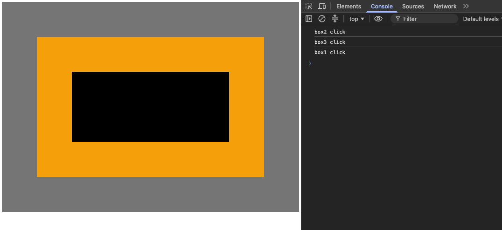

### 이벤트 객체
- 이벤트 핸들러의 첫번째 매개변수
1. 발생한 이벤트와 관련된 정보
2. 이벤트 통제 메서드
  - stopPropagation() : 이벤트 전파 차단
  - stopImmediatePropagation () : 이벤트 전파 차단, 같은 요소의 다른 이벤트도 차단
  - preventDefault() :  태그 기본 동작 방지
3. e.currentTarget : this와 동일한 대상 참조 / 이벤트가 바인딩 된 요소
   - e.target : 실제 이벤트가 발생한 요소


#### preventDefault()
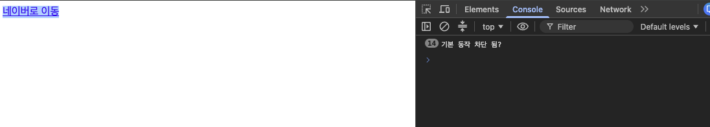

#### currentTarget, target
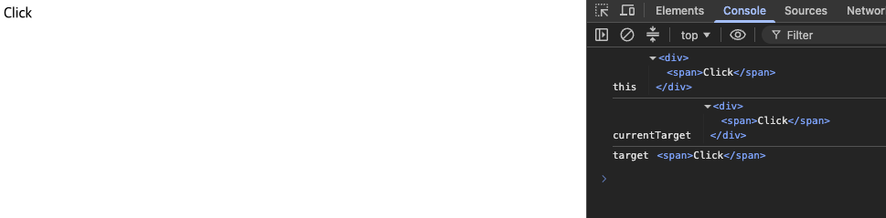

## 마우스 이벤트
- click
- dblclick
- mousemove
- mousedown
- mouseup
## 키보드 이벤트
- keydown - 주 사용
- keypress - 기능키 ( Alt, Ctrl 동작 안함)
- keyup - 눌렀다 뗼 때

| 프로퍼티 | 값의 타입 | 설명 |
| --- | --- | --- |
| `key` | 문자열 | 눌린 키가 나타내는 실제 문자 값 (예: `"a"`, `"Enter"`, `"ArrowUp"`) |
| `code` | 문자열 | 키보드 상에서 자판이 가지는 물리적인 위치 코드 (예: `"KeyA"`, `"Enter"`) |
| `keyCode` | 정수 | 눌린 키를 나타내는 레거시 숫자 코드 (사용 비권장) |
| `altKey` / `ctrlKey` / `shiftKey` | 논리값 | 입력 시 Alt / Ctrl / Shift 키가 함께 눌려 있었는지 여부 |

## 기타
- change
  - select
  - number
  - range
  - `<input type='file'>` => fileList
- submit
- focus
- blur

# 7-2

# 동기식
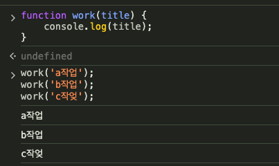

# 비동기식

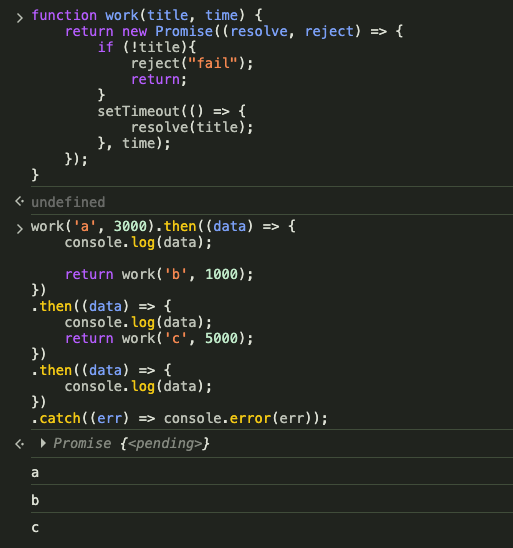
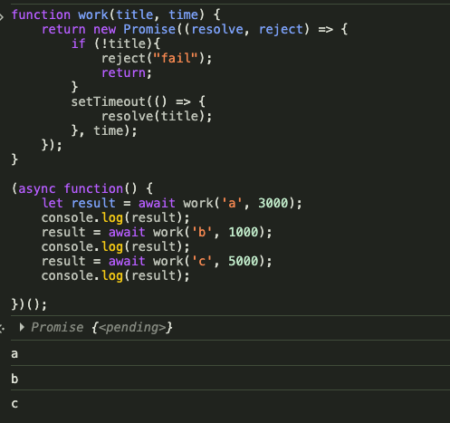
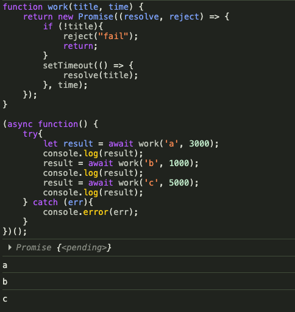

### ajax ( Asychronous JavaScript and X )
- 페이지 새로고침 없이 데이터를 치환하는 기술


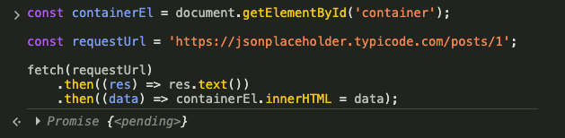
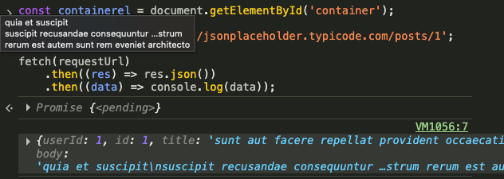
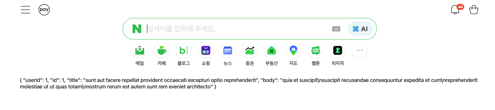

### XMLHTTPRequest

### Fetch API ( Promise 기반 )