# DQ REVIEW

- 하나의 HTML 요소에 여러 개의 이벤트 리스너를 서로 영향을 주지 않고 누적하여 등록할 수 있는 표준 메서드
  - addEventListener
- 자식 요소에서 발생한 클릭 이벤트가 상위 부모 요소로 전파되는 버블링 흐름을 중간에서 차단하고 싶을 때 이벤트 객체에서 호출하는 메서드
  - stopPropagation()
- 마우스 이벤트 객체의 좌표 프로퍼티 중, 스크롤되어 화면에 보이지 않는 영역까지 포함한 전체 HTML 문서를 기준으로 좌표를 반환하는 프로퍼티
  - 뷰포트 ( OffsetX, OffsetY )
- 비동기 작업의 순서를 제어하기 위해 함수의 인자로 또 다른 함수를 계속 중첩하여 전달함으로써 코드 구조가 복잡해지고 가독성이 떨어지는 현상
  - 콜백 지옥
- Promise.all() 과 Promise.race() 의 동작 차이점
  - all : 다른 작업 종료시 까지 대기 후 결과를 한번에 출력
  - race : 작업이 종료 될때 마다 출력

# TypeScript

- 정적 타입
- 일반 언어의 특징 도입 ( Java, C# )
- 타입 스크립트 문법 -> tsc (트랜스파일) -> JS 변환 -> 실행

- ts 파일에서 js 변환시에 파일 체크 -> 이상 존재하면 JS로 변환되지 않음

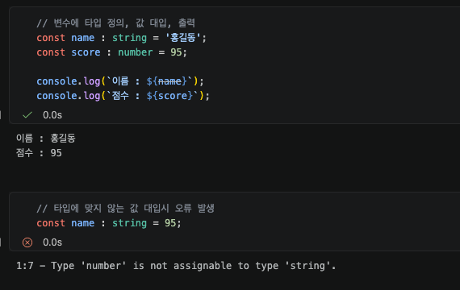

# chap 2-1

### 원시 타입

- 더 이상 세부적으로 분해할 수 없는 데이터의 최소 단위, 하나의 변수에 단 하나의 값만 할당되는 형태
- String, number, boolean, null, undefined

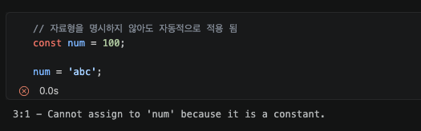

### 배열 선언

#### 대괄호 표기법 ( Type[] )

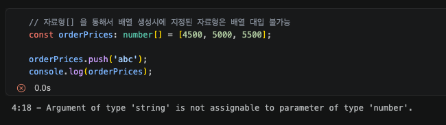

#### 제네릭 표기법 ( Array )

### 튜플 ( Tuple )

- 배열 형식이지만, 포함될 요소의 총 개수와 각 인덱스의 데이터 타입을 명확히 제한하는 구조

#### 튜블 선언 구조

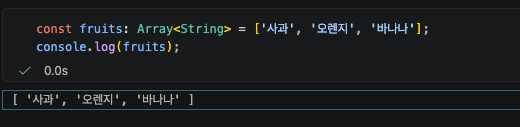

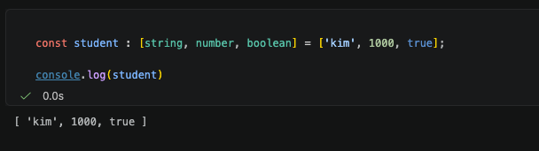
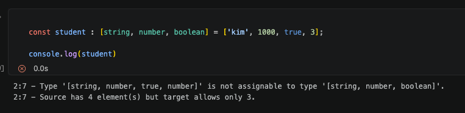
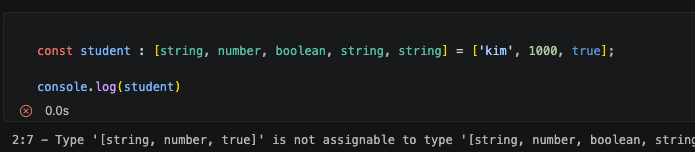

# chap 2-2

## 특수 타입

### any

- 타입 스크립트가 컴파일 시점에서 타입 체크 미실행
- 모든 타입 체크 가능
- 타입 오류 체크 미실행
  - 런타임시 오류 발생 가능
- 지양

### unknown

- 모든 타입 대입 가능
- 로직 상에서 타입을 알 수 있는 코드 가 반드시 필요 ( typeof, instanceof )
  - y x -> 컴파일시 오류
- any 보다 타입 안정성 존재

#### 타입 관련 정보 미제공 - 오류 발생

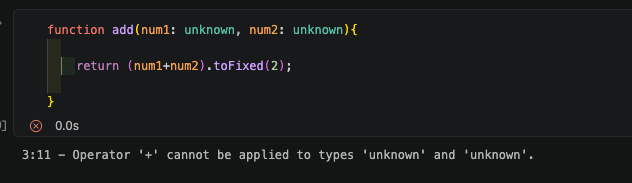

#### 타입 예측 정보 제공 - 정상 작동

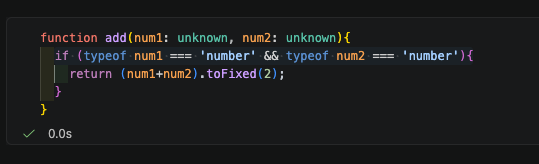

#### any보다 unknown 사용을 지향

| **비교 항목**           | **any 타입**                                  | **unknown 타입**                             |
| ----------------------- | --------------------------------------------- | -------------------------------------------- |
| **값의 할당**           | 모든 타입의 값을 대입할 수 있음               | 모든 타입의 값을 대입할 수 있음              |
| **속성 및 메서드 접근** | 타입 검사 없이 즉시 접근 가능                 | 타입 좁히기 전에는 접근 불가능 (컴파일 에러) |
| **안전성 수준**         | 낮음 (자바스크립트와 동일하게 오류 위험 노출) | 높음 (컴파일러가 사전 검증을 강제함)         |

any 사용 시의 문제점

> any를 사용하면 타입스크립트의 정적 분석 기능이 무력화되므로, 오타나 잘못된 메서드 호출을 컴파일 시점에 잡아낼 수 없습니다. 따라서 정체를 알 수 없는 데이터는 우선 unknown으로 선언한 뒤 타입 좁히기를 통해 안전하게 구체적인 타입을 찾아내는 것이 올바른 설계 방향입니다.

### Never 타입

- 값을 가질 수 없으며, 함수의 실행이 정상적으로 종료되지 않음을 의미하는 타입입니다.
- 의도적으로 예외 오류를 발생시키거나 무한 루프를 실행하여 반환값 자체가 존재하지 않는 구조에 지정됩니다.

### 타입 추론

- 코드 작성할 때 타입을 직접 명시하지 않아도 대입된 초기값을 기준으로 타입 자동 지정 매커니즘

### 타입 단언 ( Type Assertion )

- 컴파일러가 유추하는 타입보다 개발자가 해당 데이터의 타입을 더 명확히 알고 있을 때, 컴파일러에게 특정 타입으로 간주하도록 직접 지시하는 구문
- 형 변환과 달리 실제 실행 시점의 데이터를 변환하지 않으며, 오직 컴파일 시점의 타입 검사만 재정의

# chap 3-1

## 선택적 매개변수

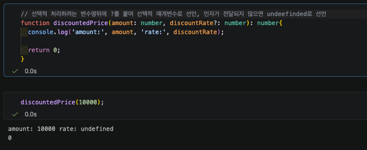

## 가변 인자

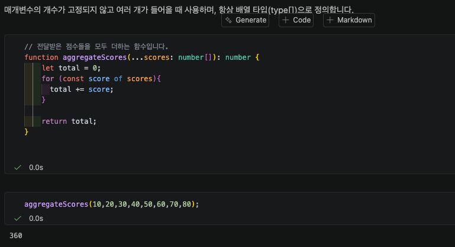

# chap 3-2

### 함수 타입 표현식

- 화살표 함수 형태로 변수 선언부 자리에 `(매개변수: 타입) => 반환타입`을 작성하는 문법
- ( 매개변수 : 타입 ... ) => 반환값 타입

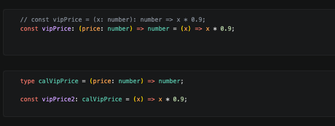

### 인라인 함수 시그니처

- 중괄호(`{}`) 내부에 `(매개변수: 타입): 반환타입;` 형태로 함수의 구조를 정의하는 문법
- 화살표(`=>`) 대신 콜론(`:`)을 사용하며, 함수의 형태를 객체의 속성처럼 상세히 묘사할 때 활용
- { ( 매개변수: 타입 .. ): 반환값 타입 }

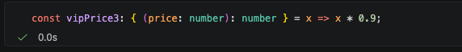

### map ( 배열 변환 ) 과정에서 콜백 타입 지정

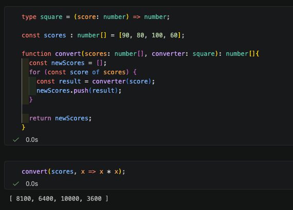

### 타입 별칭 ( Type Alias )

- type 키워드를 사용하여 기존 타입에 새로운 이름을 붙여주는 방식.
- 객체뿐만 아니라 단순한 문자열이나 숫자 배열 등 모든 타입을 가리킬 수 있다.
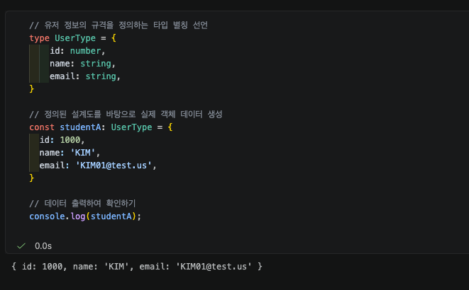

### 인터페이스로 객체 정의

- interface keyword 사용하여 오직 객체의 구조만 정의하기 위해 만들어진 문법
- 상속이나 확장성이 뛰어나 다양한 웹 프레임워크에서 데이터를 주고받을 때 사용
  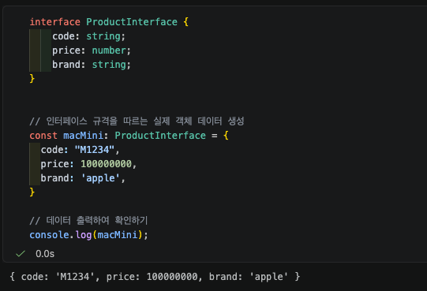

### 타입 별칭과 인터페이스의 차이점

| **구분 (기능 및 특징)**                      | **인터페이스 (interface)** | **타입 별칭 (type alias)** |
| -------------------------------------------- | -------------------------- | -------------------------- |
| **객체(object) 구조 정의**                   | ✅ 가능                    | ✅ 가능                    |
| **객체 구조 확장 (extends)**                 | ✅ extends 사용            | ✅ 인터섹션(`&`) 사용      |
| **클래스 구현 (implements)**                 | ✅ 가능                    | ✅ 가능                    |
| **선언 병합 (Declaration Merging)**          | ✅ 가능                    | ❌ 불가능                  |
| **복합 타입 정의 (유니온 / 인터섹션)**       | ❌ 불가능                  | ✅ `\|`, `&`로 가능        |
| **함수(function) 타입 정의**                 | ❌ 불가능                  | ✅ 가능                    |
| **객체 이외의 다양한 타입 표현 (원시값 등)** | ❌ 불가능                  | ✅ 가능                    |
| **typeof 연산자를 활용한 타입 추출**         | ❌ 불가능                  | ✅ 가능                    |

### 선언 병합

### ReadOnly 
- readonly와 ? 는 데이터의 수정 가능 여부와 필수 여부를 제어
- 객체 속성의 안전성을 보장하거나 불필요한 에러 없이 유연한 데이터 처리를 가능하다.
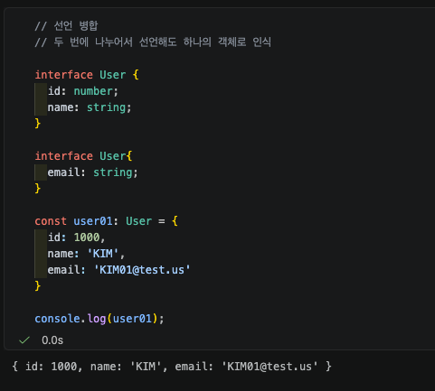

###  선택적 속성
- 속성명 뒤에 ? 가 붙어 있으면 선택적으로 값을 입력하여도 된다.
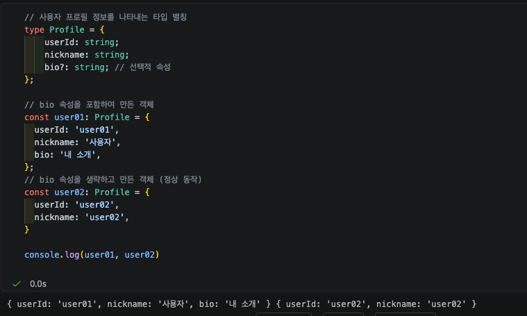

# 4-2

### 인덱스 시그니쳐
- 속성의 이름을 지정하는 것이 아닌, key & value의 타입 규격만 정의하여 동적 객체를 선언
- 허용되는 key 타입 : string, number, symbol

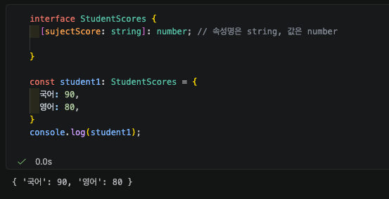
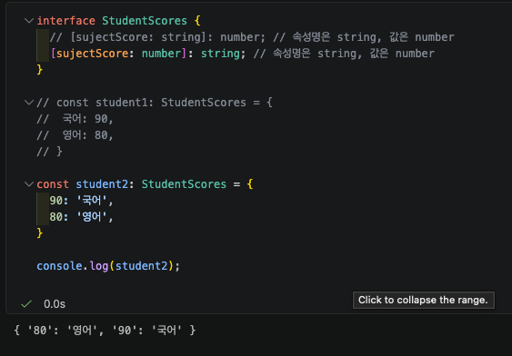

### 템플릿 리터럴 키 타입 정의 (TypeScript 4.4+)
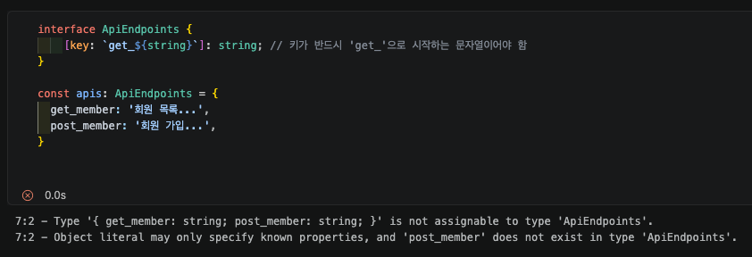

### 특정 유니온 키 제한 시 대안 (Record 활용)
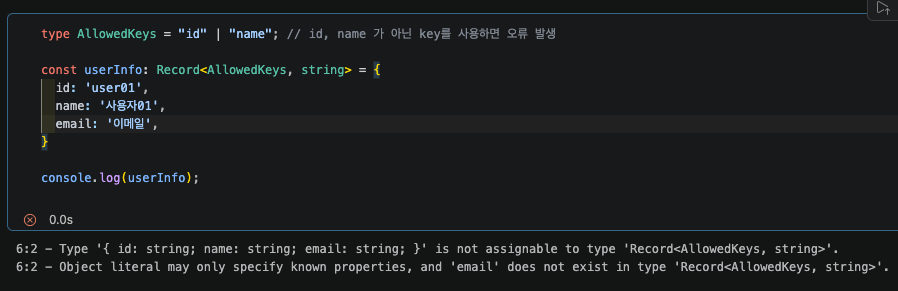
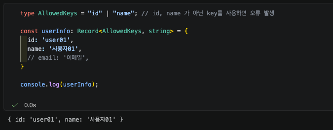

### interface 확장과 선언 병합

#### Extends 
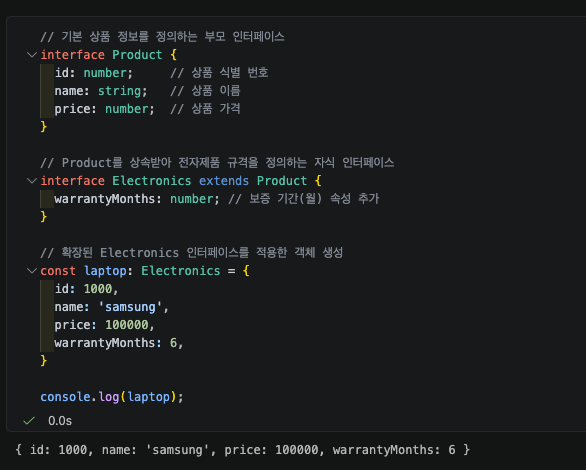