# DQ REVIEW

- 하나의 프로그래밍 언어로 작성된 소스코드를 추상화 수준이 비슷한 다른 프로그래밍 언어 코드로 변환하는 작업을 가르키는 용어
  - 트렌스파일
- TypeScript의 any와 unknown의 차이
  - any : 모든 종류의 데이터를 대입할 수 있으나, 컴파일러가 타입 오류를 감지하지 않으므로 실행 시점에 오류가 발생 가능
  - unknown : any와 동일하게 모든 종류의 데이터를 대입할 수 있지만, 정체를 확인하기 전에는 사용을 제한하는 안전한 타입, 타입 좁히기 필수
- interface와 type alias 차이
  - interface : 객체 구조 정의, 선언 병합 발생
  - type alias : 원시 타입, 객체 정의

# 5-1

## Union Type : 다중 타입 허용

### 기본 개념 & 선언 문법

- 파이프 기호를 기준으로 기재된 타입 중 하나를 만족하면 허용되는 타입 구조
- 숫자나 문자열 등 여러 타입의 데이터가 입력될 수 있는 변수 정의시에 사용
  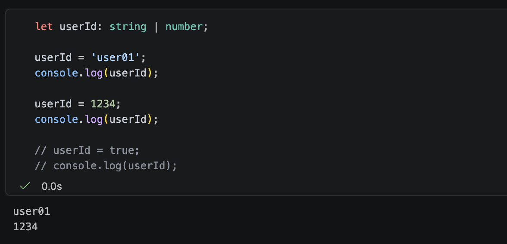

### 객체 유니온 & 공통 필드 접근 규칙

- 서로 다른 객체 타입들을 유니온으로 묶으면, 컴파일러는 모든 타입에 공통으로 존재하는 속성만 접근을 허용 (접근 제한 원리)
- 특정 객체 타입에만 존재하는 속성에 접근할 때 발생할 수 있는 런타임 오류를 방지 (안전성 보장)
  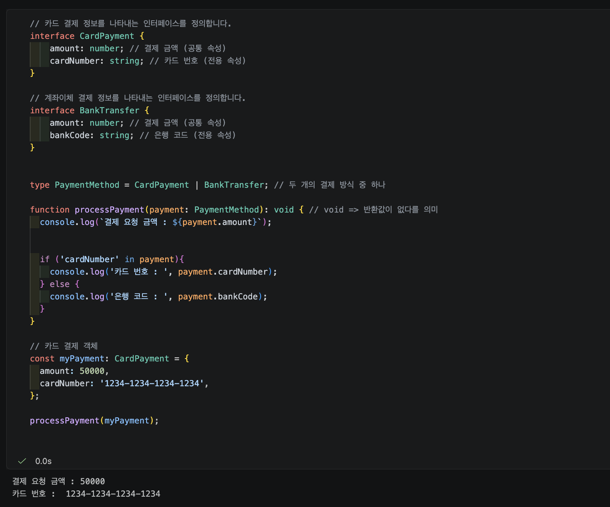

## Intersection Type : 폭합 타입 합성

### Intersection Type 기본 개념 & 선언 문법

- 앰퍼샌드(`&`) 기호를 사용하여 지정된 모든 타입의 속성을 동시에 만족하도록 합성하는 타입
- 기존에 정의된 독립적인 타입들을 결합하여 확장된 타입을 생성할 때 활용
  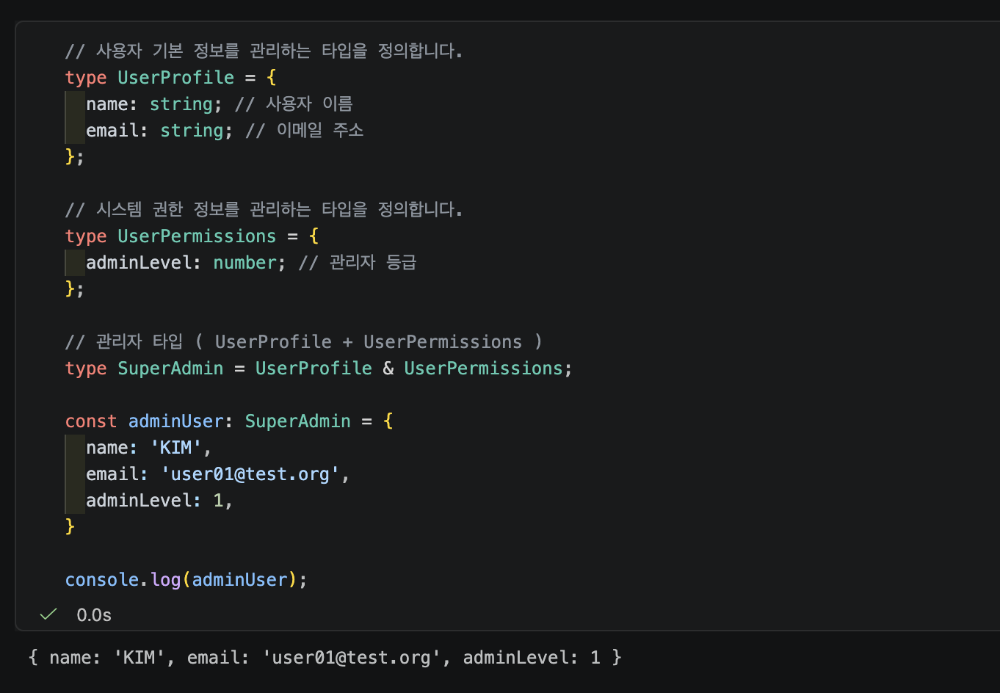

### Intersection Type : 속성 확장 & 주의 사항

- 결합된 타입 내부의 속성을 갖추어야 컴파일 오류가 발생하지 않는다
- `string & number`와 같이 양립할 수 없는 원시 타입을 결합할 경우 어떤 값도 할당할 수 없는 `never` 타입이 됨

## Literal Type : 특정 값으로 범위 제한

> string이나 number 타입의 전체 범위 대신 지정된 값만을 허용하는 타입 정의 방식

### 문자열 & 숫자 리터럴 타입

- 변수에 저장될 수 있는 값을 특정 문자열이나 숫자로 제한
- 정해지지 않은 문자열이나 숫자가 입력되는 상황을 컴파일 시점에 확인
  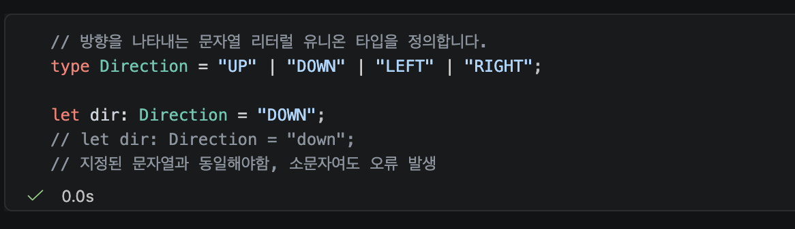

# 5-2

## 타입 가드 & 서로소 판열 유니온

### typeof 연산자를 활용한 원시 타입 좁히기

- 넓은 범위를 가진 유니온 타입을 특정 조건문 내부에서 더 구체적인 타입으로 제한하는 과정
- JavaScript 런타임에서 피연산자의 원시 타입 정보를 문자열로 반환하는 연산자
  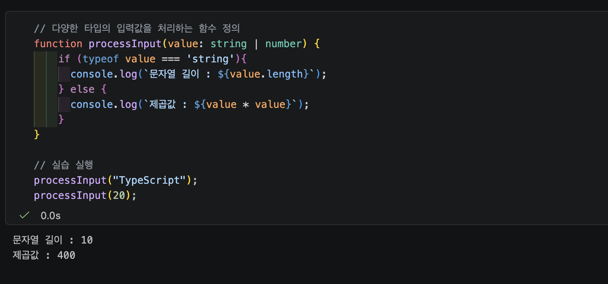

### in 연산자 & instanceof를 활용한 객체 타입 좁히기

- in 연산자 : 객체 내부에 특정 속성 (property) 이름이 존재하는지 확인
- instanceof : 객체가 특정 클래스의 인스턴스인지 확인

#### in 연산자

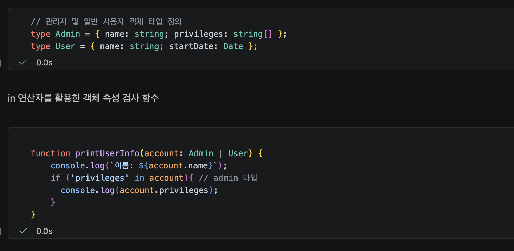

#### instanceof 연산자

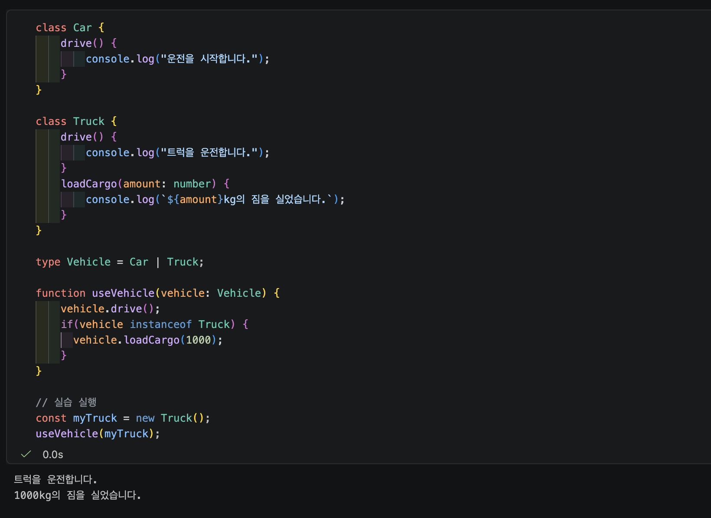

## 서로소 판별 유니온 ( Discriminated Union )

> 서로소 판별 유니온은 객체 타입에 공통된 리터럴 태그 속성을 부여하여 조건문에서 타입을 명확하게 구분할 수 있도록 만드는 설계 패턴

### 판별자 태그를 통한 상태 모델링

- 판별자(Discriminant): 객체 타입을 구분하는 공통 속성이며, 서로 중복되지 않는 리터럴 값을 가짐
- 상태 구조화: API 요청 상태(로딩, 성공, 실패)와 같이 서로 독립적인 상황에 필요한 데이터를 정리 가능
  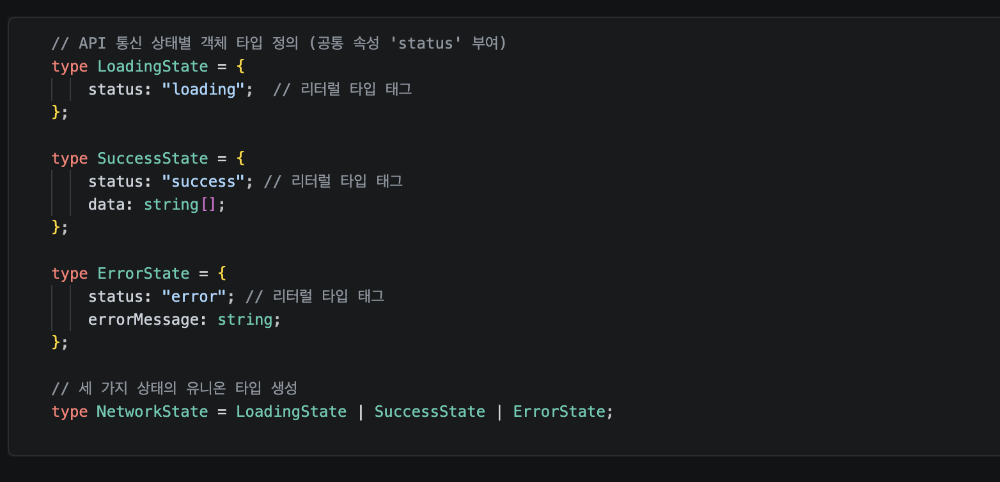

### switch 문을 활용한 상태 분기

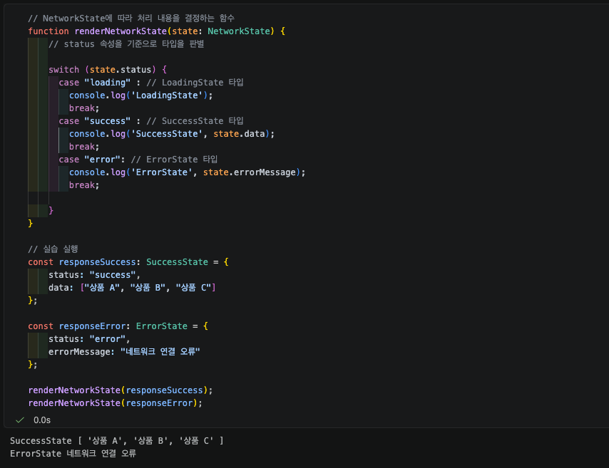

# 6-1

## 제네릭 개녑 & 필요성

> 다양한 타입을 하나의 틀로 다루면서도 타입 안정성을 보장하는 TypeScript의 타입 변수 시스템

### any Type 한계 & 제네릭 필요성

- any 사용시에 컴파일러의 타입 검사가 비활성화되어 런타입 오류 발생 가능
- 타입별로 개별 함수를 선언하면 동일한 로직이 반복되어 유지보구 어려워짐 ( 코드 중복 )
- 타입을 미리 고정하지 않고, 함수나 인터페이스 호출 시점에 타입을 인자로 전달받아 결정 ( 제네릭의 해결 방식 )

#### any type 사용 함수 ( 타입 안정성 X )

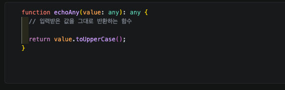

#### 제네릭을 사용한 함수 ( 타입 안정성 O )

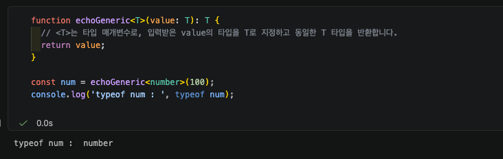

#### 타입을 굳이 지정하지 않고, 매개변수로 전달되는 값을 알아서 T에 대입함

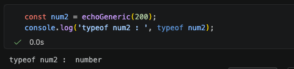

## 제네릭 함수 설계

> 함수 호출 시 타입을 인자로 전달하여 매개변수와 반환값의 타입을 동적으로 정하는 함수

### 타입 매개변수 & 타입 추론

- 타입 매개변수 식별자
  - 관례적으로 `<T>`를 사용하며, 여러개 필요한 경우, `<T, U, V>` 순으로 확장
- 타입 자동 추론
  - 함수 호출 시 처럼 타입을 명시하지 않아도, 전달되는 인자 값을 보고 컴파일러가 타입을 자동 추론

### 배열 요소 처리 제네릭 함수

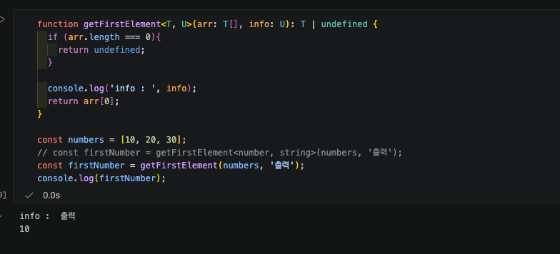

## 제네릭 인터페이스(Generic Interface)와 응답 데이터 모델링

#### 공통 API 데이터 응답 구조 설계

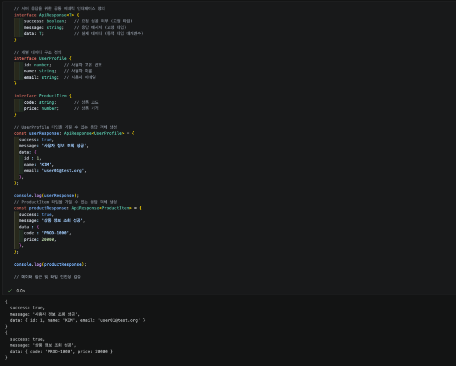

# 6-2

## 제네릭 제약 조건

### extends 키워드 통한 타입 제한

> <T extends 제한할\_타입> 형태로 선언하며, T가 반드시 해당 타입을 만족하도록 강제
> 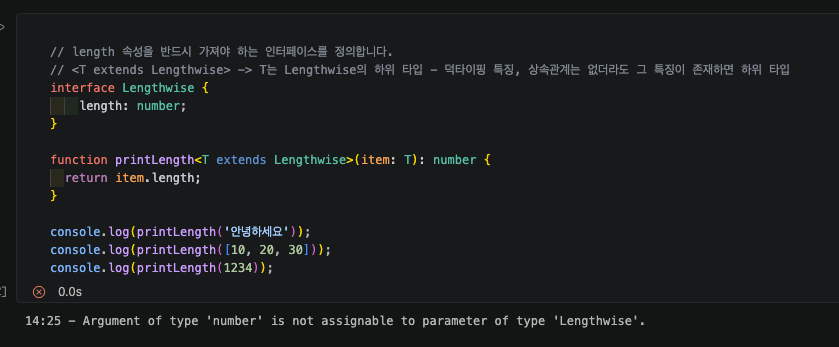

### keyof 연산자

- 객체 형태의 타입 앞에 작성, 해당 객체의 속성명들을 유니온 타입으로 추출
- 오타 등올 인해 존재하지 않는 속성에 접근하는 실수를 방지
  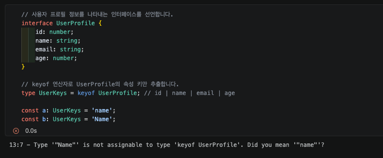

## 제네릭 + keyof의 결합

### 안전한 속성 조회 함수 getProperty 설계

- `<T, K extends keyof T>` 형태로 선언, K 타입이 T 객체의 키 중 하나이여야 함을 명시
- 반환 타입을 `T[K]`로 지정하여, 조회한 속성의 실제 터압울 정확히 추론

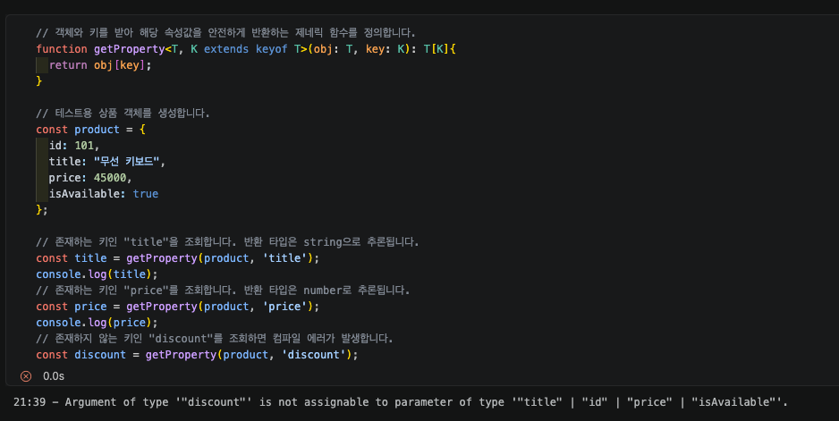

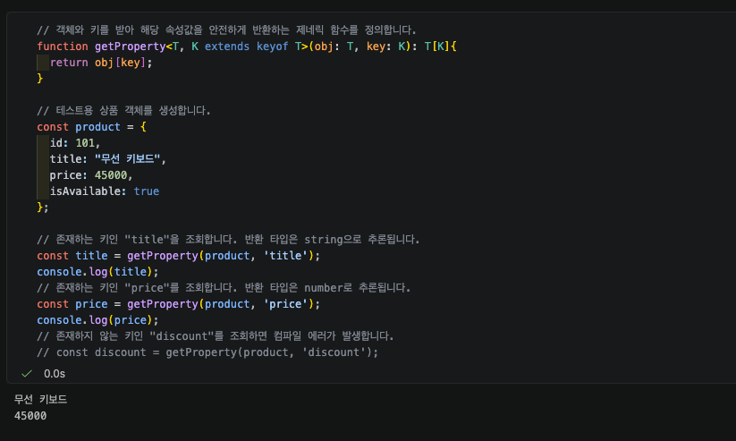

# 7 - 1

## 클래스 구조 & 접근 제한자

- 클래스 : 객체를 찍어내는 툴
- 접근 제한자 : 내부 데이터를 외부에 얼마나 공개할 지 결정하는 안전장치
  - public : 클래스 내부, 외부 모두 접근 가능 ( 기본값 )
  - protected : 클래스 내부에서만 접근 가능, 상속을 통해 하위 클래스 내부에서도 접근 가능
  - private : 클래스 내부에서만 접근 가능

### typescript 클래스 필드 선언 & 생성자

- 클래스 필드 : 클래스 내우베엇 관리되는 변수, typeScript에서는 타입을 미리 명시
- 생성자 : 객체가 생성될 때 가장 먼저 실행되는 함수, 필드 값을 초기화하는 역할 수행
  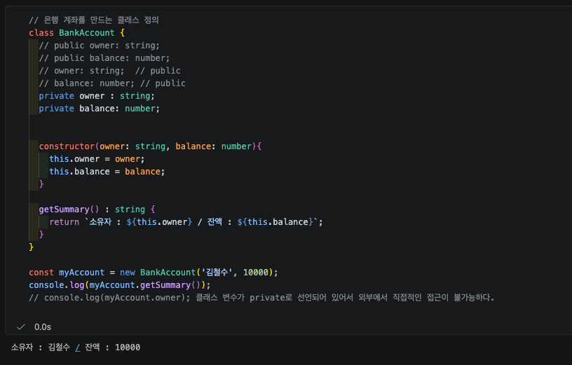

### 생성자 단축 속성 선언

- 생성자 매개변수 앞에 접근 제한자 작성시, 필드 선언과 this 할당 과정을 자동으로 처리
  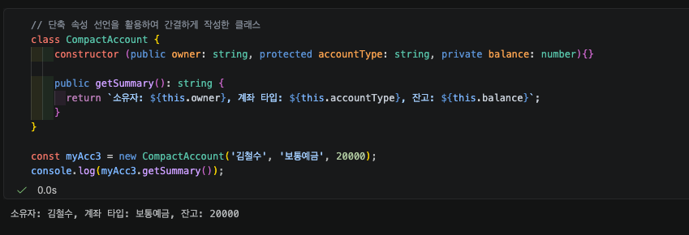

# 7 - 2

## 추상 클래스 ( Abstract Class )
- 함수의 기능 수행이 정의 되지 않은 클래스
- 클래스 키워드 앞에 `abstract` 키워드 추가 해야함

### 추상 클래스의 정의 & 특징
- abstract keyword : 클래스와 메서드 앞에 작성하여 추상 규격임을 선언
- 인스턴스화 제한 : new 연산자를 사용해 직접 객체를 생성할 수 없음
- 추상 메서드 : 본문이 없으며, 상속받는 하위 클래스에서는 반드시 재정의(오버라이딩)하여 구현 해야 함

## 인터페이스 ( Interface )
- 객체 구조를 정의하는 타입
- 메서드는 모두 추상 메서드
- 객체 설계만 목적으로 가진 타입

### implements 키워드 & 다형성

#### 구조적 규격 강제 : 클래스가 특정 인터페이스에 정의된 모든 속성과 메서드를 포함하도록 강제한다
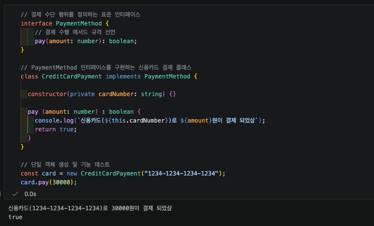

#### 다중 구현 가능: 단일 클래스가 여러 인터페이스를 동시에 구현 가능

