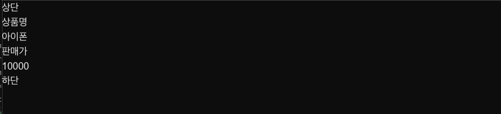
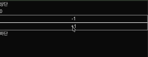

# DQ REVIEW

- Next.js가 화면을 빠르게 보여주기 위해 사용하는 두 가지 핵심 과정
  - Prerender ( 사전 렌더링 ) : 서버가 미리 HTML 문서를 그려두는 작업
  - Hydration : 정적 HTML 위에 자바스크립트 클릭 이벤트와 상태(State)를 연결하는 과정
- Next.js App Router에서 특정 경로에 접속했을 때 사용자에게 보여줄 실제 화면 UI 담당 파일
  - Page.tsx
- React의 가상 DOM & 재조정
  - 실제 브라우저의 화면(Real DOM) 구조를 본뜬 가벼운 자바스크립트 객체를 비교 과정(Diffing)을 통해 실제 바뀐 최소한의 부분만 브라우저 화면에 반영
- TSX에서 여러 요소를 하나로 묶되 실제 브라우저 DOM에는 불필요한 노드를 추가하지 않도록 해주는 리액트 전용 태그
  - `<Fragement>, <>`
- JSX/TSX 문법에서 자식 요소가 없는 단일 태그 작성 규칙
  - 태그 종료부가 반드시 존재해야함 | `<br />`

# 2-3

### Props 전달

```js
interface Product {
    itemName: string;
    itemPrice: number;
}

export default function ProductItem(props: Product): React.JSX.Element {
    console.log(props);
    return (
        <>
            <dl>
                <dt>상품명</dt>
                <dd>{props.itemName}</dd>
            </dl>
            <dl>
                <dt>판매가</dt>
                <dd>{props.itemPrice}</dd>
            </dl>
        </>
    );
}
```



```js
export default function ProductItem(props: Product): React.JSX.Element {
    const { itemName, itemPrice } = props;  // 비구조화 할당
    return (
        <>
            <dl>
                <dt>상품명</dt>
                <dd>{itemName}</dd>
            </dl>
            <dl>
                <dt>판매가</dt>
                <dd>{itemPrice}</dd>
            </dl>
        </>
    );
}
```

```js
export default function ProductItem({itemName, itemPrice}: Product): React.JSX.Element {
    // 매개변수 비구조화 할당
    return (
        <>
            <dl>
                <dt>상품명</dt>
                <dd>{itemName}</dd>
            </dl>
            <dl>
                <dt>판매가</dt>
                <dd>{itemPrice}</dd>
            </dl>
        </>
    );
}
```

```js
interface BadgeType {
    theme: string;
    text: string;
}

export default function Badge({ theme, text }: BadgeType): React.JSX.Element {
    return (
        <span
            className={theme === 'dark' ? 'text-purple-400' : 'text-orange-400'}
        >
            {text}
        </span>
    );
}
```

## 2-4 리액트 이벤트 & use client

```js
'use client'; // CSR

import { useState } from 'react';

export default function Counter(): React.JSX.Element {
    const [number, setNumber] = useState<number>(0);

    function increase() {
        setNumber(number + 1);
    }

    function decrease() {
        setNumber(number - 1);
    }

    return (
        <>
            <h1>{number}</h1>
            <button type="button" className="border" onClick={decrease}>
                -1
            </button>
            <button type="button" className="border" onClick={increase}>
                +1
            </button>
        </>
    );
}
```

```js
// 화살표 함수 이용해서 코드 단축 시키기

'use client'; // CSR

import { useState } from 'react';

export default function Counter(): React.JSX.Element {
    const [number, setNumber] = useState<number>(0);

    // const increase = () => setNumber(number + 1);
    // const decrease = () => setNumber(number - 1);

    return (
        <>
            <h1>{number}</h1>
            <button type="button" className="border" onClick={() => setNumber(number + 1)}>
                -1
            </button>
            <button type="button" className="border" onClick={() => setNumber(number - 1)}>
                +1
            </button>
        </>
    );
}
```



### 이벤트 타입 ( React )

- 입력값 변경 : ChangeEvent<T>
- 클릭 / 마우스 : MouseEvent<T>
- 양식 제출 : SubmitEvent<T> / FormEvent<T>
- 키보드 입력 : KeyboardEvent<T>
- 포커스 이동 : FocusEvent<T>
- 터치 ( 모바일 ) : TouchEvent<T>

### useRef() -> hook

- `상태 변화를 하지않는 값을 컴포넌트 내부에서 사용할 때`
- `DOM 선택 ( JSX 요소 Ref={...})`
- 리액트 컴포넌트 내부에서만 사용 가능
- use 키워드로 시작하는 함수
- hook에서는 다른 hook 사용 가능
- CSR


# 