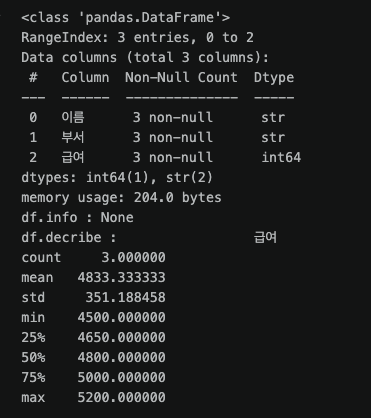

# 프롬프트

### Zero - Shot
- 별도의 입출력 예시 없이 지시문과 입력 데이터 만으로 결과를 도출하는 방식
- 명확하고 구체적인 지시어와 출력 형식 지정이 중요함
- 번역, 요약, 단순 분류 등 모델의 사전 학습 지식으로 출분히 해결 가능할 떄 자주 사용

### Few - Shot
- 원하는 출력 형태, 논리 구조, 분류 기준을 모델에게 명확히 전달하기 위해 몇 가지 예시를 제시한 후 질문하는 방식
- 예시의 개수와 패턴의 일관성이 출력 품질을 좌우한다.
- 정형화된 JSON 헝태 출력, 브랜드의 고유의 톤앤매너 유지, 복잡한 분류 기준이 필요할 떄 사용

### Role
- AI에게 특정 직업, 페르소나, 전문가의 정체성을 지정하여 답변의 전문성, 관점, 어조를 고정 시키는 방식
- 단순한 직업 이름 뿐만 아니라 전문성의 수준, 중점적인 가치관, 행동 형태 등을 함께 지정할 때 성능이 극대화
- 기획서 작성, 전문 자문, 아이디어 스토밍, 특정 페르소나 기반의 문서 작성

### Zero - Shot CoT
- 예시 없이 단순 지시문 끝에 추론 유도 문구를 추가하여 복잡한 계산이나 논리적 문제 해결 능력을 끌어올리는 방식

### Few - Shot CoT
- 예시 제공시에 정답만 보여주는 것이 아닌 정답에 이르는 중간 추론 단계를 함께 명시 하는 방식


### 스텝백 프롬프팅

1. 사용자의 질의
2. 질의에서 필요한 배경지식 도출 (LLM)
3. 도출한 배경지식을 활용하여 본 문제 해결

- 환각이나 지식 단절 현상을 방지 할 수 있음
- 기초 원리에 기반한 고품질 대답 가능성 올라감

### RTCCF

- Role [ 역할 ]

- Task [ 과업 ]

- Context [ 배경, 지식 ]

- Contraints [ 제약 조건 ]

- Format [ 형식 ]

<br>
<br>

# Numpy

### 배열 ( Array )

- 빠른 데이터 접근을 위해서 같은 자료형으로만 구성 됨
- 메모리상에서 연속된 구조로 되어 있음
- 인덱스 연산자로 접근 가능
- C언어로 개발 ( 직접 메모리 접근 )
- dtype: 자료형 명시 (np.int64, np.float64)

  | 이름 | 구성                        |
  | ---- | --------------------------- |
  | bit  | 0, 1로만 구성               |
  | Byte | 1byte == 8bit -> -256 ~ 255 |

- 숫자만 사용 권장

  ```python
  import numpy as np

  nums = np.array([10, 20, 30]) # 1차원 배열 -> Vector
  nums # array([10, 20, 30])
  ```

  ```python
  import numpy as np

  nums = np.array([10, 20, 30], dtype=np.float64)
  # dtype 미지정시 자동, 지정시 해당 자료형으로 할당
  nums # array([10., 20., 30.])
  ```

  ```python
  matrix = np.array([
    [10, 20, 30],
    [40, 50 ,60],
    [70, 80, 90]
  ]) # 2차원 배열 -> Matrix

  print(matrix)
  # [[10 20 30]
  #  [40 50 60]
  #  [70 80 90]]

  # 3차원 이상의 배열 Tensor
  ```

  ### 배열 선택, 슬라이싱
  - matrix[행, 열]
  - matrix[0:2, 1:3] # 행 -> 0 ~ 1, 열 -> 1, 2
  - matrix[:, 0] : 모든 행의 0번째 컬럼
  - matrix[1:, :2] : # 행 -> 1 ~ 끝, 열 -> 0 ~ 1

  ```python
  print('0행 2열 :' , matrix[0][2], matrix[0, 2])
  # 0행 2열 : 30 30 / 두 가지 방식으로 접근 가능

  print(matrix[0:2, 1:3]) # 행 -> 0 ~ 1, 열 -> 1, 2
  # [[20 30]
  #  [50 60]]

  print(matrix[:, 0]) # [10 40 70]

  print(matrix[1:, :2])
  # [[40 50]
  #  [70 80]]
  ```

<br>
<br>

### 차원 변경 (reshape, flatten) & 축(Axis)

- arange(시작, 종료, 증감 단위) : 시작 이상, 종료 미만으로 숫자 생성

  ```python
  arr = np.arange(1, 13)
  print(arr) # [ 1  2  3  4  5  6  7  8  9 10 11 12]
  ```

- reshape(행, 열) : 1차원 배열 -> 지정된 행과 열 구조로 차원수 변경, -1: 자동 결정 옵션
  - 요소의 개수를 맞춰주자 arr.reshape(3, 2) -> 오류 발생

  ```python
  mat_3x4 = arr.reshape(3, 4)
  print(mat_3x4)
  # [[ 1  2  3  4]
  #  [ 5  6  7  8]
  #  [ 9 10 11 12]]

  print(arr.reshape(3, -1))
  # [[ 1  2  3  4]
  #  [ 5  6  7  8]
  #  [ 9 10 11 12]]

  print(arr.reshape(4, -1))
  # [[ 1  2  3]
  #  [ 4  5  6]
  #  [ 7  8  9]
  #  [10 11 12]]
  ```

- flatten() : 2차원 배열 -> 1차원 배열로 평탄화

  ```python
  flat_arr = mat_3x4.flatten()
  print(flat_arr) # [ 1  2  3  4  5  6  7  8  9 10 11 12]
  ```

- 축 ( Axis ) : 2차원 배열에서 연산의 방향을 설정
  - Axis: 0 -> 행 기준에서 연산
  - Axis: 1 -> 열 기준에서 연산

  ```python
  mat = np.arange(1, 7).reshape(2, -1)
  print(mat)

  sum_axis0 = mat.sum(axis=0)
  sum_axis1 = mat.sum(axis=1)
  print(f'axis0 행 기준 합계: {sum_axis0}') # axis0 행 기준 합계: [5 7 9]
  print(f'axis1 열 기준 합계: {sum_axis1}') # axis1 열 기준 합계: [ 6 15]
  ```

### Numpy BroadCasting 연산

- ```python
  mat = np.array([
      [10, 20, 30],
      [40, 50, 60]
  ])

  print(mat * 5)
  # [[ 50 100 150]
  #  [200 250 300]]

  print(mat + 5)
  # [[15 25 35]
  #  [45 55 65]]

  vec = np.array([1, 2, 3])
  print(mat + vec)
  # 각 행에 vec 요소 값이 더해짐
  # [[11 22 33]
  #  [41 52 63]]
  ```

### 행렬 전치 ( Transpose ) & 행렬곱 ( @ )

- 객체.transpose() : {행, 열} -> {열, 행} / 전치
- 객체.T == 객체.transpose()

  ```python
  mat = np.array([
      [1, 2, 3],
      [4, 5, 6]
  ])

  print(mat)
  # [[1 2 3]
  #  [4 5 6]]

  print(mat.transpose())
  # [[1 4]
  #  [2 5]
  #  [3 6]]

  print(mat.T)
  # [[1 4]
  #  [2 5]
  #  [3 6]]
  ```

- 행렬곱 연산 ( @ )

  ```python
  mat1 = np.array([ [10, 20], [30, 40] ])
  mat2 = np.array([[1, 2], [3, 4]])

  mat3 = mat1 @ mat2
  print(mat3)
  # [[ 70 100]
  #  [150 220]]
  ```

<br>
<br>

# Pandas

### Series

- 1차원 구조체

  ```python
  scores = pd.Series([90, 85, 88])
  print(scores)

  # index value
  #   0    90
  #   1    85
  #   2    88
  # dtype: int64
  ```

### DataFrame

- 2차원(행, 열) 구조체

  ```python
  data = {
      '이름' : ['김철수', '이영희', '박민수'],
      '부서' : ['개발', '기획', '개발'],
      '급여' : [4500, 5200, 4800]
  }

  df = pd.DataFrame(data)
  print(df)
  #    이름   부서   급여
  # 0  김철수  개발  4500
  # 1  이영희  기획  5200
  # 2  박민수  개발  4800
  ```

### 데이터 탐색 속성 ( shape, dtypes ) & 진단 ( info, describe )

#### 탐색적 데이터 분석 ( EDA )

- df.info()
  - 누락치 확인 ( Non-null count )
  - 통계가 가능한 자료형인지 체크 ( 잘못된 데이터의 존재 여부 -> 치환 -> 자료형 변환 )
- df.describe()
  - 평균, 중앙값, 최소, 최대값을 통해서 이상치(극단치)를 확인

  ```python
  print(f'df.info : {df.info()}')
  print(f'df.decribe : {df.describe()}' )
  ```

  

### 데이터 변경 & 인덱스 제어 ( set_index, reset_index )

```python
# column 추가하기
df['보너스'] = df['급여'] * 0.1
print(df)
#     이름  부서   급여   보너스
# 0  김철수  개발  4500  450.0
# 1  이영희  기획  5200  520.0
# 2  박민수  개발  4800  480.0
```

```python
# 인덱스 특정 컬럽으로 변경하기
df_indexed = df.set_index('이름')
print(df_indexed)
#       부서   급여   보너스
# 이름
# 김철수  개발  4500  450.0
# 이영희  기획  5200  520.0
# 박민수  개발  4800  480.0
```

```python
# 인덱스를 다시 숫자형 인덱스로 변경하기
df_restored = df_indexed.reset_index()
print(df_restored)
#     이름  부서   급여   보너스
# 0  김철수  개발  4500  450.0
# 1  이영희  기획  5200  520.0
# 2  박민수  개발  4800  480.0
```

### Series & DataFrame 브로드캐스팅 연산

- axis:0 -> 행 (row) 인덱스 기준
- axis:1 -> 열 (column) 기준

```python
df = pd.DataFrame({
    '중간고사' : [80, 95, 70],
    '기말고사' : [85, 90, 75]
}, index=['김철수', '이영희', '박민수'])

print(df)
#      중간고사  기말고사
# 김철수    80    85
# 이영희    95    90
# 박민수    70    75

score_means = df.mean(axis=0) # 행 기준 ( 인덱스 기준 )
print(score_means)

# 중간고사    81.666667
# 기말고사    83.333333
# dtype: float64
```

```python
score_gap = df.sub(score_means, axis=1)
print(score_gap)
#          중간고사    기말고사
# 김철수  -1.666667  1.666667
# 이영희  13.333333  6.666667
# 박민수 -11.666667 -8.333333
```
