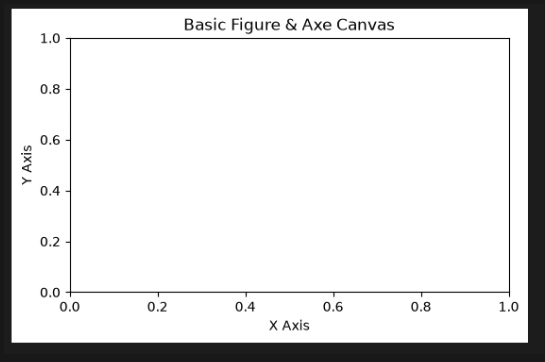
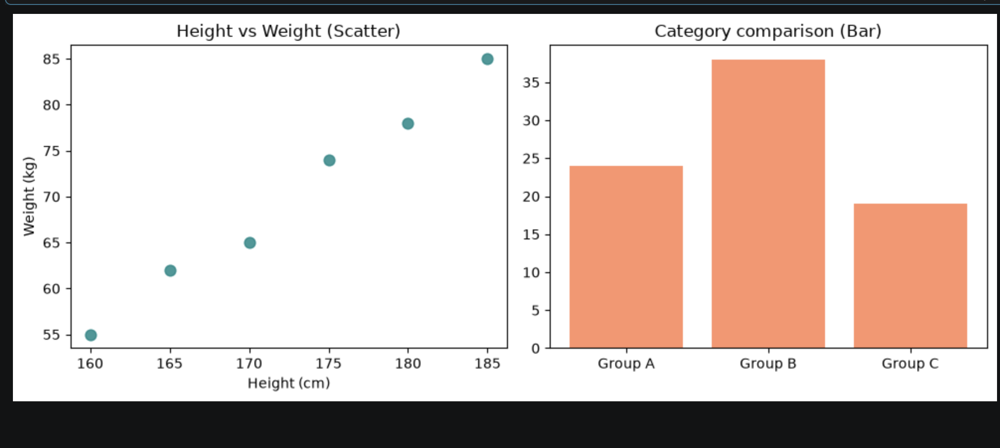
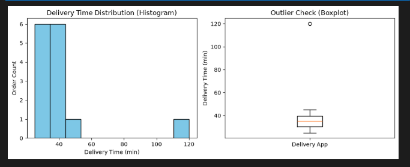
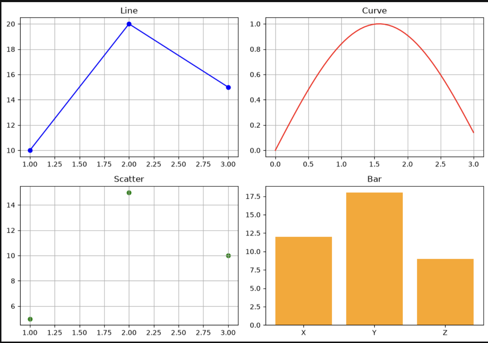

# Pandas

### 함수

- mode() : 해당 데이터 컬럼의 최빈값을 반환한다.

```python
scores = pd.Series([70, 80, 90, 70, 80, 70])

print(scores.mode()) # 70이 반환된다.
```

- mean() : 해당 데이터 컬럼의 평균값 반환

```python
print(score.mean()) #76.77777777
```

- median() : 해당 데이터 컬럼의 중앙값 반환

```python
print(score.median()) # 75.0
```

- count() : 결측치를 제외한 데이터의 개수를 반환

```python
scores = pd.Series([70, 80, 90, 70, 80, 70, None])

print(scores.count()) # None을 제외한 6을 반환한다.
```

- describe() : 주요한 통계값을 한번에 반환한다.

```python
import pandas as pd
scores = pd.Series([70, 80, 90, 70, 80, 70, None])

print(scores.describe())
# count     6.000000
# mean     76.666667
# std       8.164966
# min      70.000000
# 25%      70.000000
# 50%      75.000000
# 75%      80.000000
# max      90.000000
# dtype: float64
```

- nunique() : 결측치를 제외한 고유한 값의 개수를 반환한다.

```python
print(scores.nunique()) # 3
```

- unique() : 고유한 값의 리스트를 반환한다.

```python
print(scores.unique()) # [70, 80, 90, None]
```

### loc & iloc

- loc : 행의 이름으로 검색(선택)
  - loc[행 라벨]
  - loc[행 라벨, 컬럼 명]
  - loc[시작행 : 종료행, [컬럼1, 컬럼2, ..]]
  - loc[..., 시작컬럼:종료컬럼]
- iloc : 숫자 인덱스로 검색(선택)
  - loc와 사용법 동일, 행 라벨 대신 인덱스 번호 활용
  - 범위 지정지 종료 번호는 미만으로 설정
  - iloc[0:2, 0:2] -> 0 ~ 1 : 0 ~ 1

```python
df = pd.DataFrame({
    "나이" : [25, 30, 35, 40],
    "점수" : [80, 95, 70, 85],
    "등급" : ['B', 'A', 'C', 'D']
}, index=['user1', 'user2', 'user3', 'user4'])

print(df.loc['user1'])
# 나이    25
# 점수    80
# 등급     B
# Name: user1, dtype: object
print(df.loc['user1', '등급']) # B

print(df.loc['user1' : 'user3' , ['점수', '등급']])
# 	   점수	등급
# user1	80	B
# user2	95	A
# user3	70	C

print(df.loc['user1':'user2', '점수':'등급'])
#        점수 등급
# user1  80  B
# user2  95  A

print(df.iloc[0:2, 1:3])
#        점수 등급
# user1  80  B
# user2  95  A
```

### 불리언 인덱싱 & query() 조건 검색

- 불리언 인덱싱
  - 컬럼별 값이 True 조건만 반환
  - & : and 연산
  - | : or 연산

```python
df[df['나이'] >= 30]
df[(df['나이'] >= 30) & (df['점수'] >= 80)]
df[(df['나이'] < 30) | (df['등급'] > 'D')]
```

- query()

```python
df.query('나이 >= 30 and 점수 >= 80')
```

### 결측치 ( Missing Data ) 7대 처리 기법

```python
import numpy as np
# 결측치 - np.nan, pd.NA, NONE
raw_df = pd.DataFrame({'A': [1, np.nan, 3], 'B': [pd.NA, 5, 6], 'C': [7, 8, 9]})
```

- 결측치 탐지 및 현황 요약 (Detection)

```python
raw_df.info()
# <class 'pandas.DataFrame'>
# RangeIndex: 3 entries, 0 to 2
# Data columns (total 3 columns):
#  #   Column  Non-Null Count  Dtype
# ---  ------  --------------  -----
#  0   A       2 non-null      float64
#  1   B       2 non-null      object
#  2   C       3 non-null      int64
# dtypes: float64(1), int64(1), object(1)
# memory usage: 204.0+ bytes

raw_df.isna() # raw_df.isnull() 동일한 출력
#     A    	  B	      C
# 0	False	True	False
# 1	True	False	False
# 2	False	False	False

raw_df.isnull().sum()
# A    1
# B    1
# C    0
# dtype: int64
```

- 결측치 삭제 (Drop)
  - axis - 0 : 행 기준 - 특정 행에 결측치 존재 시 제거 ( 기본 값 )
  - axis - 1 : 열 기준 - 특정 열에 결측치 존재 시 제거

```python
# 행 기준 결측치 제거
raw_df.dropna()
#    A	B  C
# 2	3.0	6  9

# 열 기준 결측치 제거
raw_df.dropna(axis=1)
#    C
# 0	 7
# 1	 8
# 2	 9
```

### 통계적 대표값 대치 ( Imputation )

- 평균(mean())
- 중앙값(median()) : 극단치(이상치)의 영향 덜 받음
- fillna(..)

```python
median_val = df_age['나이'].median()
df_age['나이'] = df_age['나이'].fillna(median_val)
print(df_age)

#    나이
# 0  20.0
# 1  25.0
# 2  27.5
# 3  30.0
# 4  95.0
```

### 시계열 직전/직후 값 대치

- ffill() : 앞에 있는 값으로 대치
- bfill() : 뒤에 있는 값으로 대치

```python
ts_df = pd.DataFrame({'온도': [18.2, None, None, 21.0]})

# ffill
ts_df.ffill()
#   온도
# 0	18.2
# 1	18.2
# 2	18.2
# 3	21.0

# bfill
ts_df.bfill()
#    온도
# 0	18.2
# 1	21.0
# 2	21.0
# 3	21.0
```

### 선형 보간법 ( Linear Interpolation )

```python
speed_df = pd.DataFrame({'속도': [10.0, None, None, 40.0]})

speed_df['속도'] = speed_df['속도'].interpolate(method='linear')
print(speed_df)
#     속도
# 0  10.0
# 1  20.0
# 2  30.0
# 3  40.0
```

### 이상 기호 치환 및 수치형 반환 ( Replace & Type Casting )

- replace() : 이상한 데이터를 교체
- pandas.to_numeric(...) : 숫자 자료형을 변환

```python
survey_df['점수'] = survey_df['점수'].replace([-999, '?'], pd.NA)
print(survey_df) # type이 object여서 통계 확인 불가능
#      점수
# 0    85
# 1   <NA>
# 2   <NA>
# 3    95

survey_df['점수'] = pd.to_numeric(survey_df['점수'], errors='coerce')
survey_df.describe() # to_numeric으로 type을 실수로 변경하여 통계 확인 가능

# 점수
# count	2.000000
# mean	90.000000
# std	7.071068
# min	85.000000
# 25%	87.500000
# 50%	90.000000
# 75%	92.500000
# max	95.000000
```

### 결측 여부 지표 변수 생성 (Missing Indicator)

```python
user_df = pd.DataFrame({'소득': [300, None, 450, None]})
user_df['응답여부'] = user_df['소득'].isna()

print(user_df)
#     소득   응답여부
# 0  300.0  False
# 1    NaN   True
# 2  450.0  False
# 3    NaN   True
```

### groupby & .to_numpy() 상호변환

```python
sales_df = pd.DataFrame({'지점': ['서울', '서울', '부산', '부산'], '매출': [100, 150, 80, 120]})
grouped_df = sales_df.groupby('지점').mean(numeric_only=True) # 숫자 아닌 데이터가 있을 경우 숫자만 골라서 연산함
print(grouped_df)
#       매출
# 지점
# 부산  100.0
# 서울  125.0

sales_df['매출'].to_numpy(dtype=np.float64)
# array([100., 150.,  80., 120.])
```

# Matplotlib

### 그래프 종류

- 산점도 : 데이터의 분포
- 꺾은선 그래프 : 시계열 데이터의 흐름
- 히스토그램 : 데이터의 빈도수
- 박스플롯 : 이상치의 분포

- 캔버스 생성
  - plt.feature(figsize=(...)) - 1개를 그릴때
  - plt.subplots(행, 열, figsize=(...))
- figsize : 캔버스의 크기 (가로인치, 세로인치)

```python
import matplotlib.pyplot as plt

# Figure와 Axe 캔버스 기본 구조 생성
fig, ax = plt.subplots(figsize=(6, 3.5))
# fig = 전체 도화지 영역
# ax = 개별 그래프 영역
ax.set_title("Basic Figure & Axe Canvas") # 그래프 제목
ax.set_xlabel("X Axis") # x축 제목
ax.set_ylabel("Y Axis") # y축 제목

plt.show() # 캔버스 출력
```



### 선점도 & 막대 그래프

```python
import matplotlib.pyplot as plt

# 산점도 데이터 (키 vs 몸무게 상관관계)
height = [160, 165, 170, 175, 180, 185]
weight = [55, 62, 65, 74, 78, 85]

# 막대 데이터 (그룹별 인원수)
groups = ['Group A', 'Group B', 'Group C']
counts = [24, 38, 19]

fig, (ax1, ax2) = plt.subplots(1, 2, figsize=(10, 4))

# 좌측: 산점도
ax1.scatter(height, weight, color='teal', s=60, alpha=0.8)
ax1.set_title('Height vs Weight (Scatter)')
ax1.set_xlabel('Height (cm)')
ax1.set_ylabel('Weight (kg)')

# 우측: 막대 그래프
ax2.bar(groups, counts, color='coral', alpha=0.85)
ax2.set_title('Category comparison (Bar)')

plt.tight_layout()
plt.show()
```



### 히스토그램 & 박스플롯

- 히스토그램 : 데이터의 밀집 구간과 분포 왜곡도(Skewness)를 확인한다.
- 박스플롯 : 데이터의 분포를 몇 개의 대표적인 통계값으로 압축해서 보여주는 그래프

```python
import matplotlib.pyplot as plt

# 배달 앱 주문별 배달 소요 시간(분) [120분 극단 지연 건 포함]
delivery_times = [25, 28, 30, 30, 32, 33, 35, 35, 36, 38, 40, 42, 45, 120]

fig, (ax1, ax2) = plt.subplots(1, 2, figsize=(10,4))

# 좌측: 히스토그램 (대부분 25~45분 구간에 집중됨을 확인)
ax1.hist(delivery_times, bins=10, color='skyblue', edgecolor='black')
# bins : 데이터 빈도수 구간 10개로 나누기
ax1.set_title('Delivery Time Distribution (Histogram)')
ax1.set_xlabel('Delivery Time (min)');
ax1.set_ylabel('Order Count')

# 우측: 박스플롯 (120분 이상치 건물 상단 독립 점으로 검출)
# 이상치 확인용
ax2.boxplot(delivery_times, tick_labels=['Delivery App'])
ax2.set_title('Outlier Check (Boxplot)')
ax2.set_ylabel('Delivery Time (min)')

plt.tight_layout()
plt.show()
```



### 다중 서브플롯 배치

```python
import matplotlib.pyplot as plt
import numpy as np

fig, axes = plt.subplots(2, 2, figsize=(10, 7))

# 2x2 영역 각각에 서로 다른 차트 배치

# -------------------------------------------------------------
# [0, 0] 파란색 꺾은선 그래프 (Line Plot with Markers)
# -------------------------------------------------------------
x_line = [1, 2, 3]
y_line = [10, 20, 15]

axes[0, 0].plot(
    x_line,
    y_line,
    color='blue',       # 'b'
    linestyle='-',      # '-' (실선)
    marker='o'          # 'o' (원형 마커)
)
axes[0, 0].set_title('Line')
axes[0, 0].grid(True)

# -------------------------------------------------------------
# [0, 1] 빨간색 사인 곡선 (Smooth Curve)
# -------------------------------------------------------------
# 0부터 3까지 균등하게 50개 구간으로 나눈 x값 생성 (중복 연산 방지)
x_curve = np.linspace(0, 3, 50)
y_curve = np.sin(x_curve)

axes[0, 1].plot(
    x_curve,
    y_curve,
    color='red',        # 'r'
    linestyle='-'       # '-' (실선)
)
axes[0, 1].set_title('Curve')
axes[0, 1].grid(True)

# -------------------------------------------------------------
# [1, 0] 초록색 산점도 (Scatter Plot)
# -------------------------------------------------------------
x_scatter = [1, 2, 3]
y_scatter = [5, 15, 10]

axes[1, 0].scatter(
    x_scatter,
    y_scatter,
    color='green'       # 'g'
)
axes[1, 0].set_title('Scatter')
axes[1, 0].grid(True)

# -------------------------------------------------------------
# [1, 1] 주황색 막대 그래프 (Bar Chart)
# -------------------------------------------------------------
categories = ['X', 'Y', 'Z']
values = [12, 18, 9]

axes[1, 1].bar(
    categories,
    values,
    color='orange'
)
axes[1, 1].set_title('Bar')

# 레이아웃 겹침 방지 및 출력
plt.tight_layout()
plt.show()
```



### pandas 내장 boxplot 활용하기

```python
df.boxplot(column='danceability', by='track_genre', ax=axes[1])
# track_genre별로 danceability 값의 분포를 박스플롯으로 생성
```

<br>
<br>

# 머신러닝 개요

- 머신러닝
  - 데이터 사이언스의 한 분야
  - 예측, 분류 할 수 있도록 데이터에 기반한 규칙(알고리즘)을 발견하는 분야
  - 학습을 바탕으로 규칙을 찾음
    - 지도 학습 ( 문제 [ feature / 특성 / 톡립 변수 ] + 답 [ Label / 레이블 / 종속 변수 ] )
    - 비지도 학습 : 문제 => 규칙 찾기 - ex) K-Means -> 클러스터링, 군집
    - 준 지도 학습 : 지도 학습 + 비지도 학습
    - 강화 학습 : 보상 알고리즘을 통해서 학습
  - 규칙을 통해 해결하고자 하는 문제 영역
    - 회귀 (regression) -> 수치 예측
    - 분류 (classification)
  - 알고리즘
    - Regression - 선형 회귀
    - ANN ( Anificial Neural Network ) : 인공 신경망 ( 페셉트론 )
      - DNN ( Deep Nerual Network )
        - CNN
        - RNN, LSTM, GRU
        - GAN
    - KNN : K - 최근접 알고리즘
    - SVM : 서브 벡터 머신
    - Decision Tree
    - Ensernble

# 코테

### 1. 문자열 정렬하기

```python
def solution(my_string):
    answer = []
    for i in my_string:
        if i < 'A':
            answer.append(int(i))

    answer.sort()

# A의 아스키코드값 활용해서 A보다 작으면 0 ~ 9 범위에 들어감.

    for i in my_string:
        if i.isdigit():
            answer.append(int(i))
    answer.sort()

    return answer

# isdigit, isdecimal, isnumeric을 활용하여 문자열의 값이 숫자 인지 판별 가능
# isdecimal < isdigit < isnumeric 순으로 범위의 차이가 있음
# isdecimal -> 0 ~ 9의 10진수만 판별
# isdigit -> 정수, 위첨자, 아래첨자, 원문자 까지 가능
# isnumeric -> 분수 기호, 로마 숫자, 한자 숫자 등 그냥 숫자 관련은 다 되는듯
```
