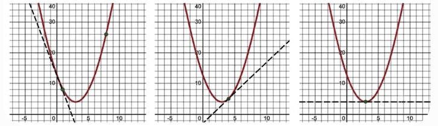

# 선형 회귀 모델 & 오차 평가지표

### 선형 회귀

- 입력값과 정답 사이에 비례하는 규칙이 존재한다고 가정한 후
- 이를 가장 잘 나타내는 직선을 그어 미래를 예측하는 머신러닝 기법

### 직선의 방정식

$\hat{y}$ = wx + b

- $\hat{y}$ : 모델이 입력값 x를 바탕으로 예측한 결과값(Prediction)이다.
- x : 입력값 ( Feature, Input ) , 예측에 사용되는 독립변수
- w : 가중치 ( Weight ), 직선의 기울기를 의미한다.
  - 입력값 x가 1단위 증가할 때 예측값이 얼마나 변하는지 나타내며, 모델에서 이 변수의 중요도를 결정한다.
- b : 직선 y의 절편(Intercept)를 의미한다. x가 0일때 기본 예측값

- 학습 목적
  - 손실의 값을 최대한 줄여서 예측의 정확도 향상
  - 손실 값을 최저로 만들 수 있는 최적의 가중지(w)와 절편(b)를 결정

- w,b = 모델 파라미터
  - 모델이 학습을 통해서 결정한 값

### 오차 & 손실함수

- 오차
- 개별 데이터 하나하나에서 발생하는 `실제값과 예측값의 차이`
  - 해당 알고리즘의 안정성을 검증하는 도구가 된다.
  - 예측을 잘하면 오차가 작음

- 손실 함수 ( Loss - Function )
  - 오차들을 모아 모델의 성능을 평가하는 공식

- 손실 함수 종류
  - 모든 오차를 더하는 방법 : 음수와 양수가 함께 있어서 사용 잘 안함
  - 대표값을 구하는 공식
  - `Error = y - $\hat{y}$ = ( 원 값 - 예측 값 )`
    - MSE ( Mean Squared Error ) - 평균 제곱 오차
      - 곡선 : 미분 가능 (최적의 가중치를 결정 가능)
      - 예측이 크게 빗나간 이상치에 대해서 민감하며, 큰 실수를 범하지 않도록 엄격하게 훈련할 때 사용

      ```math
      MSE = \frac{1}{n} \sum_{i=1}^{n} (y_i - \hat{y}_i)^2
      ```

    - MAE ( Mean Absolute Error) - 평균 절댓값 오차
      - 곡선 : 미분 어려움
      - 직관적인 크기 확인 가능하여 결과를 해석하고 보고하기 좋다.

      ```math
      MAE = \frac{1}{n} \sum_{i=1}^{n} |y_i - \hat{y}_i|
      ```

  - 손실 ( Loss ) 높음 -> 가중치 조절 -> 학습 -> 손실 확인 -> 가중치 조절 [ 만족 할 때 까지 반복 ]

- 미분
  - 지정한 위치에서 어느 방향으로, 얼마나 가파르게 움직이는지 찾아내는 도구
  - 그래프에서는 특정 점에 가져다 댄 `접선의 기울기`
  - 경사하강법으로 정답을 찾아갈 떄 안정적으로 학습이 가능하도록 돕는다.

    

  - 그림 1 : 미분값이 음수이므로 오차의 최저점으로 이동하기 위해서 양수 방향으로 이동해야 한다.
  - 그림 2 : 미분값이 양수이므로 오차의 최저점으로 이동하기 위해서 음수 방향으로 이동해야 한다.
  - 그림 3 : 미분값이 최저점에 도달했다. 더 이상 이동하지 않아도 됨.
    - 그림 3의 가중치와 절편에 도달하기 위해 그림 1, 2를 계속 반복한다.

- 경사하강법
  - 최적화 (Optimization) : 가장 오차가 적은 완벽한 정답을 도출하는 매개변수를 찾는 과정
  - 비용 함수 (Cost Function): 인공지능이 예측한 값과 실제 정답 사이의 오차를 수치화 한 함수
    - 이 값이 0에 가까워질수록 모델이 똑똑해진다.

- 경사하강법의 움직임 공식
  - 가중치 업데치트 공식 : 인공지능이 다음 데이터를 어느것으로 결정하는 머신러닝의 핵심 연산

```math
W_{new} = W_{old} - \alpha{}\cdot{}\frac{\partial{}J}{\partial{}W}
```

- $W_{new}$ : 새로운 위치, 다음번에 인공지능이 움직일 새로운 좌표(업데이트 가중치)
- $W_{old}$ : 현재 위치, 지금 인공지응이 있는 좌표 (현재 가중치)
- $ - \alpha{}$ : 학습률 (Learning Rate). 한번에 얼마만큼의 이동을 할지 결정하는 값
  - (하이퍼 파라미터)
  - 보통 알파의 값은 0.1, 0.01, 0.001 같은 작은 양수의 값으로 설정한다.
  - 알파의 값이 너무 클때는 최저점을 지나치는 OverShooting이 발생하거나, <br>
    심한 경우 오차가 줄어들지 않고 점점 커지며 오차가 무한대로 커지는 발산 현상이 발생할 수 있다.
  - 학습률의 값이 너무 작을 때는 최저점까지 가는 데 시간이 굉장히 오래 걸린다. 이런 경우에는 <br>
    로컬 미니멈 (Local Minimum)에 갇혀 최저점으로 가지 못하고 학습이 끝나버릴 가능성이 있다.
  - 기울기는 오차가 늘어나는 방향을 가르킨다.
  - 이 모델의 목표는 오차를 줄이는 것이기 때문에 반대 방향을 가르켜야 한다.
  - 기울기 앞에 마이너스를 붙임으로써 최저점으로 내려가도록 방향을 뒤집어 주는 역할을 한다.

- $\frac{\partial{}J}{\partial{}W}$ : 기울기 (Gradient), 현재 위치에서의 경사
  - (Back Propagation) 역전파, 가중치의 업데이트 정도
  - 가중치 W를 미세하게 변화시켰을 때, 전체 오차 J가 얼마나 변화하는지를 나타내는 순간 변화율
  - 이 값이 모델 학습에 제공하는 정보
    - 오차를 줄이기 위해 가중치를 움직여야 하는 방향
      - 해당 값이 양수일때 W값이 커지면 J의 값도 커진다. 오차를 줄이기 위해서는 w를 감소시켜야 한다.
      - 해당 값이 음수일때 W값이 커지면 오차 J가 작아진다. 오차를 줄이기 위해서 w를 증가시켜야 한다.
    - 가중치를 얼마나 크게 바꾸어야 하는지 나타내는 크기
      - 기울기의 절대값이 크다는 것은 아직 최저점에서 멀리 떨어져 있기 때문이다. w를 큰폭으로 수정해야 한다.
      - 기울기의 절대값이 0에 가깝다는 것은 거의 최저점에 도달해 있다. w를 미세한 폭으로 수정하며 조율해야 한다.
- J : 비용 함수, 손실 함수 | 현재 예측값과 실제 정답 사이의 오차를 나타내는 함수
  - 모델의 성능이 나쁠수록 J의 값이 커지며, 모델의 예측값이 정확해질수록 0에 가까워진다.
  - J를 최소로 만드는 것이 목적이다.
- W : 가중치,

- 기울기를 움직이기 위한 가중치 업데이트 공식 ( 옵티마이저 )
  - 실제 정답과 모델 예측값 사이의 오차(Loss)를 최소화 하도록 가중치(w)와 편향(b)을 자동으로 조절하는 
  - SGD : 확률적 경사 하강법 -> 기준점을 랜덤하게 뽑아서 확인
  - Momentum : 관성( 방향, 속도 )
  - RMSprop ( Adaptive 계열 ): 학습률을 조정해서 학습의 효율성을 극대화
  - Adam ( Adaptive Moment Estination ) : Momentum과 Adaptive의 특징을 결합

### 지역 최소값 ( Local Minimum )의 함정

- 블록 함수 ( Convex Function )
  - 바닥이 단 하나뿐이라 경사하강법으로 반드시 최저점을 찾을 수 있는 이상적 형태
- 비블록 함수 ( Non-Convex Function )
  - 실제 현실의 데이터는 이상적인 형태가 아닌 매우 복잡한 형태를 가지고 있다.

### 모델 파라미터 & 하이퍼 파라미터

- 모델 파라미터
  - 인공지능이 훈련 과정을 통해서 스스로 학습하고 결정하는 값.
  - 앞서 살펴본 가중치 (w) 나 편향 (b)가 해당
- 하이퍼 파라미터
  - 모델 파라미터와 달리 사람(개발자)가 학습 시작하기 전에 미리 선언해야 하는 값
  - 학습률 ($\Alpha{}$) 나 학습 횟수 (Epochs)가 해당한다.
  - 이 값을 완벽히 맞추는 정답 공식은 없으며, 여러번 시도하며 최적의 값을 찾아 나가야 한다.
