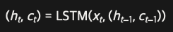
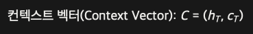

### 시퀀스 투 시퀀스 ( Seq2Seq ) 아키텍처
- 순환 신경망 이용
- 주로 변역에서 사용 목적으로 연구
- 인코더 ( 문장 이해, 컨텍스트 벡터 ) - 디코더 ( 문장 생성, 인코더의 컨텍스트 벡터를 초기값으로 )
- 인코더는 LSTM 레이어 활용 : 은닉 상태(단기기억), 셀 상태(장기기억)

### 인코더
- 입력 단어들을 순차적으로 읽으며 문장의 전체 맥락을 하나의 벡터로 압축
- 정보 유실을 방지 하기 위하여 LSTM 레이어 활용
- 단기 기억 담당인 은닉 상태(h), 장기 기억 담당인 셀 상테 (c)를 업데이트

### 컨텍스트 벡터
- 입력 문장의 마지막 단어 시점에서 도출된 최종 은닉 상태와 셀 상태의 세트
- 입력 문장의 전체 맥락이 컨텍스트 벡터에 압축

### 디코더
- 인코더가 전달한 최종 컨텍스트 벡터를 초기 은닉 상태와 셀 상태로 설정
- 번역할 언어의 단어를 한 단계씩 예측하여 생성
- 문장 시작 토큰 < sos >, 종료 토큰 < eos >

#### 교사 강요 (Teacher Forcing)
- 학습 초기에 디코더가 잘못된 단어를 예측하더라도, 다음 시점의 입력으로 디코더의 예측값 대신 실제 정답을 강제로 주입

### 고정 크기 컨텍스트 벡터의 한계
- 병목 현상 ( Bottleneck Problem )
    - 입력 문장의 길이에 상관 없이 컨텍스트 벡터의 길이는 항상 고정되어 있다.
    - LSTM 레이어를 선언할때 Hidden state의 값으로 지정
- 정보 유실
  - 짧은 문장은 효과적으로 압축하지만, 문장이 길어질수록 고정된 크기의 벡터에 많은 정보를 담아야 하므로 앞부분에 입력된 단어 정보가 점차 유실되는 현상

### 임베딩
- 자연어 토큰을 신경망이 수치 연산을 진행할 수 있도록 고정된 차원의 연속적인 밀집 벡터로 매핑하는 변환 기법

# 어텐션 메커니즘
### 기존 시퀀스 투 시퀀스 모델의 한계
- 정보 압축의 한계
  - 입력 문장의 길이에 상관없이 무조건 고정된 크기의 컨텍스트 벡터 하나에 전체 문맥을 압축해야 함
- 정보 손실
  - 짧은 문장은 효과적으로 압축하지만, 문장이 길어질수록 고정된 크기의 벡터에 많은 정보를 담아야 하므로 앞부분에 입력된 단어 정보가 점차 유실되는 현상
- 구조적 결합
  - 대규모 학습 데이터를 사용하더라도 문장이 길어질수록 문장 앞부분의 정보가 점차 유실되는 현상을 해결하기 어려움

### 어텐션 메커니즘
- 모든 상태를 활용
  - 모든 은닉 상태를 보관
- 선택적 주의 집중
  - 매 단어 생성 시에 인코더의 단어들을 다시 확인
  - 현재 예측하려는 단어와 관련성이 높은 성분에 더 높은 가중치 부여
- Q, K, V 벡터
  - Query : 무엇을 찾을 것인가
  - Key   : 어떻게 찾을 것인가 ( 이름표 )
  - Value : Key를 통해서 찾은 의미 정보
- 번역 과정에서 한국어와 영어의 어순의 차이가 있더라도, 어텐션 메커니즘이 단어 간의 올바른 연관 관계를 찾아낸다

### 언텐션 메커니즘 작동 원리
- 사용자가 입력한 검색어(Query)를 바탕으로 데이터베이스의 키워드(Key)를 검색한 뒤, 이와 가장 매칭 되는
 실제 데이터(Value)를 가져오는 과정

### 어텐션 연산의 3단계 흐름
- 유사도 측정
  - 디코더의 현재 상태와 인코더의 각 단어 이름표를 내적하여 단어 간의 유사도 점수 계산

    $\text{Score}(Q, K) = Q \cdot K^T$ 
- 가중치 분해
  - 유사도 점수에 소프트맥스를 적용하여 총합이 1(100%)가 되는 확률 분포 형태의 가중치로 변환

    $\text{Attention Weights} = \text{Softmax}(\text{Score})$
- 가중합 계산
  - 계산된 가중치를 각 Value 벡터에 곱한 후 모두 더해서, 현재 시점에 가장 필요한 최종 요약 벡터 생성
    $\text{Context Vector} = \sum (\text{Attention Weights} \times V)$

