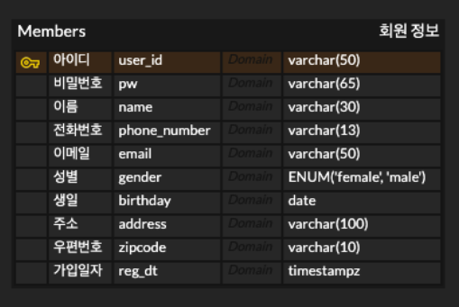

# DQ

- 시퀀스 투 시퀀스 모델에서 인코더가 디코더에 전달하는 '컨텍스트 벡터'의 내부 구성 요소
  - LSTM 기준 [ 마지막 은닉 상태(h) 및 마지막 셀 상태(c) ]
- 디코더 학습 시, 이전 시점의 예측값 대신 실제 정답 단어를 다음 시점 입력으로 강제 주입하여 학습을 안정화 하는 기법
  - 교사 강요
- 어텐션 메커니즘에서 디코더의 현재 상태 벡터에 해당, 정보를 탐색하기 위한 '질문' 역할을 하는 요소
  - Query
- 시퀀스 투 시퀀스 모델과 비교했을 때, 트랜스포머가 채텍한 설계 철학
  - 순환 신경망을 사용하지 않고 병렬 처리 + 셀프 어텐션
- 트랜스포머 디코더에서 학습 시 미래의 정답 단어를 미리 참조하지 못하도록 차단하는 기법
  - 인과적 마스크

# Hugging Face

- Hugging Face
  - 전 세계의 고성능 오픈소스 모델을 표준화된 인터페이스로 제공하는 플랫폼

### 허깅페이스 구성 요소

- 파이프라인 ( Pipeline )
  - 토큰화, 인코딩, 모델 연산, 소프트맥스 확률 변환 등 추론에 필요한 전 과정을 추상화하여 제공하는 상위 API
- 자동 클래스 ( Auto Class )
  - AutoTokenizer, AutoModel 등의 클래스를 사용하면, 모델 이름 문자열만으로 적합한 전용 아키텍쳐와 가중치를 자동으로 다운로드 및 설정

### 토크나이저 ( Tokenizer )

- 모델의 임베딩 레이어는 가공되지 않은 텍스트를 직접 처리할 수 없으므로, 정해진 사전에 맞게 단어를 쪼개고 고유 정수 ID로 매핑하는 과정이 필요함

#### BPF ( Byte Pair Encoding )

- 데이터에서 가장 빈번하게 등장하는 글자 쌍을 반복적으로 병합하여 어휘 사전을 구축하는 알고리즘
- 현대 LLM의 기반

#### WordPiece

- BPE와 유사하게 빈도 기반으로 작동, 단순히 자주 겹치는 단어 쌍을 합치는 것을 넘어 통합했을때 전체 코퍼스의 우도(Likeihood)를 얼마나 높이는지 통계적으로 계산하여 분할.
- 전체 코퍼스의 우도란?
  - 내가 만든 언어 모델이 학습 데이터 전체를 얼마나 그럴듯하게 설명하느냐
  - 언어 모델은 각 문장에 대해서 확률을 계산하는데, 전체 코퍼스의 우도는 이 확률들을 전부 곱한 값.

#### SentencePiece
- BPE나 WordPiece와 다르게 문장에 사전 공백이 존재하지 않아도 처리가 가능한 독립형 전처리 라이브러리
- 공백 자체를 특수 기호로 취급하여 처리하므로, 띄어쓰기 규칙이 불규칙한 한국어나 공백이 없는 중국어, 일본어에 효과적

# SQL, Data

- 데이터 : 처리되지 않은 원시 값
- 정보 : 데이터에 의미를 부여

- DB
  - 데이터의 집합
  - 단순히 모아두는 것이 아니라 효율적인 저장 및 조회가 가능하도록 구조화된 저장공간

- DBMS ( Data Base Management System )
  - 데이터 베이스 관리 소프트웨어
  - 데이터 무결성 제약조건을 지키기 위해 사용
  - RDBMS ( Relation DBMS )
    - 테이블 간의 관계

- SQL ( Structured Query Language)
  - 데이터베이스에 보내는 질문, 질의의 문법적 규칙

- 테이블
  - 데이터를 저장하기 위한 공간
  - 행과 열로 구성된 2차원 구조
    - 행 ( Row / Record )
    - 열 ( Column / Field / 속성 )
    - 셀 : 각각의 데이터

- 스키마
  - 테이블의 구조 및 제약사항을 정의한 명세서 or 설계도

### 데이터 무결성 제약 조건

- 도메인 무결성 제약 조건
  - 동일 컬럼은 동일한 자료형 이어야 함
- 개체 무결성 제약 조건 ( 기본키 제약 조건 )
  -
- 참조 무결성 제약 조건
  -

### SQL Data type

- 정수형
  - int ( 4 byte )
  - smallint ( 2 byte )
  - bigint ( 8 byte )
- 실수형
  - REAL ( 4 byte )
  - DOUBLE PRECISION ( 8 byte )
  - DECIMAL(p, s) : 소수점이 있는 숫자 ( 전체 p 자리, 소수점 s 자리)
- 문자형
  - CHAR(자리수) : 고정 사이즈 문자
  - varchar(n) : 가변 길이 문자열 (최대 n의 크기만큼)
  - text : 긴 문자열 ( 길이 제한 없는 가변 문자열 )
- Boolean : True / False / Null ( 1 byte )
- 날짜 시간
  - Date : 날짜 YYYY-MM-DD 형식
  - Time : 시간 HH:MM:SS 형식
  - timestamp : 날짜 + 시간
  - timestampz : 날짜 + 시간 + 시간대
- JSON
  - jsonb : 바이너리 형태로 저장 , 속도가 빨라서 권장됨
  - json
- 기타
  - enum : 열거형, 지정된 항목 내에서만 데이터 선택이 가능하도록 함
  - vector(차원수) : 벡터 db에서 사용

### 회원 테이블 구성

### 기본키 ( Primary key )

- 하나의 레코드를 식별할 수 있는 대표 컬럼 또는 컬럼의 조합
- 중복 금지 및 Null 금지
