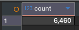
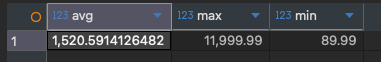
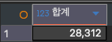
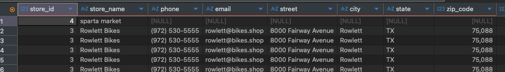
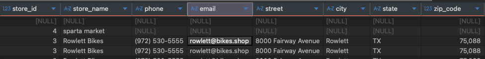
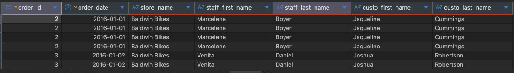

# DML - SELECT
### SELECT
- 테이블에서 원하는 컬럼을 선택하여 데이터 조회시에 사용

### SELECT *
- 실무에서는 SELECT * 을 잘 사용하지 않는다.
- 불필요한 데이터 조회로 인한 성능 저하
- 테이블 구조 변경시에 예상치 못한 열 포함 가능
- 코드 가독성이 떨어져 유지보수 어려움

- SELECT [ *, 컬럼 이름1, 컬럼 이름2....] FROM 테이블명[, 테이블명2.... ] [ WHERE 조건식 ]
- SELECT [ALL | DISTINCT ] 컬럼명 FROM 테이벌명

```SQL
-- 컬럼 지정 조회
SELECT first_name, last_name, email from customers;

-- 전체 컬럼 조회
SELECT * FROM products

-- 중복 제거
SELECT DISTINCT store_id from orders;

-- store_id + staff_id 조합 중복 제거
SELECT DISTINCT store_id, staff_id FROM orders;
```
### DISTINCT
- 컬럼에 중복 값이 존재 하는 경우, 고유한 값만 남겨 조회 가능

### WHERE 조건식 : 조회의 범위 지정

- 비교 연산자 : >, <, >=, <=, =
- 논리 연산자 : AND, OR, NOT
- IN, NOT IN : 포함 여부
- BETWEEN A AND B : A와 B 사이
- IS NULL, IS NOT NULL : NULL인지 아닌지 -> NULL은 데이터가 없는 상태로 비교 및 산술 연산이 불가능
- CASE WHEN : 조건에 따른 다른 값을 부여하는 경우, 필드 명시 위치에 적용
  - SELECT CASE WHEN 조건식1 THEN 결과1 WHEN 조건식2 THEN 결과2 ELSE 결과 END AS 새로운 컬럼 명
- LIKE '키워드': 키워드와 적황히 매칭
  LIKE '키워드%' : 키워드 이후 아무글자나 있어도 됨
  LIKE '%키워드' : 키워드 이전 아무글자나 있어도 됨
  LIKE '%키워드%' : 키워드 전후로 아무글자나 있어도 됨
  LIKE '*키워드' : 키워드 앞으로 반드시 *의 길이만큼 데이터가 있어야함

```SQL
-- 연습문제 4
SELECT DISTINCT store_id FROM orders;

-- 연습문제 5
SELECT DISTINCT state FROM customers;

-- 연습문제 6
SELECT DISTINCT brand_id FROM products;

-- 연습문제 7
SELECT * FROM orders WHERE shipped_date IS NULL;

-- 연습문제 8
SELECT * FROM staffs WHERE store_id = 1;

-- 연습문제 9
SELECT * FROM products WHERE 500 < list_price AND 1000 > list_price;
SELECT * FROM products WHERE list_price BETWEEN 500 AND 1000;

SELECT order_id, product_id, list_price,
	CASE WHEN list_price < 100 THEN '저가'
		 WHEN list_price < 500 THEN '중가'
		 ELSE '고가'
    END AS price_grade
   FROM order_items;

-- 상품명에 Trek이 포함되는 데이터
SELECT * FROM products WHERE product_name LIKE '%Trek%';
-- 상품명 2018로 끝나는 데이터
SELECT * FROM products WHERE product_name LIKE '%2018';
-- 지정한 날짜 사이에 있는 데이터
SELECT * FROM orders WHERE order_date BETWEEN '2016-01-01' AND '2016-01-31';

SELECT * FROM customers WHERE state = 'CA' or state ='NY';
SELECT * FROM customers WHERE state IN ('NY', 'CA');
SELECT * FROM customers WHERE state NOT IN ('NY', 'CA');

-- 연습문제 11
SELECT 
  CASE WHEN order_status = 1 THEN '처리중'
    WHEN order_status = 2 THEN '거부'
    WHEN order_status = 3 THEN '배송완료'
    ELSE '취소'
  END AS '주문 상태 코드'
  FROM orders;

-- 연습 문제 15
SELECT * FROM stocks WHERE quantity <= 5;

```

### ORDER BY

- 지정한 컬럼 기준 정렬
- 컬럼을 여러개 지정한 경우 순차적으로 정렬하되, 동일한 값의 경우 다음 컬럼 기준으로 정렬
- ASC, DESC : 오름차, 내림차

```SQL
SELECT * FROM products ORDER BY list_price DESC;

SELECT * FROM orders ORDER BY store_id ASC, order_date DESC;
```

# 데이터 집계 및 분석

### 집계 함수

- COUNT(컬럼명1, [컬럼명2, ...]) : 레코드 갯수 조회
  - count(\*): 전체 레코드 조회
  - NULL 배제하고 계산
- SUM(컬럼명) : 합계
- AVG(컬럼명) : 평균
- MIN(컬럼명) : 최솟값
- MAX(컬럼명) : 최댓값

```SQL
SELECT COUNT(*) from orders;
```



```SQL
select avg(list_price), max(list_price), min(list_price) from products;
```



```SQL
SELECT sum(quantity) 합계 from order_items;
```




### GROUP BY

- 특정 컬럼의 같은 값을 기준으로 그룹화
- 대부분 집계 함수와 함께 사용
- 레코드 갯수는 그룹화된 결과 갯수 만큼 조회
- 조회 컬럼은 반드시 GROUP BY에 명시된 컬럼만 사용가능
- 집계 함수 포함한 조건은 절대 WHERE 절에서 사용 불가능
- GROUP BY \_\_ HAVING 집계함수 조건

```SQL
-- brand_id 별 통계
select avg(list_price), max(list_price), min(list_price) from products GROUP BY brand_id ORDER BY brand_id;

-- 실행 불가
SELECT brand_id, COUNT(*) FROM products WHERE count(*) > 100 GROUP BY brand_id;
-- 실행 가능
SELECT brand_id, COUNT(*) FROM products GROUP BY brand_id HAVING count(*) > 100;

-- 연습문제 7
select avg(list_price) from products GROUP BY category_id HAVING avg(list_price) > 500;
```

# 테이블 결합

### 집합

- 합집합 : UNION
- 교집합 : INTERSECT
- 차집합 : EXCEPT

```SQL
-- 2016-01-17 이전
select order_id, order_date from orders
WHERE order_date <= '2016-01-17' ORDER BY order_date;

-- 2016-01-15 이후 데이터
select order_id, order_date from orders
WHERE order_date >= '2016-01-15' ORDER BY order_date;

-- 공통 레코드 조회 ( INTERSECT )
select order_id, order_date from orders
WHERE order_date <= '2016-01-17'
INTERSECT
select order_id, order_date from orders
WHERE order_date >= '2016-01-15' ORDER BY order_date;

-- 레코드 합치기 ( UNION )
select order_id, order_date from orders
WHERE order_date <= '2016-01-17'
UNION
select order_id, order_date from orders
WHERE order_date >= '2016-01-15' ORDER BY order_date;

-- 레코드 합치기 ( UNION ALL 중복 허용 )
select order_id, order_date from orders
WHERE order_date <= '2016-01-17'
UNION ALL
select order_id, order_date from orders
WHERE order_date >= '2016-01-15' ORDER BY order_date;


-- 차집합
select order_id, order_date from orders
WHERE order_date <= '2016-01-17'
EXCEPT
select order_id, order_date from orders
WHERE order_date >= '2016-01-15' ORDER BY order_date;
```

### JOIN

- 두 테이블에서 공통적인 값을 기준으로 테이블을 하나처럼 조회되도록 결합하는 것

#### INNER JOIN : 동등, 내부 조인

- INNER 키워드 생략 가능

```SQL

```

#### LEFT OUTER JOIN : 외부 조인

- 왼쪽 테이블을 메인으로 모두 출력하고 오른쪽 테이블은 보조정보

#### RIGHT OUTER JOIN : 외부조인

- 오른쪽 테이블을 메인으로 모두 출력하고 왼쪽 테이블은 보조정보

#### FULL OUTER JOIN : 전체 조인

- 두 테이블 모두 주 테이블로 모든 데이터 출력

```SQL
select * from orders, stores;

-- 주문이 발생한 매장 정보
select * from orders, stores where orders.store_id = stores.store_id;

--INNER JOIN ( 동등, 내부 조인 )
select * from orders o INNER JOIN stores s ON o.store_id = s.store_id;

select DISTINCT store_id FROM orders;

insert into stores (store_id, store_name) values (4, 'sparta market');

-- stores 기준에서 orders 테이블의 정보를 결합
SELECT DISTINCT s.store_id FROM stores s JOIN orders o ON s.store_id = o.store_id;

-- LEFT OUTER JOIN -> stores가 주테이블로 모든 데이터 출력, orders는 보조 테이블로 있는 것만 출력
SELECT * FROM stores s LEFT JOIN orders o ON s.store_id = o.store_id ORDER BY s.store_id DESC;
```



```SQL
INSERT INTO orders (order_id, customer_id, order_date) VALUES (1700, 1, current_timestamp );
-- FULL OUTER JOIN -> 양쪽 테이블 모두 주 테이블로 전부 출력
SELECT * FROM stores s FULL OUTER JOIN orders o ON s.store_id = o.store_id ORDER BY s.store_id DESC, o.order_id DESC;
```



#### 다수 테이블 조인
```SQL
-- 다수 테이블 조인하기
SELECT 
  o.order_id, o.order_date,
  s.store_name,
  f.first_name staff_first_name,
  f.last_name staff_last_name,
  c.first_name custo_first_name,
  c.last_name  custo_last_name
FROM orders o 
  LEFT JOIN customers c ON o.customer_id = c.customer_id
  LEFT JOIN stores s ON o.store_id = s.store_id
  LEFT JOIN staffs f ON o.staff_id = f.staff_id;
```



```SQL
-- 연습문제 1
SELECT store_id FROM staffs
UNION
SELECT store_id FROM orders;

-- 연습문제 2
SELECT order_id, first_name, last_name, order_date
FROM orders o
JOIN customers c ON o.customer_id = c.customer_id;

-- 연습문제 3
SELECT p.product_id, product_name, quantity
FROM products p
FULL OUTER JOIN stocks s ON p.product_id = s.product_id;

-- 연습문제 6
select o.order_id, s.first_name, s.last_name, s.store_id
from orders o
join staffs s ON o.staff_id = s.staff_id AND o.store_id = s.store_id ;
```

### LIMIT 
- 조회할 행 수 지정
- [OFFSET 시작 인덱스 번호]
```SQL
SELECT * FROM orders LIMIT 10 
```