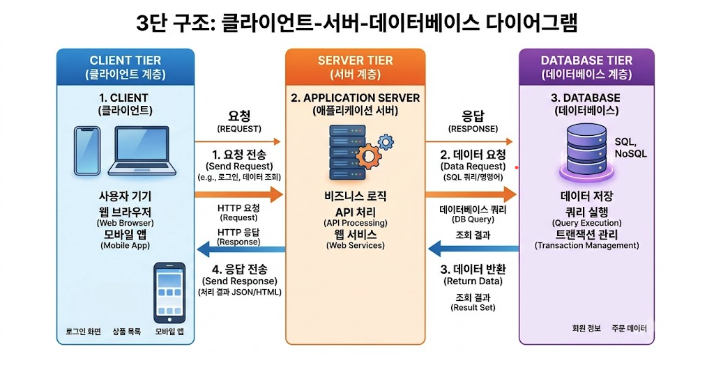

# 서브쿼리

### 서브쿼리 ( 부속 질의 )

- SELECT 문에 SELECT가 포함된 질의
- 내부쿼리의 결과를 외부쿼리가 이용

### 스칼라 서브쿼리 : SELECT

- 단일 값 반환

### 인라인 뷰 : FROM

- 가상의 임시 테이블처럼 활용

### 상관 서브쿼리 : WHERE

- 조건값을 동적으로 계산
- 내부쿼리 결과 외부쿼리가 사용

```SQL
-- 연습문제 1 , 단일행 서브쿼리
SELECT product_id, product_name, list_price
FROM products
WHERE list_price > (SELECT AVG(list_price) FROM products);

-- 다중행 서브쿼리 ( IN, NOT IN, EXISTS )
SELECT DISTINCT customer_id FROM orders;

-- 연습문제 2
SELECT customer_id, first_name, last_name
FROM customers
WHERE customer_id IN (SELECT DISTINCT customer_id FROM orders);

-- 연습문제 3
SELECT customer_id, first_name, last_name
FROM customers
WHERE customer_id NOT IN (SELECT DISTINCT customer_id FROM orders);
-- 연습문제 4
SELECT product_id, product_name FROM products p
WHERE EXISTS ( SELECT * FROM stocks s WHERE s.product_id = p.product_id )

SELECT product_id, product_name FROM products
WHERE product_id IN (SELECT product_id FROM stocks)

-- 연습문제 5
SELECT p.product_id, p.product_name FROM products p
WHERE NOT EXISTS (SELECT 1 FROM order_items o WHERE o.product_id = p.product_id);
```

```SQL
-- 스칼라 서브쿼리
SELECT product_id, product_name,
(SELECT SUM(list_price) FROM order_items oi WHERE oi.product_id = p.product_id) "총 판매금"
FROM products p limit 10;


-- 연습문제 1
SELECT store_id, total_stock
FROM (
    SELECT store_id, SUM(quantity) total_stock 
    FROM stocks
    GROUP BY store_id
) AS store_stock
WHERE (
    SELECT store_id, AVG(total_stock)
    FROM (
        SELECT store_id, SUM(quantity) total_stock 
        FROM stocks
        GROUP BY store_id
    ) AS avg_stock
);

-- 연습문제 2
SELECT product_id, product_name, list_price,
    (SELECT AVG(list_price) FROM products) AS avg_lp
FROM products;


SELECT (SELECT )


```

# SUPABASE
### 클라이언트, 서버, 데이터베이스
- 클라이언트 : 사용자 입력, 화면 표시 / 웹브라우저, 어플리케이션
- 서버 : 요청 처리, 로직 수행 / 백엔드 프로그램
- 데이터베이스 : 데이터 저장, 조회 / PostgreSQL



### API, SDK
- API ( Appliccation Programming Interface )
  - 프로그램끼리 정해진 규칙으로 데이터를 주고 받는 창구
- SDK ( Software Development Kit )
  - API를 코드에서 더 쉽게 쓸 수 있도록 미리 만들어둔 도구 모음

### 연결 정보, 인증, 권한
- 연결 정보 : 어떤 DB에 접속할지 / Project URL
- 인증 (Authentication) : 요청자가 누구인지 /  API KEY, 로그인
- 권한 (Authorization) : 무엇을 할 수 있는지 결정 / 읽기 전용 