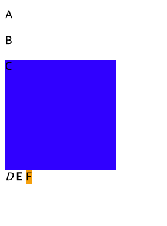
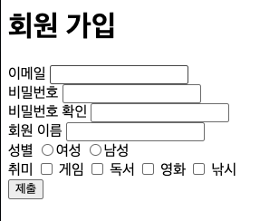

# HTML 개념

### Web

- 뼈대 : Hyper Text Markup Language ( 페이지 이동, 매크로 구성 ) / `<tag>` 사용
- 스타일링 : CSS (Cascading Style Sheet) 상위 요소의 스타일이 하위요소에 전달
- 동적요소 : JavaScript

### HTML

1. 웹 표준 (Web Standard)

- 어떤 브라우저를 사용하더라도 동일한 화면, 기능을 제공하도록 만든 국제 공식 규칙

2. 기본 구성

- `<!DOCTYPE html>` : 현재 HTML5 최신 버전을 사용하고 있다.
- `<html>` : HTML 문서 시작, 종료 알림
- `<head>` : 웹페이지의 제목, 인코딩 설정 등 브라우저가 알아야 할 문서의 정보(메타데이터)를 담는 구역
- `<body>` : 실제로 눈으로 보이는 모든 콘텐츠(텍스트, 이미지, 영상)가 들어가는 구역

3. 태그

- 제목 태그
  - `<h1> ~ <h6>`
- 본문 서식 태그
  - `<p>` : 문단 구분
  - `<b>`, `<strong>` : 볼드체
  - `<i>` : 이탤릭체
  - `<u>` : 밑줄
  - `<del>`, `<strike>` : 취소선
  - `<br>` : 줄 개행

4. 주석

- `<!-- -->` : 설명, 출력 배제

5. 문단 태그 (Block 속성)

- 줄 개행 O
- p, div, h1 ~ h6, form ...
- 공간 가짐 ( 너비, 높이 지정 가능 )

6. 글 태그 (Inline 속성)

- 줄 개행 X
- i, b, strong, u, a, span ...
- 공간을 가지지 않음 ( 너비, 높이 지정 못함 )

```html
<style>
  div {
    width: 150px;
    height: 150px;
    background-color: blue;
  }

  span {
    width: 150px;
    height: 150px;
    background-color: orange;
  }
</style>
<p>A</p>
<p>B</p>
<div>C</div>

<i>D</i>
<b>E</b>
<span>F</span>
```



## 하이퍼링크, 멀티미디어 & 폼 태그

### 하이퍼링크

- 페이지 이동
- `<a>` : 하이퍼링크 태그
- 속성 ( Attribute ) : 태그의 추가 정보 -> 태그의 기능을 수행하기 위한 정보
  - href : 이동할 경로
    - 절대 경로
    - 상대 경로
  - target : 출력할 창의 위치
    - \_self ( default ) => 현재 창
    - \_blank => 새로운 창
    - \_parent => 부모 창
      - `<iframe>`: src -> 창에 출력할 경로(URL)
    - \_top : 가장 상위에 있는 창
    - 창의 이름

### Form 태그

- action : 제출 처리 URL ( 서버 URL )
- input 태그 : 입력을 위한 태그
  - type : 입력 유형 설정
    - text (default)
    - password : 비밀번호 입력
    - radio : 여러개 중 하나 선택
    - checkbox : 여러개 중 다중 선택
    - submit : 양식 제출, reset - 입력항목 초기화, button
  - name:
    - radio, checkbox 그룹 명칭

```html
<h1>회원 가입</h1>
<form>
  이메일 <input type="text" /> <br />
  비밀번호 <input type="password" /> <br />
  비밀번호 확인 <input type="password" /> <br />
  회원 이름 <input type="'text" /> <br />
  성별 <input type="radio" name="gender" />여성
      <input type="radio" name="gender" />남성 <br />
  취미 <input type="checkbox" name="hobby" /> 게임
      <input type="checkbox" name="hobby" /> 독서
      <input type="checkbox" name="hobby" /> 영화
      <input type="checkbox" name="hobby" /> 낚시
  <br />

  <input type="submit" />
</form>
```



<br>
<br>
<br>

# LLM 한계 & 위험 요소

### 주요 한계

- 환각 (Hallucination)
- 지식 컷오프 (Knowledge Cutoff)
- 비결정성 (Non-determinism)
- 편향 (Bias)

### 파이썬 실습: 환각 방지 프롬프트 및 temperature 제어


- top-k : 가장 높은 확률의 k개 만큼의 토큰을 선택, 선택된 토큰을 응답으로 사용
  - ex) top-k = 100, 가장 높은 확률 토큰 100개 중 선택
- top-p : p 확률 이상의 토큰에서 선택
- top-p + top-k 사용하는게 좋음
- temperature : 확률 분포를 조정 ( 0에 가까울수록 정확한 답변, 1에 가까울수록 창의적인 답변 )
  - 0에 가깝게 설정 : 도구선택, 형식의 고정
  
```python
from langchain_core.prompts import ChatPromptTemplate
# from langchain_ollama import ChatOllama
from langchain.chat_models import init_chat_model # 사용시에 다른 모델을 사용하더라도 코드가 정상작동 가능함
from langchain_core.output_parsers import StrOutputParser # 출력값을 문자열 형태로 변환하는듯

prompt_template = ChatPromptTemplate.from_messages([
  ("system", "당신은 객관적 사실만을 전달하는 정보 검증관입니다.제공된 지식 범위 밖의 내용이거나 사실 확인이 불가능하다면 '해당 정보는 확인할 수 없습니다'라고만 명확히 답변하세요. 절대 거짓 정보를 지어내지 마세요."),
  ("user", "{user_question}")
])


model = init_chat_model(
  model_provider="ollama",
  model="mistral",
  temperature=0.9
)

parser = StrOutputParser()

chain = prompt_template | model | parser

question = "2028년 한국에서 개최된 달 탐사 기념 축제의 주요 행사를 알려줘"

response = chain.invoke({"user_question", question})

response
# " 해당 정보는 확인할 수 없습니다. 2028년 달 탐사 기념 축제의 정보는 현재 알려져 있지 않습니다. 그러나 2028년 예정된 대중 인터넷 축제인 'World Internet Conference' 또는 2028년 예정된 기타 축제의 주요 행사는 아닙니다. 추가적인 정보가 있다면, 최신의 정보를 확인하세요."
```

## System·User·Assistant 메시지 구조

### 역할별 메세지 템플릿 조립
- System    : 모델의 역할(페르소나), 상황, 과업, 규칙 정의, 최우선순위 / SystemMessage
- User      : 실제 질의 응답에 대한 사용자 질문, 처리할 데이터의 전달, 가변적, 프롬프트 템플릿 / HumanMessage
- Assistant : AI가 출력한 응답 / AIMessage

* User - Assistant -> 대화의 맥락 정보를 쌍으로 전달, 1쌍 = 턴, 여러쌍 = 멀티턴
* BaseMessage의 하위 클래스(HumanMessage, SystemMessage, AIMessage, ToolMessage)

### 역할별 메세지 템플릿
```python
from langchain_core.prompts import ChatPromptTemplate

prompt_template = ChatPromptTemplate.from_messages([
  ("system", "당신은 재치있게 컴퓨터의 개념을 설명하는 유치원 교사입니다."),
  ("user", "다음 개념을 설명하세요 : {text}")
])

chain2 = prompt_template | model | parser

response = chain2.invoke({"text" :  "변수"})

response
```

### 대화이력 구조 설계
- Assistant 메세지 기반 문맥 유지
```python
messages: list[BaseMessage] = [
  HumanMessage("내 이름은 김철수야"),
  AIMessage("반갑습니다. 철수님 무엇을 도와드릴까요?"),
  HumanMessage("오늘 점심 메뉴 추천 해줘"),
  AIMessage("오늘 점심은 돈까스가 좋을것 같아요."),
  HumanMessage("오늘 점심 추천이 뭐였지?")
  # HumanMessage("내 이름이 뭐라고 했지?")
]

response = chain.invoke(messages)

response
# ' 오늘 점심 추천은 돈까스였습니다.'
```