# 1-2

### Form 태그

- target : 출력할 창의 위치
- action : 제출 처리 URL ( 서버 URL )
- Method : 전송 방식
  - GET ( default )
    - 자원 조회 [ 검색 ]
    - 전송할 데이터는 URL에 포함
    - \_?이름=값&이름=값.... => ( Query String )
  - POST
    - 서버에 변경을 가하는 요청 => 회원가입 or 글작성 등
    - 요청 전문의 body에 데이터가 전송됨
- input 태그 : 입력을 위한 태그
  - type : 입력 유형 설정
    - text (default)
    - password : 비밀번호 입력
    - radio : 여러개 중 하나 선택
    - checkbox : 여러개 중 다중 선택
    - submit : 양식 제출, reset - 입력항목 초기화, button
  - name:
    - 전송할 값의 이름
    - radio, checkbox 그룹 명칭
  - value:
    - 입력 값
    - radio, checkbox에서는 개발자가 각 value값을 지정해야 함
    - type이 text, password, number 에서는 사용자가 입력하면 값이 할당
- button 태그
  - type
    - submit : 양식 제출
    - reset : 양식 입력 취소
    - button : 일반 버튼
  - `<button> BUTTON NAME </button>`
- 태그랑 입력 요소 연결
  - 입력 요소를 태그로 감싼다. 주로 lable 태그 사용
  - for(lable) id(입력요소, 유일무의) 속성 연결
- textarea : 여러줄 텍스트 입력
- select : 여러개 중 한개 또는 여러개 선택
  - selected : 선택 상태로 지정
  - multiple : 여러개 선택
  - size : 한 번에 보일 수 지정

- required : 필수 입력 항목
  - required 속성값이 있는 데이터는 입력값이 없을 경우에 이후 과정으로 넘어가지 않음
- placeholder : 안내 문구
- readonly : 읽기 전용 ( 데이터 전송 O )
- disabled : 기능 무력화 ( 데이터 전송 X )

```html
<!-- GET / radio,checkbox에 value값 추가 -->
<h1>회원 가입</h1>
<form action="sign_up.html">
  이메일   <input type="text" name="email" /> <br />
  비밀번호  <input type="password" name="password" /> <br />
  비밀번호 확인 <input type="password" name="confirm_password" /> <br />
  회원 이름  <input type="'text" name="user_name" /> <br />
  성별 <input type="radio" name="gender" value="FEMALE" /> 여성
      <input type="radio" name="gender" value="MALE" /> 남성 <br />
  취미 <input type="checkbox" name="hobby" value="GAME" /> 게임
      <input type="checkbox" name="hobby" value="READ" /> 독서
      <input type="checkbox" name="hobby" value="MOVIE" /> 영화 <br />
      <input type="submit" />
</form>
<!-- sign_up.html?email=123&password=qwe&confirm_password=qwe&user_name=123&gender=MALE&hobby=GAME&hobby=READ -->
```

```html
<!-- POST -->
<h1>회원 가입</h1>
<form method="POST" action="sign_up.html">
  이메일  <input type="text" name="email" /> <br />
  비밀번호 <input type="password" name="password" /> <br />
  비밀번호 확인 <input type="password" name="confirm_password" /> <br />
  회원 이름 <input type="'text" name="user_name" /> <br />
  성별 <input type="radio" name="gender" value="FEMALE" /> 여성
      <input type="radio" name="gender" value="MALE" /> 남성 <br />
  취미 <input type="checkbox" name="hobby" value="GAME" /> 게임
      <input type="checkbox" name="hobby" value="READ" /> 독서
      <input type="checkbox" name="hobby" value="MOVIE" /> 영화 <br />
      <input type="submit" />
</form>
<!-- chapter01/sign_up.html -->
<!-- URL 상에서 정보가 숨겨짐 -->
```

```html
<!-- value값 통해서 기본 입력값 설정, button 태그 사용-->
<form method="POST" action="sign_up.html">
  이메일  <input type="text" name="email" value="user01@test.org" /> <br />
  비밀번호 <input type="password" name="password" /> <br />
  비밀번호 확인 <input type="password" name="confirm_password" /> <br />
  회원 이름    <input type="'text" name="user_name" value="user01" /> <br />
  성별 <input type="radio" name="gender" value="FEMALE" />여성
      <input type="radio" name="gender" value="MALE" />남성 <br />
  취미 <input type="checkbox" name="hobby" value="GAME" /> 게임
      <input type="checkbox" name="hobby" value="READ" /> 독서
      <input type="checkbox" name="hobby" value="MOVIE" /> 영화
  <br />
  <!-- <input type="submit" value="회원가입"/> -->
  <button type="submit">회원가입</button>
</form>
```

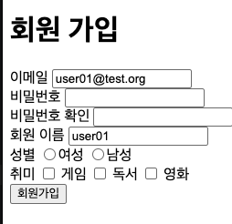
<br>
<br>

```html
<!-- radio, checkbox에서 checked 속성 사용-->
이메일  <input type="text" name="email" value="user01@test.org" /> <br />
비밀번호 <input type="password" name="password" /> <br />
비밀번호 확인 <input type="password" name="confirm_password" /> <br />
회원 이름 <input type="'text" name="user_name" value="user01" /> <br />
성별 <input type="radio" name="gender" value="FEMALE" checked />여성
    <input type="radio" name="gender" value="MALE" />남성 <br />
취미 <input type="checkbox" name="hobby" value="GAME" checked /> 게임
    <input type="checkbox" name="hobby" value="READ" /> 독서
    <input type="checkbox" name="hobby" value="MOVIE" checked /> 영화
<br />
<button type="submit">회원가입</button>
```

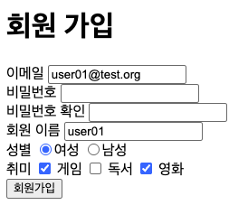
<br>
<br>

```html
<!-- label 활용 -->
성별
<label>
  <input type="radio" name="gender" value="FEMALE" checked />여성
  <input type="radio" name="gender" value="MALE" />남성
</label>
<br />
취미
<input type="checkbox" id="hobby_game" name="hobby" value="GAME" checked />
<label for="hobby_game">게임</label>
<input type="checkbox" id="hobby_read" name="hobby" value="READ" />
<label for="hobby_read">독서</label>
<input type="checkbox" id="hobby_movie" name="hobby" value="MOVIE" checked />
<label for="hobby_movie">영화</label>
<br />
<button type="submit">회원가입</button>
```

```html
<!-- textarea / placeholder 활용-->
자기소개
<textarea
  name="introduction"
  rows="5"
  cols="100"
  placeholder="두 줄 이상 입력하세요"
></textarea
>"
```

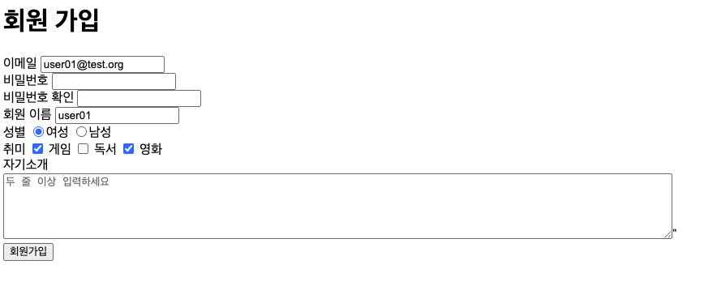
<br>
<br>

```html
<!-- select 태그 -->
태어난 년도
<select name="birth_year">
  <option value="2020">2020</option>
  <option value="2019">2019</option>
  <option value="2018">2018</option>
  <option value="2017">2017</option>
  <option value="2016">2016</option>
</select>
```

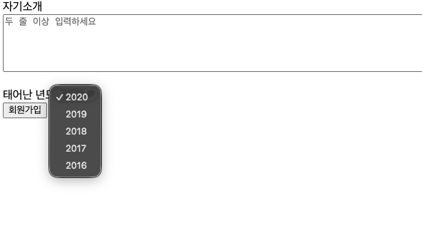
<br>
<br>

```html
<body>
  <ul>
    <li>짜장면</li>
    <li>짬뽕</li>
    <li>군만두</li>
  </ul>

  <ol>
    <li>소렌토</li>
    <li>팰리세이드</li>
    <li>모하비</li>
  </ol>

  <dl>
    <dt>상품명</dt>
    <dd>아이폰 Duo</dd>
  </dl>
  <dl>
    <dt>판매가</dt>
    <dd>3,290,000원</dd>
  </dl>

  <table>
    <thead>
      <tr>
        <th>번호</th>
        <th>이름</th>
        <th>국어</th>
        <th>수학</th>
        <th>영어</th>
      </tr>
    </thead>
    <tbody>
      <tr>
        <td>1</td>
        <td>K</td>
        <td>90</td>
        <td>90</td>
        <td>90</td>
      </tr>
      <tr>
        <td>2</td>
        <td>L</td>
        <td>80</td>
        <td>80</td>
        <td>80</td>
      </tr>
    </tbody>
  </table>

  <br />
  
  <br />
  <br />
  <video
    src="https://www.w3schools.com/html/mov_bbb.mp4"
    controls
    muted
    loop
    poster="https://picsum.photos/400/225"
    width="400"
  >
    최신 브라우저를 이용해 주세요.
  </video>
</body>
```

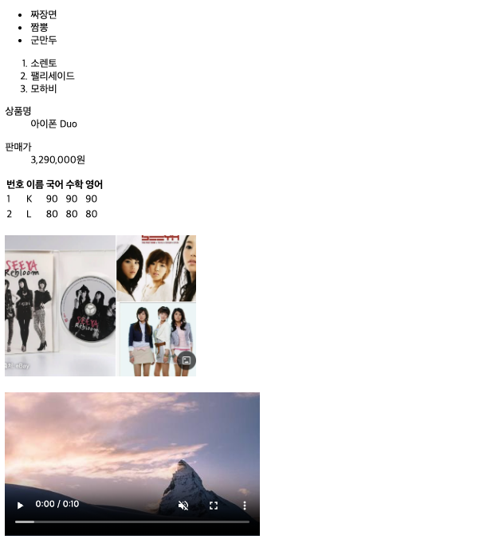
<br>
<br>

# 1-3

### 시멘틱 태그
- 의미를 가지고 있는 태그
  - form, table, video, nav
- 비시멘틱 태그
  - div, span

#### 필요한 이유
- 검색 엔진 최적화
- 웹 접근성
- 코드 가독성 향상

레이아웃 구성 태그
- header  : 상단 공통 영역
- footer  : 하단 공통 영역
- main    : 본문, 하나만 정의
- section : 내용 구분
- article : 섹션별 내용
- nav     : 주 메뉴
- aside : 왼쪽, 오른쪽 영역

```html
<!doctype html>
<html lang="en">
  <head>
    <meta charset="UTF-8" />
    <meta name="viewport" content="width=device-width, initial-scale=1.0" />
    <title>Document</title>
  </head>
  <body>
    <header>
      <a href=".."></a>
      <form method="get">검색 부분 정의</form>

      <nav>
        <a href="#">메뉴1</a>
        <a href="#">메뉴2</a>
        <a href="#">메뉴3</a>
        <a href="#">메뉴4</a>
      </nav>
    </header>

    <main>
      <section>
        <article>....</article>
        <article>....</article>
      </section>

      <section>
        <article>....</article>
        <article>....</article>
      </section>
    </main>

    <aside>숨김 왼쪽 더보기 메뉴</aside>

    <footer>사이트 공통 하단</footer>
  </body>
</html>
```

# 2-1
### CSS ( Cascading Style Sheet )
- HTML 문서에 정의된 요소들의 시각적 스타일을 지정하는 스타일시트 언어
- 주석 : /* */

### 스타일 적용 기본 구조
```css
선택자 {
  속성: 값,
  속성: 값,
  ...
}
```

### 적용방법
- 인라인 스타일
  - 태그의 style 속성에 직접 적용
- 내부 스타일 시트
  - style 태그 안에 스타일을 정의
- 외부 스타일 시트 ( 주 사용 )
  - css 파일을 따로 생성 후 연동 `<link> ... `

```html
<!-- 인라인 스타일 -->
<ul>
  <li>사과</li>
  <li>배</li>
  <li style="color: orange; background-color:black; ">감</li>
  <li>귤</li>
  </ul>
```

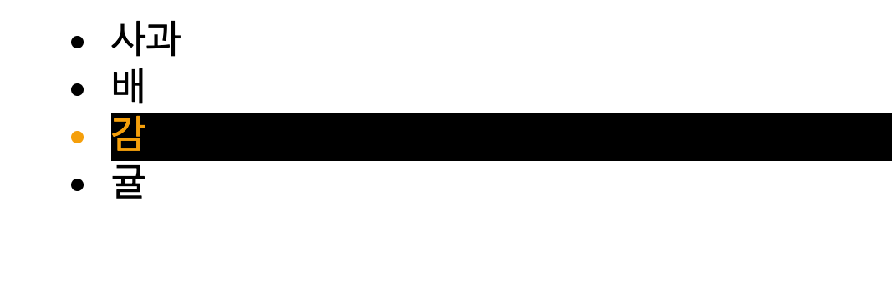
<br><br>


```html
<!-- 내부 스타일 -->
    <style>
        li {
            color: blue;
            background-color : gray;
        }
    </style>
    <ul>
        <li>사과</li>
        <li>배</li>
        <li style="color: orange; background-color:black; ">감</li>
        <li>귤</li>
    </ul>
```

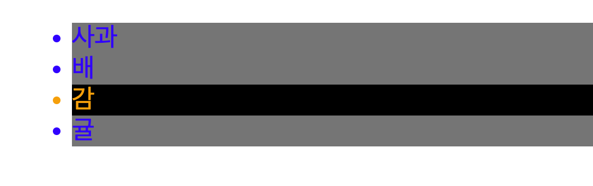
<br><br>


```css
/* style.css */
body {
    background-color : green ;
}
```
```html
<!-- css 파일 불러오기-->
<head>
    <link rel="stylesheet" type="text/css" href="css/style.css" />
</head>
<body>
<style>
    li {
        color: blue;
        background-color : gray;
    }
</style>
<ul>
    <li>사과</li>
    <li>배</li>
    <li style="color: orange; background-color:black; ">감</li>
    <li>귤</li>
</ul> 
```
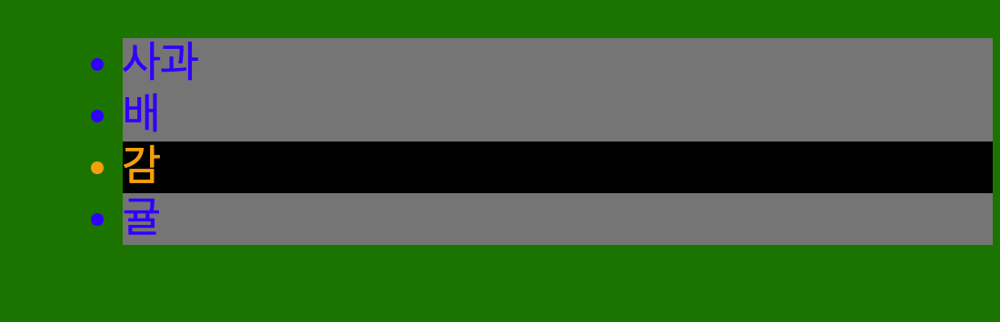
<br><br>


### CSS 선택자
- 전체 선택자
  - *
- 태그 선택자 
  - 태그명 사용
- 클래스 선택자
  - 여러개 요소 선택
  - .클래스명 => 방식으로 접근
  - 복수 선언, 복수 지정 가능
- 아이디 선택자
  - `# 아이디명`
  - 아이디명은 하나만 지정 가능, 중복 안됨

### 스타일 적용 우선 순위
- 선택자의 범위가 넓을수록 우선순위가 낮으며, 좁을수록 우선순위가 높다.
- 태그 < 클래스 < 아이디 < style 속성 
- 태그 = 공통 스타일 , 클래스 = 세부 스타일 설정으로 가장 많이 사용

* 우선순위 강제 적용 : !important 


```html
    <style>
        li {
            background-color: gray ;
        }
        .Kia {
            background: orange ;
        }
        .discontinued {
            font-style: italic;
        }
        #sorento {
            background: red;
        }
        .kia2{
            background: skyblue;
        }
    </style>
    <ul>
        <li class="Kia" id="sorento">소렌토</li>
        <li>팰리세이드</li>
        <li class="Kia kia2 discontinued">모하비</li>
        <li>트레일블레이져</li>
        <li>카이엔</li>
    </ul>
```

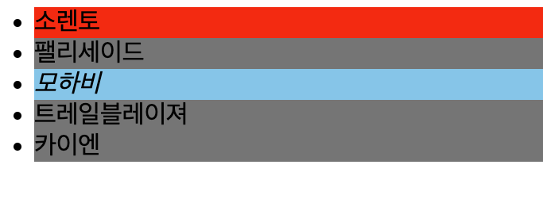
<br>
<br>
<br>


### 복합 관계 선택자
- 하위 선택자 ( 조상 - 자손 )
- 자식 선택자 ( 부모 > 자식 )
```html
<style>
        /* 조상 - 자손 선택자 */
        ol span{
            background : orange;
        }
        /* 부모 > 자녀 선택자 */
        li div > span{
            background: skyblue;
        }
    </style>
    <ul>
        <li>menu1</li>
        <li>menu2</li>
        <li><span>menu3</span></li>
        <li>menu4
            <ol>
                <li>
                    <div>
                        <span>sub menu1</span>
                    </div>
                </li>
                <li><span>sub menu2</span></li>
                <li>sub menu3</li>
            </ol>
        </li>
        <li>menu5</li>
    </ul>
```
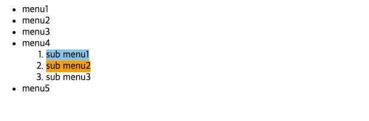

- 일반 형제 선택자 ( 형 ~ 동생 )
  - 형을 기준으로 기준 아래에 정의된 요소
- 인접 형제 선택자 ( 형 + 동생 )
  - 형을 기준으로 바로 아래 요소 1개

```html
    <style>
        .menu5 ~ li {
            background: magenta;
        }
        .menu5 + li {
            background: green;
        }
    </style>
    <ul>
        <li>메뉴1</li>
        <li>메뉴2</li>
        <li>메뉴3</li>
        <li>메뉴4</li>
        <li class="menu5">메뉴5</li>
        <li>메뉴6</li>
        <li>메뉴7</li>
        <li>메뉴8</li>
        <li>메뉴9</li>
        <li>메뉴10</li>
    </ul>
```

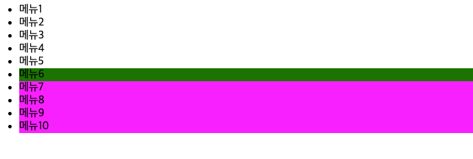