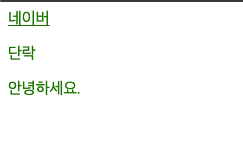
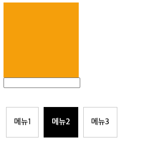
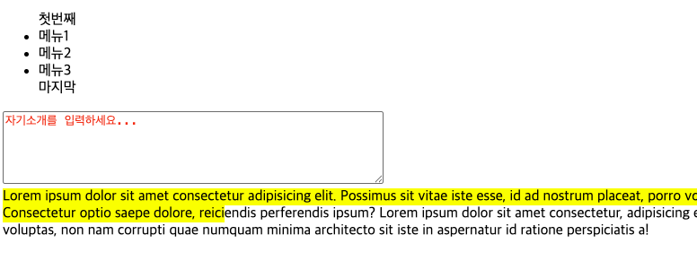
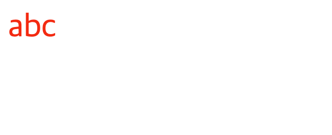
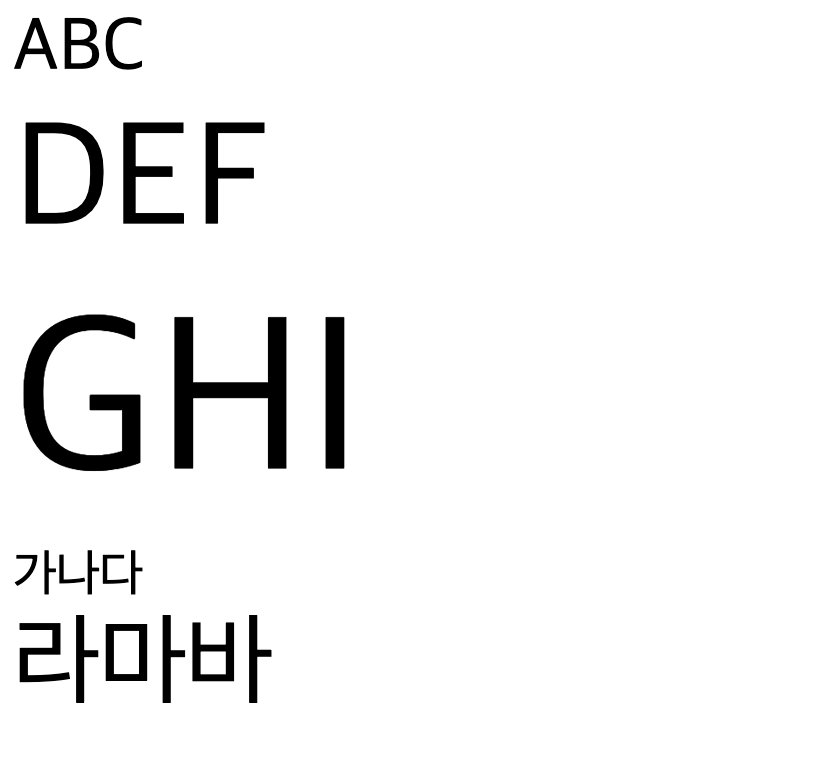

# 2-1

### 복합 관계 선택자

- 일반 형제 선택자 ( 형 ~ 동생 )
  - 형 기준으로 뒤에 오는 모든 요소
- 인접 형제 선택자 ( 형 + 동생 )
  - 형 기준 바로 옆 동생 선택
- 그룹 선택자 (, )

```html
    <style>
        a, p, .greeting{
            color: green;
        }
        span.greeting{
            color: orange
        }
        input[type]{
            border:3px;
        }
    </style>
    <a href="#">네이버</a>
    <p>단락</p>
    <div class="greeting">안녕하세요.</div>
    <span class="greeting">반갑습니다.</span
```


#### 속성 선택자

- [속성명] : 지정된 속성이 존재하면 선택
  - 다른 선택자와 조합을 통한 선택 주로 사용
  - 선택자[속성명]
- [속성명 = "값"] : 속성의 값이 일치하는 요소 선택
- [속성명^ = "값"] : 속성의 값으로 시작하는 요소 선택
- [속성명$ = "값"] : 속성의 값으로 끝나는 요소 선택
- [속성명* = "값"] : 속성의 값이 포함되어 있는 요소 선택

```html
<style>
  /* 그룹 선택자 */
  a,
  p,
  .greeting {
    color: green;
  }
  span.greeting {
    color: orange;
  }
  /* 속성 선택자 : 속성명*/
  input[type] {
    border: 3px solid red;
  }
  /* 속성 선택자 : 속성값 */
  input[type="number"] {
    border-color: blue;
  }
  a[href^="tel"] {
    background: gray;
  }
  a[href$="com"] {
    background: olive;
  }
  a[href$=".net"] {
    background: yellow;
  }
</style>
<a href="https://www.naver.com">네이버</a>
<a href="https://daum.net">다음</a>
<a href="tel:010-1000-1000">전화 걸기</a>
<p>단락</p>
<div class="greeting">안녕하세요.</div>
<span class="greeting">반갑습니다.</span>

<hr />
<input type="text" />
<input type="number" />
```


#### 가상 클래스 선택자

- 선택자 : 상태, 조건, 위치

- 가상 클래스 : 위치
  - 자식 요소는 타입이 달라도 선택 가능
    - :first-child = 첫번째 자식 요소
    - :last-child = 마지막 자식 요소
    - :nth-child(숫자) = 숫자 위치에 있는 요소 선택
    - :nth-child(수식) = 수식에 해당하는 요소 선택
  - 같은 타입들만 선택
    - :first-of-type
    - :last-of-type
    - :nth-of-type
    - :only-of-type : 하위 요소가 한 개만 있는 경우

- 조건 선택자
  - not(선택자) : 선택자
    - 지정된 선택자가 아닌 요소 선택
  - is(선택자1, 선택자2, ...) 자식요소
    - 상위 요소 그룹 -> 하위 요소를 선택

- 상태 선택자
  - :hover = 마우스가 요소 위에 올라간 상태
  - :focus = 특정 요소가 선택 되는 경우, 커서가 있는 상태
  - :blur = 특정 요소가 선택 된 후, 커서가 없어지는 상태
  - :checked = 체크 된 상태
  - :read-only = 읽기 전용 상태
  - :disabled = 비활성 상태 <-> :enabled

```html
<style>
        .box {
            width: 150px;
            height: 150px;
            background: orange;
            transition: all 0.5s;
        }
        .box:hover {
            width: 300px;
            height: 300px;
            rotate: 270deg; 
        }

        .text:focus {
            background: yellow;
        }
        .tab-group{
            width:400px;
            display:flex;
            align-items: center;
        }
        .tab-group input[type='radio'] {
            display:none;
        }

        .tab-group label{
            border: 1px solid #ccc;
            padding: 20px 15px;
            margin: 0 5px;
        }
        .tab-group input[type='radio']:checked + label {
            border-color:black;
            background: black;
            color:white;
        }
    </style>
    <div class="box"></div>
    <input type="text" class="text">
    <br>
    <br>
    <br>
    <div class="tab-group">
        <input type="radio" name="tab" value="menu1" id="tab-1">
        <label for="tab-1">메뉴1</label>
        <input type="radio" name="tab" value="menu2" id="tab-2">
        <label for="tab-2">메뉴2</label>
        <input type="radio" name="tab" value="menu3" id="tab-3">
        <label for="tab-3">메뉴3</label>
    </div>
```


#### 요소 추가 선택자
- 선택자::___
  - ::before = 자식의 첫번째 요소로 추가
  - ::after = 자식의 마지막 요소로 추가
    - 반드시 추가할 내용이 있어야 노출 됨 / CONTENT 필수
    - inline 속성
  - ::placeholder : 가이드라인 텍스트
  - ::selection : 선택된 영역

```html
<style>
        ul::before{
            content: '첫번째';
        }
        ul::after{
            content: '마지막';
        }
        /* 기본값 색상 변경 */
        textarea::placeholder{
            color:red;
        }
        /* 드래그 색상 변경 */
        .text::selection{
            background:yellow;
        }
    </style>
    <ul>
        <li>메뉴1</li>
        <li>메뉴2</li>
        <li>메뉴3</li>
    </ul>

    <textarea placeholder="자기소개를 입력하세요..." rows="5" cols="50"></textarea>
    <div class="text">
        Lorem ipsum dolor sit amet consectetur adipisicing elit. Possimus sit vitae iste esse, id ad nostrum placeat, porro voluptates, iure et officia consequuntur? Consectetur optio saepe dolore, reiciendis perferendis ipsum?
    </div>
```


### CSS 속성
- 텍스트 및 폰트 속성
  - color : 폰트 색상
    - 색상명, rgb(255,255,255), Hexcode, rgba(255,255,255,0~1)
  - font-size : 폰트 크기 조정
    - 절대 크기
      - px, pt(인쇄 기준), 
    - 상대 크기
      - em  : 폰트 사이즈가 지정된 상위 태그
      - rem : 가장 상위 태그의 글자 사이즈가 기준, html 태그에 설정된 px


```html

<style>
    .text1{
        /* rgb함수, 헥사코드 */
        /* color: rgb(255, 0, 0); */
        /* color: #ff0000 */
        color : #f00;
    }
</style>
<div class="text1">abc</div>
```


```html
<!-- em, rem -->
<style>
    html{
        font-size:30px; /* 1rem = 13px*/
    }
    .text1 {
        font-size: 1rem;
    }
    .text2 {
        font-size: 2rem;
    }
    .text3 {
        font-size: 3rem;
    }
    .text-group{
        font-size: 20px; /* 20px -> 1em */ 
    }
    .text4 {
        font-size: 1em;
    }
    .text5{
        font-size: 2em; /* 40px */
    }
</style>
<div class="text1">ABC</div>
<div class="text2">DEF</div>
<div class="text3">GHI</div>

<div class="text-group">
    <div class="text4">가나다</div>
    <div class="text5">라마바</div>
</div>
```


### CSS 박스 모델
- content : 내용이 존재하는 위치
  - 기본 설정으로 너비와 높이의 기준 (width, height)
  - 실질적인 박스 모델의 사이즈는 content + padding + border
- padding : 내부 여백, border 안쪽
- border : 외곽선
- margin : 외부 여백, border 바깥쪽

- box-sizing 속성을 사용하여 너비와 높이의 기준
  - content-box ( default ) : 내용 영역(content) 기준
  - border-box : 외곽선 기준, 외곽선을 기준으로 박스 모델의 사이즈를 지정하기 때문에, padding의 사이즈가 변하거나, border의 사이즈가 변하면 내용 영역의 사이즈도 변한다.

### 외부 여백 ( margin )
- block 속성 태그 : 제한 X ( 상하좌우 가능 )
  - 여백 중첩시의 더 높은 값의 여백만 적용
  - margin : 100px auto; => 상하 100px, 좌우는 균등하게 분배함
- inline 속성 태그 : 제한 O ( 좌우 만 가능 )

- margin 옵션 개수 차이
  - 1 : 전체
  - 2 : 상하 좌우
  - 3 : 상 좌우 하
  - 4 : 상 우 하 좌

- margin,padding 방향 지정 옵션
    - top, bottom, left, right

# Display
- block -> block이 아닌 속성을 block으로 변경
- inline -> inline이 아닌 속성을 inline으로 변경

```html
<style>
    .box {
        width: 150px;
        height: 150px;
        background : orange;
        margin: 100px;
    }
    .box:nth-of-type(2){
        background: blue;
    }
    .box:nth-of-type(3){
        background: green;
    }
    .box:nth-of-type(4){
        background: red
    }
    div.box{
        display:inline;
    }
    span.box{
        display:block;
    }
</style>
<div class="box">A</div>
<div class="box">B</div>
<span class="box">C</span>
<span class="box">D</span>
```


- inline-block : 줄개행 X, 너비 높이 지정 가능, 외부 여백 전체 가능
  - 여백의 중첩이 일어나지 않으며, 독립적인 여백을 유지함

```html
<style>
    .box {
        width: 150px;
        height: 150px;
        background : orange;
        margin: 100px;
    }
    .box:nth-of-type(2){
        background: blue;
    }
    .box:nth-of-type(3){
        background: green;
    }
    .box:nth-of-type(4){
        background: red
    }
    div.box, span.box{
        display:inline-block;
    }
</style>
<div class="box">A</div>
<div class="box">B</div>
<span class="box">C</span>
<span class="box">D</span>

```

- none : 감추기 
  - visibility : visible(기본값), hidden
  - visibility는 영역을 유지하며 숨김, none은 영역 자체를 숨김
```html
<!-- display: none -->
<style>
    .box {
        width: 150px;
        height: 150px;
        background : orange;
        margin: 100px;
    }
    .box2{
        background: blue;
    }
    .box:nth-of-type(3){
        background: green;
    }
    .box:nth-of-type(4){
        background: red;
    }
    div.box, span.box{
        display:inline-block;
    }
    .box2{
        display: none;
    }
</style>
<div class="box">A</div>
<div class="box2">B</div>
<span class="box">C</span>
<span class="box">D</span>
```

```html
<!-- visibility -->
<style>
    .box {
        width: 150px;
        height: 150px;
        background : orange;
        margin: 100px;
    }
    .box2{
        background: blue;
    }
    .box:nth-of-type(3){
        background: green;
    }
    .box:nth-of-type(4){
        background: red
    }
    div.box, span.box{
        display:inline-block;
    }
    
    .box2{
        visibility: hidden;
    }
</style>
<div class="box">A</div>
<div class="box2">B</div>
<span class="box">C</span>
<span class="box">D</span>
```


# flexbox ( 1차원 정렬 )
- 설정 : 부모 요소 -> display: flex;
- 적용 : 자식 요소 
- 정렬 방향 
  - flex-direction : row ( 기본값 ) 좌 -> 우로 정렬
                   : row-reverse  우 -> 좌로 정렬
                   : column 상 -> 하로 정렬
                   : column-reverse 하 -> 상으로 정렬
- 정렬 속성 제어 : justify-content
  - flex-start : 왼쪽 정렬
  - flex-end : 오른쪽 정렬
  - center : 가운데
  - space-between : 좌,우측 요소 1개를 양끝에 배치, 나머지 요소를 균등한 여백 부여
  - space-around : 요소 1개당 양쪽에 공백을 부여함.
  - space-evenly : 각 요소 사이의 공백이 모두 동일하게 부여
- align-items : 자식 요소들의 위치, 배치 
  - stretch : 부모의 높이에 맞게 늘려서 맞춤
  - flex-start : 위쪽 배치
  - flex-end : 아래쪽 배치
  - center : 가운데 배치


```html
<!-- display: flex 적용-->
<style>
    body{
        margin: 0;
    }
    ul{
        margin:0;
        padding: 0;
        list-style-type: none; 
        height:100px;
    }
    ul li {
        min-width: 100px; 
    }
    li:nth-of-type(1){
        background: red;
    }
    li:nth-of-type(2){
        background: blue;
    }
    li:nth-of-type(3){
        background: green;
    }
    .flex1{
        display : flex;
    }
</style>
<ul class="flex1">
    <li>A</li>
    <li>B</li>
    <li>C</li>
</ul>
```

```html
<!-- flex-direction을 활용한 우 -> 좌 정렬 -->
<style>
    body{
        margin: 0;
    }
    ul{
        margin:0;
        padding: 0;
        list-style-type: none; 
        height:100px;
    }
    ul li {
        min-width: 100px;
        
    }
    li:nth-of-type(1){
        background: red;
    }
    li:nth-of-type(2){
        background: blue;
    }
    li:nth-of-type(3){
        background: green;
    }
    .flex1{
        display : flex;
        flex-direction: row-reverse;
    }
</style>
<ul class="flex1">
    <li>A</li>
    <li>B</li>
    <li>C</li>
</ul>

```

```html
<!-- justify-content를 활용한 리스트 정렬 -->
<style>
    body{
        margin: 0;
    }
    ul{
        margin:0;
        padding: 0;
        list-style-type: none; 
        height:100px;
    }
    ul li {
        min-width: 100px;
        
    }
    li:nth-of-type(1){
        background: red;
    }
    li:nth-of-type(2){
        background: blue;
    }
    li:nth-of-type(3){
        background: green;
    }
    .flex1{
        display : flex;
    }
    .flex2{
        display : flex;
        justify-content: center;
    }
    .flex3{
        display : flex;
        justify-content: flex-end;
    } 
</style>
<h1>start</h1>
<ul class="flex1">
    <li>A</li>
    <li>B</li>
    <li>C</li>
</ul>
<h1>center</h1>
<ul class="flex2">
    <li>A</li>
    <li>B</li>
    <li>C</li>
</ul>
<h1>end</h1>
<ul class="flex3">
    <li>A</li>
    <li>B</li>
    <li>C</li>
</ul>

```

```html
<!-- space-between, around, evenly 적용 -->
<style>
    body{
        margin: 0;
    }
    ul{
        margin:0;
        padding: 0;
        list-style-type: none; 
        height:100px;
    }
    ul li {
        min-width: 100px;
        
    }
    li:nth-of-type(1){
        background: red;
    }
    li:nth-of-type(2){
        background: blue;
    }
    li:nth-of-type(3){
        background: green;
    }
    .flex4{
        display: flex;
        justify-content: space-between;
    }
    .flex5{
        display: flex;
        justify-content: space-around;
    }
    .flex6{
        display: flex;
        justify-content: space-evenly;
    }
    
</style>
<h1>space-between</h1>
<ul class="flex4">
    <li>A</li>
    <li>B</li>
    <li>C</li>
</ul>
<h1>space-around</h1>
<ul class="flex5">
    <li>A</li>
    <li>B</li>
    <li>C</li>
</ul>
<h1>space-evenly</h1>
<ul class="flex6">
    <li>A</li>
    <li>B</li>
    <li>C</li>
</ul>
```

```html
<!-- align-items : flex-start, flex-end, center -->
<style>
    body{
        margin: 0;
    }
    ul{
        margin:0;
        padding: 0;
        list-style-type: none; 
        height:100px;
    }
    ul li {
        min-width: 100px;
        
    }
    li:nth-of-type(1){
        background: red;
    }
    li:nth-of-type(2){
        background: blue;
    }
    li:nth-of-type(3){
        background: green;
    }
    .flex7{
        display: flex;
        justify-content: space-evenly;
        align-items: flex-start;
    }
    .flex8{
        display: flex;
        justify-content: space-evenly;
        align-items: flex-end;
    }
    .flex9{
        display: flex;
        justify-content: space-evenly;
        align-items: center;
    }
    
</style>
<h1>align-items: flex-start</h1>
<ul class="flex7">
    <li>A</li>
    <li>B</li>
    <li>C</li>
</ul>
<h1>align-items: flex-end</h1>
<ul class="flex8">
    <li>A</li>
    <li>B</li>
    <li>C</li>
</ul>
<h1>align-items: center</h1>
<ul class="flex9">
    <li>A</li>
    <li>B</li>
    <li>C</li>
</ul>
```


우측 마진 주고 justify-content로 우측 정렬
flex-direction으로 세로 정렬 하고
상하 정렬할거는 각자 다른 클래스
그 위에 header 클래스로 모으고
