# DQ REVIEW

- HTML 문서에 CSS 적용하는 3가지 방식
- 인라인 스타일
- 내부 style 태그
- 외부 css 파일 연동 [ 주 사용 ]
- 부모 요소에 적용된 스타일 속성이 별도 선언 없이 자식 요소에게 물려 내려오는 현상
- 상속, cascading
- css 명시도 가중치가 높은 순
  태그 선택자 < 클래스 선택자 < 아이디 선택자 < 인라인 스타일
- 콜론 두개 (::)를 사용하여 실제 존재하지 않는 가상의 요소를 css를 통해 동적으로 삽입하는 문법
  - 가상 요소

# CSS

## flex-direction

```html
<style>
  body {
    margin: 0;
    padding: 10%;
  }
  ul {
    margin: 0;
    padding: 0;
    list-style: none;
    border: 1px solid #000;
    color: white;
  }
  li:nth-of-type(1) {
    background: red;
  }
  li:nth-of-type(2) {
    background: blue;
  }
  li:nth-of-type(3) {
    background: gray;
  }
  .flex1 {
    display: flex;
  }
  .flex2 {
    display: flex;
    flex-direction: row-reverse;
  }
  .flex3 {
    display: flex;
    flex-direction: column;
  }
  .flex4 {
    display: flex;
    flex-direction: column-reverse;
  }
</style>

<h3>flex-direction : row ( 좌 -> 우 )</h3>
<ul class="flex1">
  <li>메뉴1</li>
  <li>메뉴2</li>
  <li>메뉴3</li>
</ul>

<h3>flex-direction : row-reverse ( 우 -> 좌 )</h3>
<ul class="flex2">
  <li>메뉴1</li>
  <li>메뉴2</li>
  <li>메뉴3</li>
</ul>

<h3>flex-direction : column ( 상 -> 하 )</h3>
<ul class="flex3">
  <li>메뉴1</li>
  <li>메뉴2</li>
  <li>메뉴3</li>
</ul>

<h3>flex-direction : column-reverse ( 하 -> 상 )</h3>
<ul class="flex4">
  <li>메뉴1</li>
  <li>메뉴2</li>
  <li>메뉴3</li>
</ul>
```

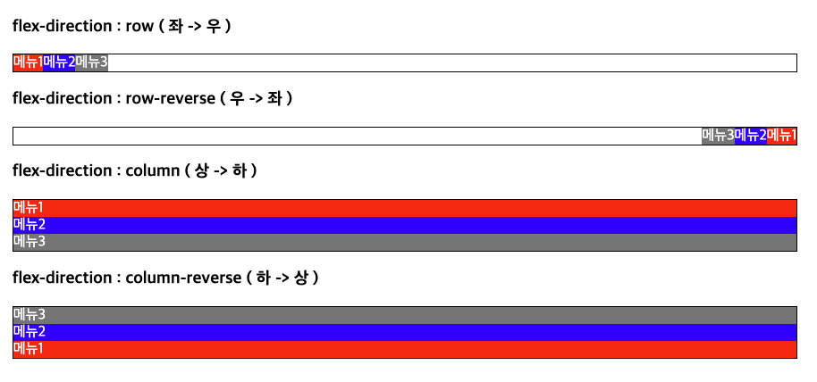
<br><br>

## justify-content

```html
<style>
  body {
    margin: 0;
    padding: 0 10%;
  }
  ul {
    margin: 0;
    padding: 0;
    list-style: none;
    border: 1px solid #000;
  }
  li {
    min-width: 100px;
    min-height: 100px;
  }

  li:nth-of-type(1) {
    background: red;
  }
  li:nth-of-type(2) {
    background: blue;
  }
  li:nth-of-type(3) {
    background: gray;
  }

  .flex1 {
    display: flex;
    justify-content: flex-start;
  }
  .flex2 {
    display: flex;
    justify-content: flex-end;
  }
  .flex3 {
    display: flex;
    justify-content: center;
  }
</style>

<h3>justify-content: flex-start(기본값)</h3>
<ul class="flex1">
  <li>메뉴1</li>
  <li>메뉴2</li>
  <li>메뉴3</li>
</ul>

<h3>justify-content: flex-end</h3>
<ul class="flex2">
  <li>메뉴1</li>
  <li>메뉴2</li>
  <li>메뉴3</li>
</ul>

<h3>justify-content: center</h3>
<ul class="flex3">
  <li>메뉴1</li>
  <li>메뉴2</li>
  <li>메뉴3</li>
</ul>
```

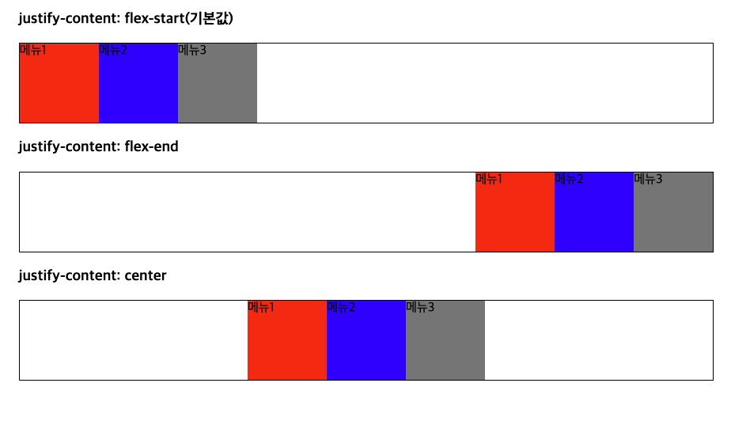
<br><br>

```html
<style>
  body {
    margin: 0;
    padding: 0 10%;
  }
  ul {
    margin: 0;
    padding: 0;
    list-style: none;
    border: 1px solid #000;
  }
  li {
    min-width: 100px;
    min-height: 100px;
  }
  li:nth-of-type(1) {
    background: red;
  }
  li:nth-of-type(2) {
    background: blue;
  }
  li:nth-of-type(3) {
    background: gray;
  }
  .flex1 {
    display: flex;
    justify-content: space-between;
  }
  .flex2 {
    display: flex;
    justify-content: space-around;
  }
  .flex3 {
    display: flex;
    justify-content: space-evenly;
  }
</style>

<h3>justify-content: space-between</h3>
<ul class="flex1">
  <li>메뉴1</li>
  <li>메뉴2</li>
  <li>메뉴3</li>
</ul>

<h3>justify-content: space-around</h3>
<ul class="flex2">
  <li>메뉴1</li>
  <li>메뉴2</li>
  <li>메뉴3</li>
</ul>

<h3>justify-content: space-evenly</h3>
<ul class="flex3">
  <li>메뉴1</li>
  <li>메뉴2</li>
  <li>메뉴3</li>
</ul>
```

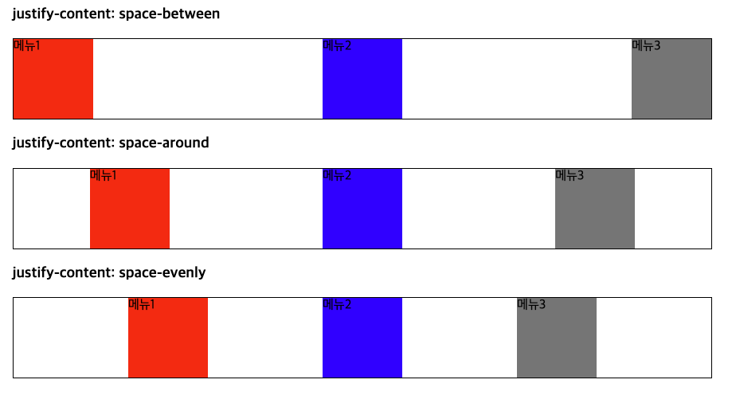

<br><br>

## align-items : 요소의 배치

```html
<style>
  body {
    margin: 0;
    padding: 10%;
  }
  ul {
    margin: 0;
    padding: 0;
    list-style: none;
    border: 1px solid #000;
    color: white;
    height: 100px;
  }
  li {
    min-width: 100px;
  }
  li:nth-of-type(1) {
    background: red;
  }
  li:nth-of-type(2) {
    background: blue;
  }
  li:nth-of-type(3) {
    background: gray;
  }
  .flex1 {
    display: flex;
    align-items: stretch;
  }
  .flex2 {
    display: flex;
    align-items: flex-start;
  }
  .flex3 {
    display: flex;
    align-items: flex-end;
  }
  .flex4 {
    display: flex;
    align-items: center;
  }
</style>

<h3>align-items : strecth (기본값)</h3>
<ul class="flex1">
  <li>메뉴1</li>
  <li>메뉴2</li>
  <li>메뉴3</li>
</ul>
<h3>align-items : flex-start</h3>
<ul class="flex2">
  <li>메뉴1</li>
  <li>메뉴2</li>
  <li>메뉴3</li>
</ul>
<h3>align-items : flex-end</h3>
<ul class="flex3">
  <li>메뉴1</li>
  <li>메뉴2</li>
  <li>메뉴3</li>
</ul>
<h3>align-items : center</h3>
<ul class="flex4">
  <li>메뉴1</li>
  <li>메뉴2</li>
  <li>메뉴3</li>
</ul>
```

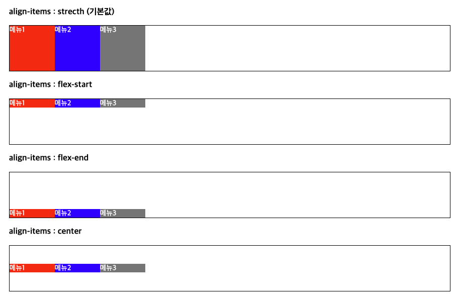

## flex-grow

1. 자식 요소 적용
2. 남아 있는 공백을 차지할 비율 설정
3. 값을 지정하는 만큼 비율에서 가져감
4. 요소 크기에 대한 등분이 아닌, 남아있는 공백에 대한 구분이기 때문에, 요소의 길이가 다르면 지정되는 크기가 달라짐

```html
<style>
  body {
    margin: 0;
    padding: 10%;
  }
  ul {
    margin: 0;
    padding: 0;
    list-style: none;
    border: 1px solid #000;
    color: white;
    height: 100px;
  }
  li {
    min-width: 100px;
  }

  li:nth-of-type(1) {
    background: red;
    flex-grow: 1;
  }
  li:nth-of-type(2) {
    background: blue;
    flex-grow: 1;
  }
  li:nth-of-type(3) {
    background: gray;
    flex-grow: 1;
  }

  .flex1 {
    display: flex;
    align-items: stretch;
  }
</style>
<h3></h3>
<ul class="flex1">
  <li>메뉴1</li>
  <li>메뉴2</li>
  <li>메뉴3</li>
</ul>
```

### 1 : 0 : 0

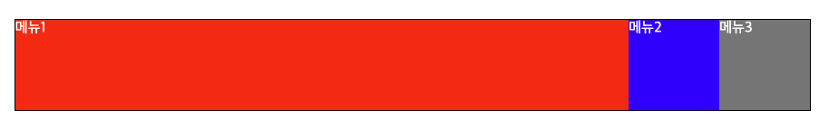

### 1 : 1 : 0

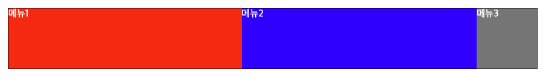

### 1 : 1 : 1

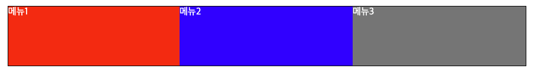

### 1 : 1 : 1 - 요소의 길이에 따라 총 길이가 달라짐

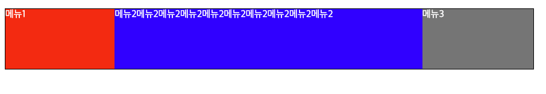

## flex-shrink

- 부모 요소의 공간이 부족할 때 자식 요소의 크기 줄임 비율
- 비율 가중치
- 0 : 요소를 축소 하지 않음
- flex-basis : 요소의 기본사이즈 ( auto : 기본값 )

## flex-wrap

- wrap : 부모 요소의 너비가 부족하면 다음칸에 개행
- nowrap (기본값) - 개행 X

# Grid : 2차원 격자 레이아웃

- grid-template-columns
  - px : 고정된 크기
    - 150px 150px 300px; -> column 3개
  - fr : 남은 공간에 대한 비율
    - 150px 1fr 2fr; -> 첫번째 150px, 두번째 1/3 비율, 세번째 2/3 비율
  - repeat(컬럼 갯수, 사이즈) -> 같은 사이즈의 지정된 컬럼 갯수 만큼 설정
- grid-template-rows

```html
<style>
  .box1 {
    display: grid;
    /* grid-template-columns: 150px 150px 300px; */
    grid-template-columns: 150px 1fr 2fr;
  }
  .card {
    background-color: skyblue;
    height: 100px;
  }
</style>

<div class="box1">
  <div class="card">A</div>
  <div class="card">B</div>
  <div class="card">C</div>
  <div class="card">D</div>
  <div class="card">E</div>
  <div class="card">F</div>
</div>
```

#### px

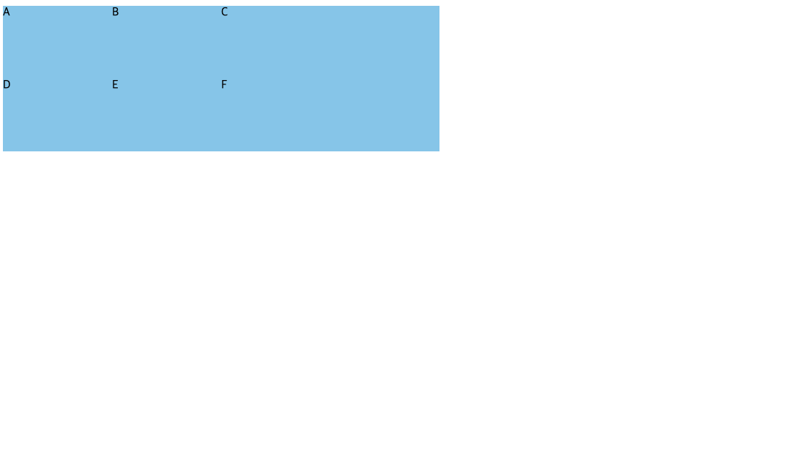

#### fr

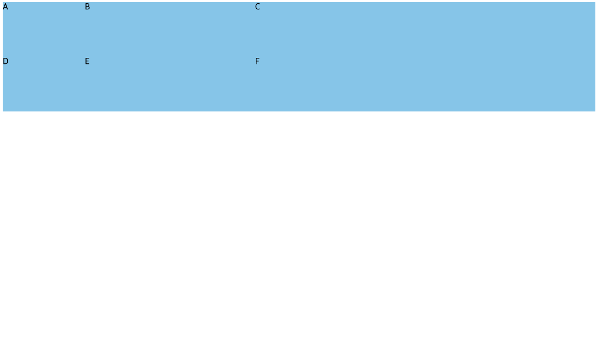

#### repeat(3, 1fr)

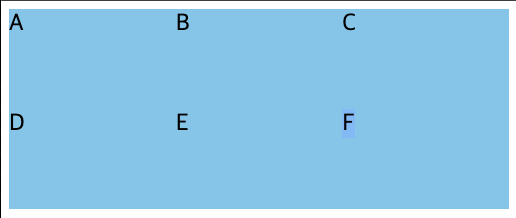

### gap

- row-gqp : 행별 여백
- column-gap : 열별 여백
<hr>
- gap : 20px 10px; -> row column
- gap : 30px; -> row + column

```html
<style>
  .box1 {
    width: 500px;
    display: grid;
    grid-template-columns: repeat(3, 1fr);
    font-size: 1.5rem;
    /* row-gap: 20px;
      column-gap: 10px; */
    gap: 20px 10px;
  }
  .card {
    background-color: skyblue;
    height: 100px;
  }
</style>
<div class="box1">
  <div class="card">A</div>
  <div class="card">B</div>
  <div class="card">C</div>
  <div class="card">D</div>
  <div class="card">E</div>
  <div class="card">F</div>
</div>
```

### grid-column

- grid-column : 1 / 3; 1번열 부터 ~ 3번열까지
- grid-column : span 2; -> 열 2칸 차지

### grid-row

- grid-row : 1/3
- grid-row: span 2; -> 2개 행 차지

```html
<style>
  .box {
    display: grid;
    background: #ccc;
    grid-template-columns: repeat(3, 1fr);
    width: 600px;
    padding: 30px;
    gap: 15px;
  }
  .area {
    height: 100px;
    background: skyblue;
  }
  .area:nth-of-type(1) {
    grid-column: span 2;
  }
  .area:nth-of-type(2) {
    height: 100%;
    grid-row: span 2;
  }
</style>
<div class="box">
  <div class="area">영역1</div>
  <div class="area">영역2</div>
  <div class="area">영역3</div>
  <div class="area">영역4</div>
</div>
```

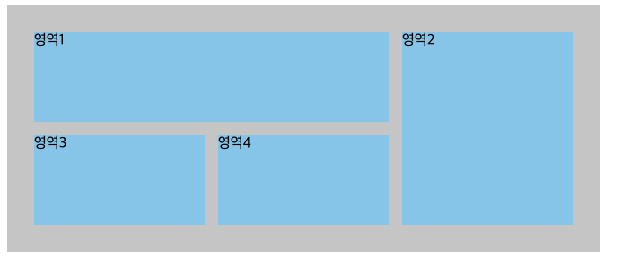

### place_items

- streatch( 기본값 )
- start ( 왼쪽 상단 )
- end ( 오른쪽 하단 )
- center ( 정가운데 )

```html
<style>
  .box1 {
    width: 500px;
    display: grid;
    grid-template-columns: repeat(3, 1fr);
    font-size: 1.5rem;
    gap: 20px 10px;
    place-items: center;
    background-color: skyblue;
  }
  .card {
    height: 100px;
  }
  .card span {
    border: 3px solid black;
    /* background: red; */
    color: black;
  }
</style>

<div class="box1">
  <div class="card"><span>A</span></div>
  <div class="card"><span>B</span></div>
  <div class="card"><span>C</span></div>
  <div class="card"><span>D</span></div>
  <div class="card"><span>E</span></div>
  <div class="card"><span>F</span></div>
</div>
```

#### palce_items : start

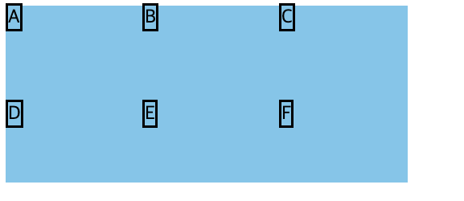

#### palce_items : end

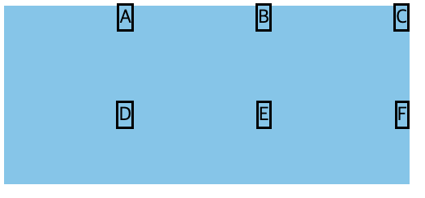

#### palce_items : center

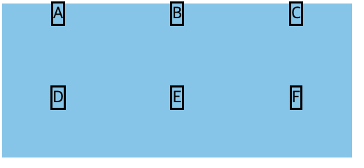

## 폰트

- color : 글 색상 ( 색상명, hexcode, rgb(), rgba())
- font-size : 글 크기 - 절대 크기, 상대크기 (em, rem)
- line-height : 행간 [ 기본값 1.2 ] -> 글자 높이 1, 20% 여백을 10 상단 / 10 하단으로 할당
  - 비율 : 1.5 <- 권장 사항 | % : 150% | px | em | rem
- letter-spacing : 자간
- word-spacing : 단어 사이 간격
- word-break : wrap / nowrap / break-all
- font-weight : 폰트 두께 지정
  - normal ( 기본값 ) - 400
  - bold ( 두껍게 ) - 700
  - 100 ~ 900 : 얇음 ~ 두꺼움 ==> 폰트 별로 지원하는 두께가 다름. ( 확인 필요 )
- text-align
  - 인라인 요소에 대한 정렬 -> 상위 블록 영역에서 지정해주어야 한다.
  - left ( 기본값 ) : 왼쪽 정렬
  - right : 오른쪽 정렬
  - center : 가운데 정렬
  - justify : 양쪽 정렬
- font-style :
  - normal ( 기본값 )
  - italic 기울임체
- text-decoration
  - -underline : 밑줄
  - line-through : 취소선
  - none : 기본값
- font-family : 글꼴
  - font-family : "폰트명", "대체폰트1", "대체폰트2"
    - ex) font-family:'Malgun Gothic', 'Apple Gothic', 'sans-serif';
  - 시스템 폰트 : OS 내에 설치되어 있는 폰트
  - 웹 폰트 : OS에 설치 상관 없이 동일하게 공유 가능한 폰트

```html
<!-- 원격 서버 폰트 로딩 -->
<style>
  @import url("https://fonts.googleapis.com/css2?family=Noto+Sans+KR:wght@100..90display=swap") * {
    font-family: "Noto Sans KR", sans-serif;
    font-size: 25px;
  }
  .w-100 {
    font-weight: 100;
  }
  .w-200 {
    font-weight: 200;
  }
  .w-300 {
    font-weight: 300;
  }
  .w-400 {
    font-weight: 400;
  }
  .w-500 {
    font-weight: 500;
  }
  .w-600 {
    font-weight: 600;
  }
  .w-700 {
    font-weight: 700;
  }
  .w-800 {
    font-weight: 800;
  }
  .w-900 {
    font-weight: 900;
  }
</style>

<div class="w-100">가나다라</div>
<div class="w-200">가나다라</div>
<div class="w-300">가나다라</div>
<div class="w-400">가나다라</div>
<div class="w-500">가나다라</div>
<div class="w-600">가나다라</div>
<div class="w-700">가나다라</div>
<div class="w-800">가나다라</div>
<div class="w-900">가나다라</div>
```

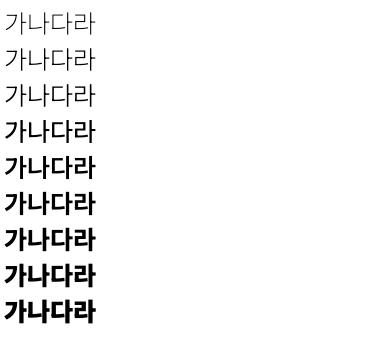

```html
<!-- 로컬 폰트 로드 -->
<style>
  /* @import url('https://fonts.googleapis.com/css2?family=Noto+Sans+KR:wght@100.900display=swap'); */
  @font-face {
    font-family: "NotoFont";
    src: url("../01/font/NotoSansKR-Regular.ttf") format("truetype");
    font-weight: 400;
    font-style: normal;
    font-display: swap; /* 폰트 로딩 전에 기본 폰트로 적용, 로딩 끝나면 해당 폰트로 적용 */
  }
  * {
    /* font-family: "Noto Sans KR", sans-serif; */
    font-family: "NotoFont", "sans-serif";
    font-size: 25px;
  }
</style>
```

# OVERFLOW

- visible ( 기본값 ) -> 넘치는 컨텐츠가 있어도 보이기
- hidden -> 넘치는 컨텐츠 숨기기
- scroll -> 넘치는 컨텐츠 존재 시에 스크롤바 노출
- auto -> 넘치는 컨텐츠 존재 시에 스크롤바 노출, 없으면 미노출

### visible
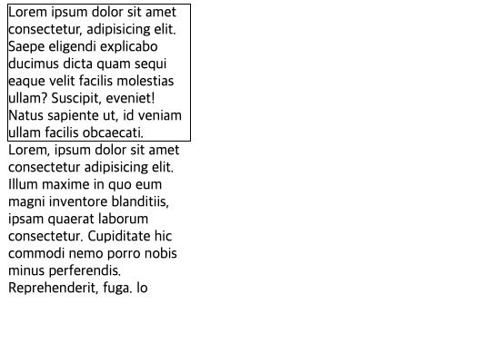

### hidden
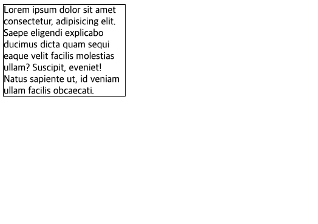

### scroll
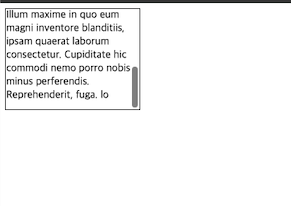


# border : 경계선
- border-width: 두께
- border-style : none ( 기본값 )
  - solid : 실선
  - dashed : 파선
  - dotted : 점선
  - double : 이중 실선
- border-color : 색상
- 단축 표현법 -> border : 두꼐 스타일 색상;
  - border : 1px solid black;
- border-radius : 모서리 둥글게 만듬
  - border-top-left-radius : 좌측 상단 모서리 
  - border-top-right-radius : 우측 상단 모서리
  - border-bottom-left-radius : 좌측 하단 모서리
  - border-bottom-right-radius : 우측 하단 모서리

```html
<style>
    .border {
      width: 250px;
      height: 250px;
      margin: 20px;
      border: 5px solid blue;
    }
    .border1 {
      /* border-radius: 25px; 원의 반지름 길이 */
      border-top-left-radius: 50px;
      border-bottom-right-radius: 50px;
    }
    .border2 {
      border-style: dashed;
    }
    .border3 {
      border-style: dotted;
    }
    .border4 {
      border-style: double;
    }
    .border5 {
      border-left : 0;
      border-right: 0;
    }
    .border6{
        border-radius: 50%;
    }
</style>

<div class="border border1"></div>
<div class="border border2"></div>
<div class="border border3"></div>
<div class="border border4"></div>
<div class="border border5"></div>
<div class="border border6"></div>
```

### solid
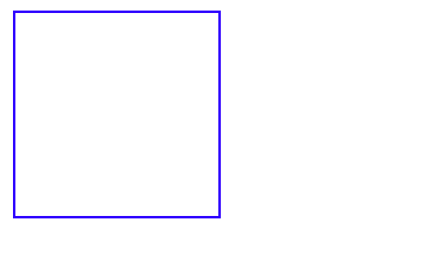

### dashed
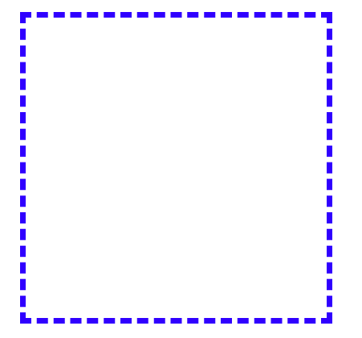

### dotted
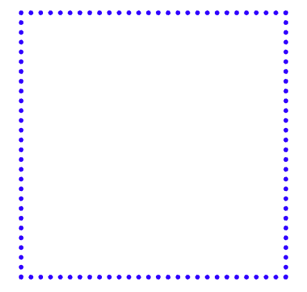

### double
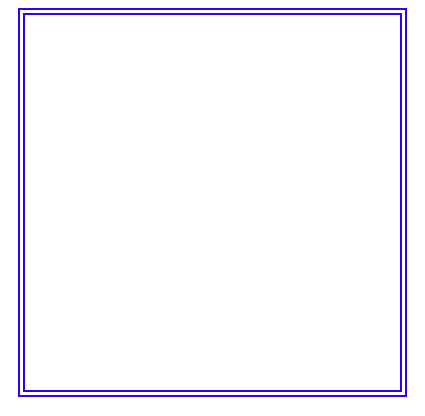

### 좌우선 제거
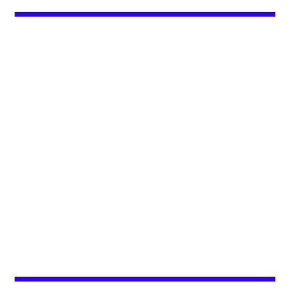

### radius
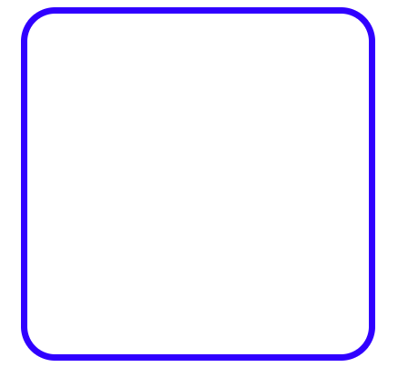

### 부분 radius
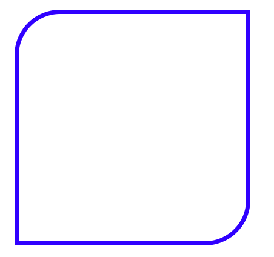

### 부분 radius
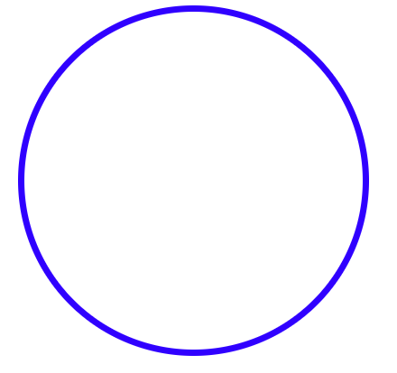

# background
- background-color : 배경색
- background-image : 배경 이미지 url('이미지 경로')
- background-repeat
  - repeat ( 기본값 ) : x,y축 모두 반복
  - repeat-x : x축 반복
  - repeat-y : y축 반복
  - no-repeat : 하나만 출력
- background-position : 배경 이미지 위치 설정
  - background-position ; 100px 50px;
    - 좌 -> 우 100px 이동
    - 상 -> 하 50px 이동
- background-size 
  - background-size : 200px 100px => 가로, 세로
  - cover : 영역 모두 채우기
    - 이미지의 비율이 배경 요소와 차이가 있다면 일부는 짤림
  - contain -> 이미지가 모두 보일수 있도록 채움
- background-attachment
  - fixed -> scroll해도 배경 이미지 고정
  - scroll -> scroll시 배경 이미지도 함께 스크롤
- 단축 표기법
  - background: 색상 이미지 반복 고정 위치 사이즈
    - 색상, 이미지 중 하나는 필수 나머지는 선택 옵션


# position
- static (기본값) : 요소의 위치는 고정 - 절대 위치
- 상대 위치 
    - relative : 속성이 정의 되어 있는 요소
    - absolute : 문서 전체 기준
      - 부모가 상대 속성 (relative, absolute, fixed)이면 부모가 기준점
    - fixed : view port 기준 [ view port : 현재 보이는 화면 ]
  - 층위 설정 가능 : Z - index : 값이 높을수록 앞쪽 배치, 값이 낮을수록 뒤쪽 배치

```html
<style>
    .box{
        width: 300px;
        height: 300px;
        position: absolute;
        left: 0;
        top: 0;
    }

    .box1{
        background: red;
        z-index: 3;
    }

    .box2 {
        background: green;
        z-index: 2;
        left:50px;
    }

    .box3 {
        background: blue;
        z-index: 1;
        left:100px;
    }
</style>
<div class="box box1"></div>
<div class="box box2"></div>
<div class="box box3"></div>
```

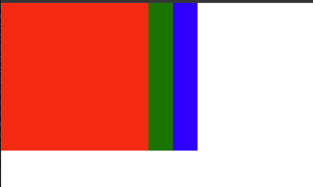