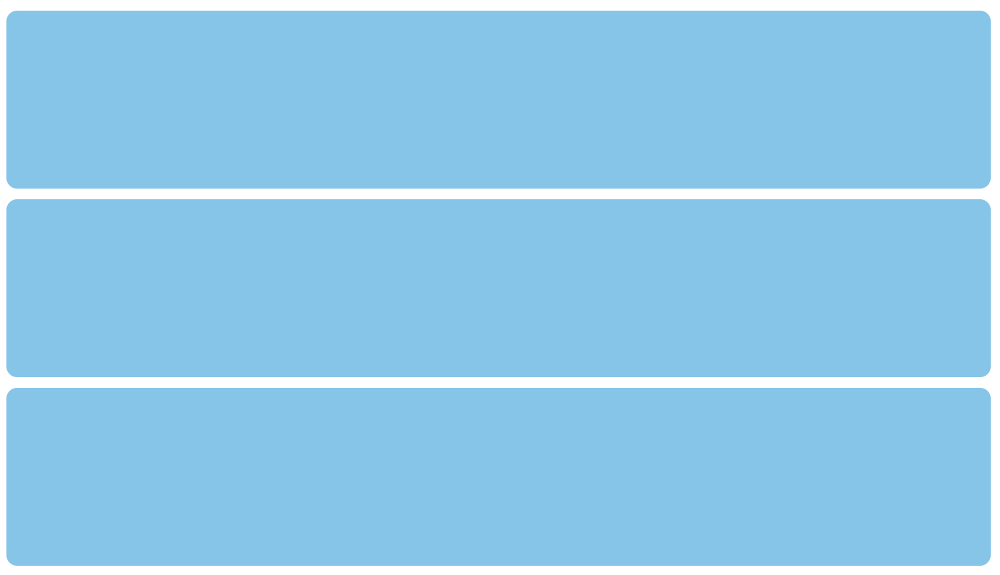
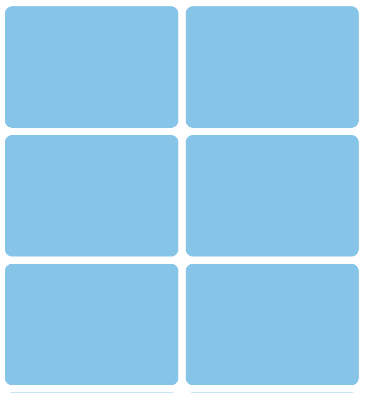
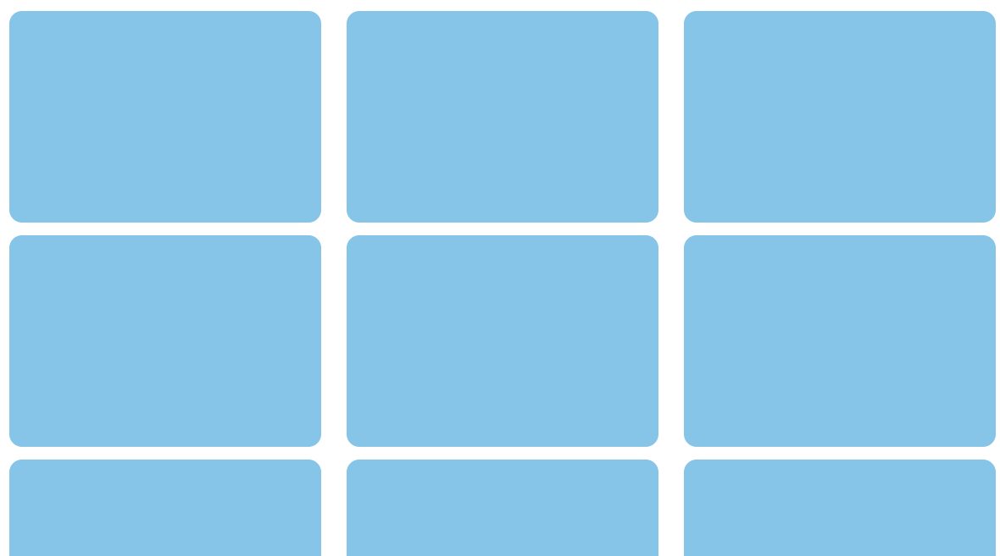

# DQ REVIEW

1. CSS 스타일 적용 방식 중 구조와 디자인의 완전한 분리로 재사용성 및 유지보수성을 극대화 할 수 있는 방식

- 외부 스타일 시트

2. 한 요소에 여러 CSS 규칙이 충돌할 때, 선택자가 더 구체적이고 좁은 범위를 타겟팅할수록 점수가 높게 산정되어 최우선 적용되는 규칙

- 명시도

5. flexbox에서 확장 비율 나눠가지기

- flex-grow : 여백을 할당 받는 비율 설정
  - 정확한 3등분 크기로 조정하기 위해서는 여백을 전체 크기로 조정하고 등분 (width: 0;)

# VIEW PORT

- width
  - device-width : 장비의 너비 기준
  - device-height : 장비의 가로모드 기준
- user-scalable
  - yes : 확대, 축소 가능
  - no : 확대, 축소 불가
- minimum-scale : 축소 비율
- maximum-scale : 확대 비율
- initial-scale : 처음 화면 비율

### break point

- css 적용을 다르게 할 수 있음
  - 모바일 ( ~ 767px)
  - 태블릿 ( 768 ~ 1023px )
  - 데스크탑 ( 1024px ~ )

### 미디어 쿼리 ( @media ... )

- @media 미디어타입(장비종류) and 미디어 특성(브레이크 포인트 주로 지정) { css .... }

### 미디어 타입(장비종류)

- screen : 데스크탑 모니터, 태블릿, 스마트폰
- print : 프린트에만 해당하는 css
- speech : 시각장애인용 스크린 리더 css
- all : 전체 ( 기본값 )

### 미디어 특성

- width : 특정 넓이, 높이에 도달했을때 css 적용
- min-width : ~ 크기 이상
- max-width : ~ 크기 이하
- orientation : 기기의 방향
  - portrait : 세로 방향
  - landscape : 가로 방향

```html
<style>
  body {
    margin: 0;
  }
  * {
    box-sizing: border-box;
  }
  .box-group {
    display: grid;
    grid-template-columns: 1fr;
    padding: 20px;
    row-gap: 15px;
  }
  .box-group .box {
    background: skyblue;
    height: 250px;
    border-radius: 15px;
  }
  /* 태블릿 사이즈 브레이크 포인트 */
  @media screen and (min-width: 768px) and (max-width: 1023px) {
    .box-group {
      grid-template-columns: repeat(2, 1fr);
      column-gap: 15px;
    }
  }
  /* 데스크탑 사이즈 브레이크 포인트 */
  @media screen and (min-width: 1024px) {
    .box-group {
      grid-template-columns: repeat(3, 1fr);
      column-gap: 30px;
    }
  }
  /* 프린트시에만 적용되는 css */
  @media print {
    body {
      background: black;
    }
  }
</style>
<div class="box-group">
  <div class="box"></div>
  <div class="box"></div>
  <div class="box"></div>
  <div class="box"></div>
  <div class="box"></div>
  <div class="box"></div>
  <div class="box"></div>
  <div class="box"></div>
  <div class="box"></div>
</div>
```

### 모바일 사이즈


### 태블릿 사이즈


### 데스크탑 사이즈

