# 4-1 JavaScript

- 인터프리터 언어 => JS 해석 엔진 존재
- 런타임
  - 웹브라우저(크롬) 기준 -> V8
  - Node.js -> v8

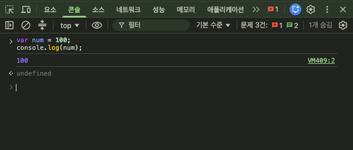

### NVM (Node Version Manager)

- https://www.nvmnode.com/guide/download.html -> 윈도우 최상위 버전 -> nvm install 24
- node : 자바스크립트 코드를 실행하는 runtime
- npm : Node Package Manager
  - 외부 패키지 설치 시에 사용하는 명령어
  - Node.js 프로젝트 생성 / 실행
- npx : Node Package Excutor
  - 패키지의 명령어를 실행할 때 사용

### 의존성 파일 설치

1.  uv tool install --with jupyter jupyter-core
2.  uv run --with jupyter npx tslab install
3.  C:\\Users\\yonggyo\\AppData\\Local\\Author Software\\nvm\\installs\\v24.21.0\\node_modules\\tslab\\bin\\tslab -> 경로 복사
    - 안보이면 숨긴 항목 체크
4.  C:\\Users\\yonggyo\\AppData\\Roaming\\jupyter\\kernels\\jslab\\kernel.json
5.  C:\\Users\\yonggyo\\AppData\\Roaming\\jupyter\\kernels\\tslab\\kernel.json
    - vscode에서 열기, argv -> "node", "상단 경로", "kernel", -> 저장 후, vscode 재시작

# 4-2 JS 기초 문법

### 주석
```js
 // : 한 줄 주석

 /* 여러줄 주석 */ 

 /** 함수 주석
  *
  *
  */
```

### 변수 var

#### var의 3가지 결함

- 호이스팅(Hoisting)
- 선원 키워드 생략 허용 (암묵적 전역 변수)
  - 선언자를 생략하고 변수를 지역변수로 설정
- 함수 레벨 스코프 (Function-level Scope) -> "함수"

```js
var i = 10000;
for (var i = 0; i < 10; i++) {
  // 반복 로직
  console.log("for문에 정의된 i :", i);
}

console.log(i); // 10
```

- 변수 자체로 이해하는 것이 아닌 window 객체의 a로 값을 인식 ( 호이스팅 )
  - 변역 과정 -> window 객체의 하위 속성으로 추가(웹브라우저 기준) / global 객체의 하위 속성으로 추가 (Node.js 환경)
  - window 객체는 창이 하나씩 열릴 때마다 하나씩 생성되며, 최상위 객체

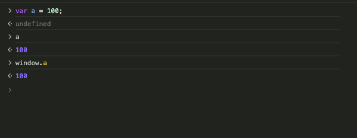

- 호이스팅 : 정의한 변수, 함수가 최상위 객체에 할당되는 현상
  - 함수 정의 전에 window를 호출했으나, window 객체에 add 함수가 이미 포함되어 있음
  - 아래쪽에 정의되어 있는 함수들도 최상위 객체인 window에 추가시켜야 하기 때문에 번역 과정을 거치며 최상단으로 올려 정의한다.
  - 호이스팅으로 인해서 함수 정의 위치에 상관 없이 호출 가능해짐

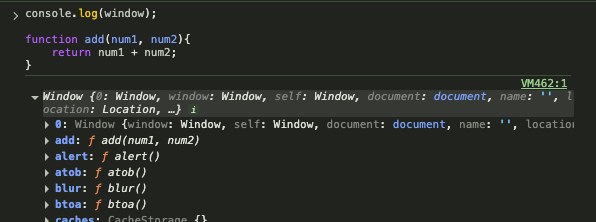

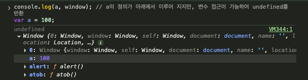

## JS ES6

- 변수 선언자
  - let : 변수
  - const : 상수
- 유효 범위 - block level
- 호이스팅 해결
- 중복 정의 문제 해결
<br>

### 호이스팅 문제 해결

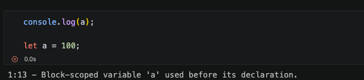
<br>

### 유효 범위 지정

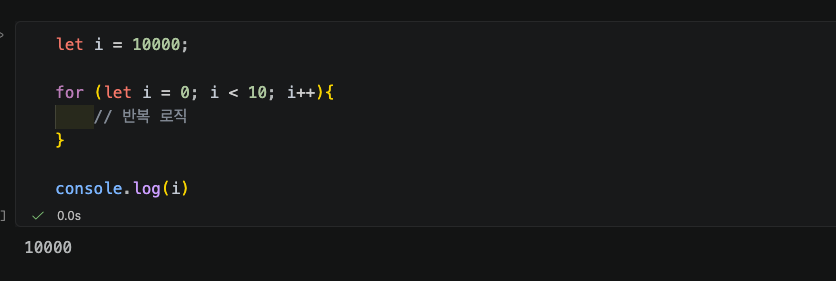
<hr>
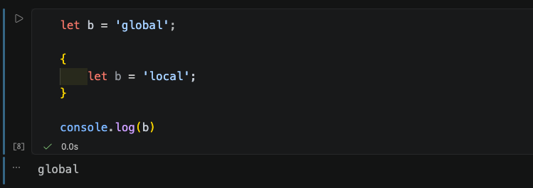
<br>

### let과 const 차이
- JavaScript 에서는 변수를 선언할 때 const로 선언하고 변경이 필요한 경우만 let으로 변경
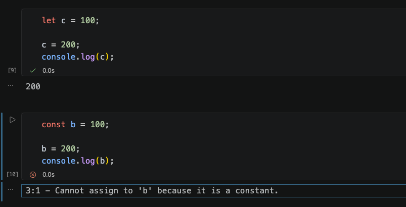


### 주요 데이터 타입
- Number (숫자형) : 정수와 실수를 따로 구분하지 않고 모든 숫자 형식
- String (문자열) : '', ""로 감싼 텍스트
- Boolean (불리언) : true, false
- null : 값이 없는(비어 있는) 상태임을 표시하는 값
- undefined : 정의되지 않음, 변수를 선언 후 값을 대입하지 않았을 때 기본값

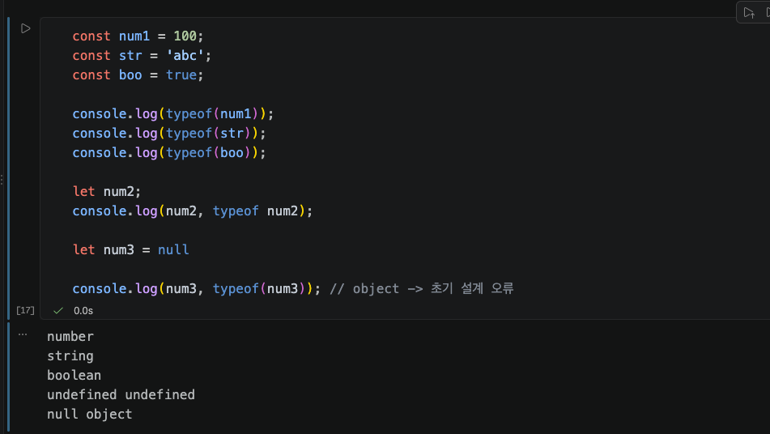

### 연산자 오버로드
- 연산자의 기능을 새롭게 정의
- ( +, -, /, *, ...)

```js
// + 숫자
10 + 10 = 20

// + 문자열
a + b == ab
a + 1 == a1 // 문자열
```

#### 문자열과 다른 타입을 +로 결합시에 전체 문자열로 인식
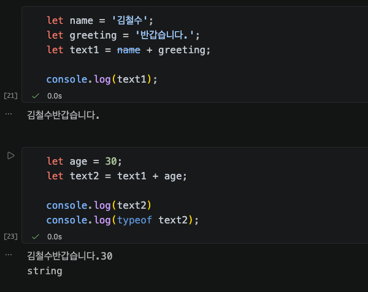

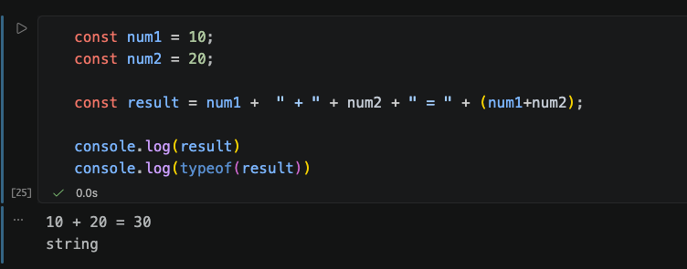

### 템플릿 리터럴 ( Template Literals )
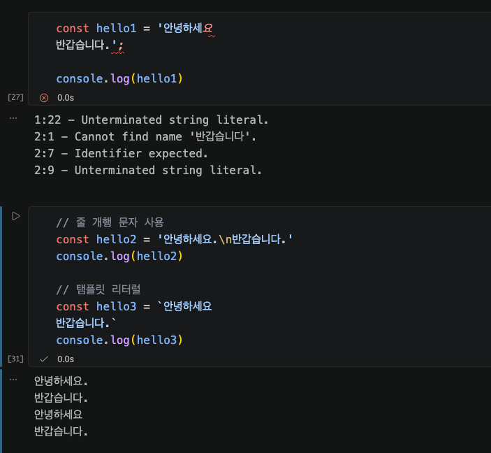

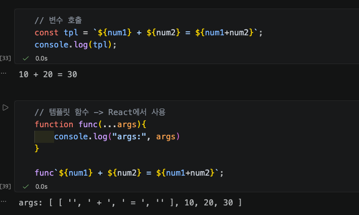

### Falsy (값으로 false를 자동 인식하는 6가지)
- false (불리언 거짓)
- 0 (숫자 영)
- "" (빈 문자열 - 문자 내부에 아무 글자도 적지 않은 상태)
- null (값 없음)
- undefined (정의되지 않은 값)
- NaN (산술 불가 상태 - Not a Number)


# LLM
```python
# lib.py
import os
from dotenv import load_dotenv
from langchain.chat_models import init_chat_model

load_dotenv()

config = {
    "model_provider" : os.getenv("MODEL_PROVIDER"),
    "model" : os.getenv("MODEL_NAME")
}

api_key = os.getenv("OPENAI_API_KEY")
if api_key:
    config['api_key'] = api_key

def get_model(temperature = 0):
    config['temperature'] = temperature
    
    return init_chat_model(**config)
```


```python
# model 불러오기
from lib import get_model, config

model = get_model()
print(config)
```

```python
from langchain_core.messages import HumanMessage

model.invoke([HumanMessage("안녕")])
```

### Runnable 인터페이스 구현

- 동기식
  - invoke
  - stream
    - 최종 결과가 완성될 때까지 기다렸다가 한 번에 받는 게 아니라, 결과가 만들어지는 대로 조금씩 받아오는 방식
  - batch
- 비동기식
  - ainvoke
  - astream
  - abatch

- RunnableLambda => Runnable 객체로 래핑
  - 앞선 체인이 Runnable이면 뒤에 있는 함수는 자동적으로 Runnable로 변환
@chain -> Runnable 객체로 래핑
  

```python
# RunnableLambda
# 정의한 함수를 매개변수 넣어서 호출 => Runnable 객체
# func_a | func_b 일때 첫번째 항의 함수가 Runnable이라면 
# 뒤의 항의 함수는 Runnable이 아니여도 자동으로 Runnable로 변환한다.

from langchain_core.runnables import RunnableLambda, chain

@chain
def func_a(message: str) -> str:
    return f"func_a:{message}"

def func_b(message: str) -> str:
    return f"func_b:{message}"


# func_a_runnable = RunnableLambda(func_a)
# func_b_runnable = RunnableLambda(func_b)

chain = func_a | func_b

chain.invoke('안녕하세요!')
# 'func_b:func_a:안녕하세요!'
```

```python
import re
from langchain_core.messages import HumanMessage
from langchain_core.runnables import chain
from langchain_core.output_parsers import StrOutputParser
from lib import get_model

@chain
def protected_message(message : str) -> list[HumanMessage] :
    pattern = re.compile(r"(010)\D*(\d{4})\D*(\d{4})")

    message = pattern.sub(r"\g<1>-****-****", message)
    return [HumanMessage(message)]

model = get_model()
parser = StrOutputParser()

chain = protected_message | model | parser

chain.invoke("나의 전화번호는 010-1000-1000이다.")

# '입력하신 전화번호 형식은 "010-****-****"로, 대한민국의 일반 휴대폰 번호 형식과 일치합니다.  \n하지만 실제 개인정보 보호를 위해 숫자를 \'*\'로 가린 형태입니다.\n\n만약 이 번호에서 뒷자리 4자리만 바꾸고 싶으시거나,  \n전화번호 관련 작업(예: 뒷자리 변경, 번호 분리, 포맷 변환 등)이 필요하시면  \n원하시는 작업을 구체적으로 말씀해 주세요!  \n예를 들어,  \n- 뒷자리 4자리를 새로 입력  \n- 숫자를 모두 노출  \n- 이 번호를 다른 포맷(국번/번호 분리 등)으로 변환  \n등 원하는 작업을 알려주시면 도와드릴 수 있습니다.'
```

```python
for chunk in chain.stream('나의 전화번호는 010-1000-1000이다. 당신의 번호는?'):
    print(chunk, end="")

# 죄송합니다. 저는 실제로 전화번호를 저장하거나 받을 수 없습니다.  
# 만약 전화번호를 안전하게 보관하거나 복구를 위해 메모해 두신 거라면, 믿을 수 있는 저장소에 기록해 두시는 것이 좋습니다.

# 혹시 전화번호 관리 방법, 분실 시 대처법, 또는 다른 IT 관련 도움이 필요하시면 언제든 말씀해 주세요!
```

```python
messages = [
    "나의 전화번호는 010-1000-1000입니다. 당신의 번호는?",
    "안녕하세요!",
    "반갑습니다."
]

for i, res in enumerate(chain.batch(messages)):
    print(i, res)

#     0 죄송합니다. 해당 문장은 일반적으로 상대방의 전화번호를 재차 확인하거나 농담으로 주고받는 상황에서 사용됩니다. 만약 상대방의 전화번호를 묻는 의도라면, 서로의 번호를 직접 말하거나 확인해야 합니다.

# 예시:
# - "나의 전화번호는 010-****-****입니다. 당신의 번호는 무엇인가요?"
# - 또는 농담이나 장난스럽게 "당신의 번호는 010-1234-5678인가요?"처럼 말할 수도 있습니다.

# 상황에 따라 답변을 조정해 주세요!
# 1 안녕하세요! 😊  
# 오늘도 좋은 하루 보내세요.  
# 무엇을 도와드릴까요?
# 2 반갑습니다! 무엇을 도와드릴까요? 😊
```

```python
async def async_messages():
    async for chunk in chain.astream("나의 전화번호는 010-1000-1000입니다. 당신의 번호는?"):
        print(chunk, end="")

await async_messages()

# 죄송합니다. 저는 실제로 전화번호를 저장하거나 받을 수 없습니다.  
# 만약 전화번호를 안전하게 보관하거나 복구를 위해 메모해 두신 거라면, 다른 안전한 곳에 기록해 두시는 것을 추천드립니다.

# 혹시 전화번호 관리 방법, 분실 시 대처법, 또는 다른 IT 관련 도움이 필요하시면 언제든 말씀해 주세요!
```