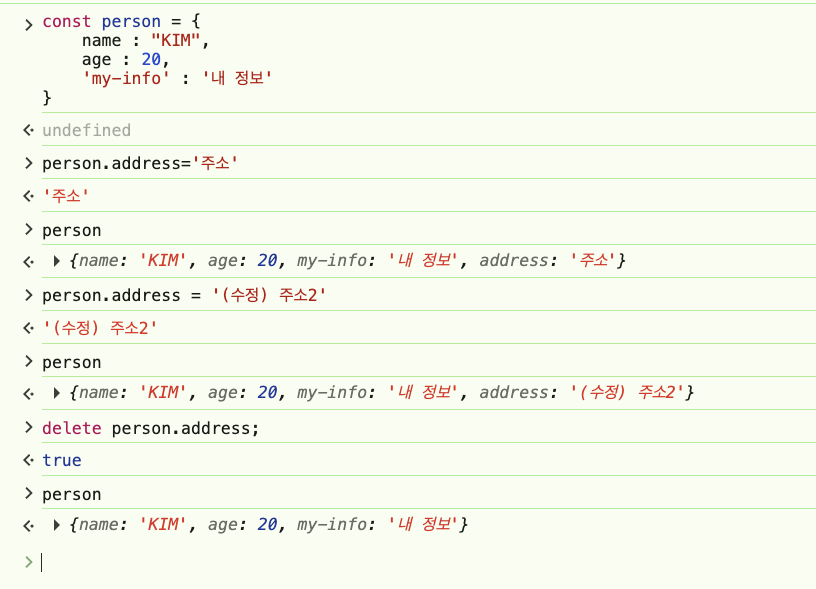
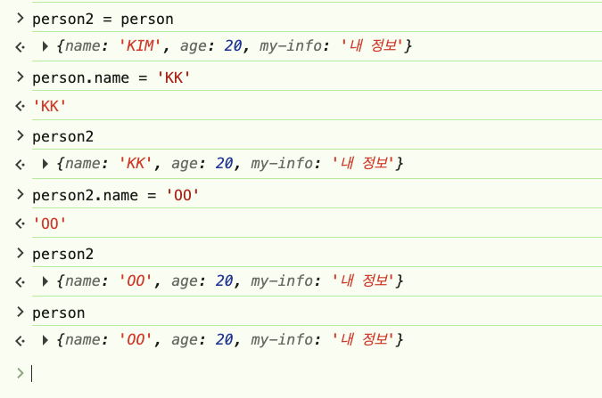

# 4.3

### 객체 리터럴
- { 키 : 값, 키 : 값 ... }
- 값
  - 원시 타입 : 재료가 되는 값 => 숫자, 문자, 논리값, undefined, null
  - 객체 타입 : 원시타입 외 전부

속성(Property)
1. 접근
  - .  : 속성명이 변수명 규칙에 부합하는 경우
  - [] : 속성명이 변수명 규칙에 부합하지 않는 경우
2. 추가 : 새로운 속성명으로 값을 대입
3. 수정 : 기존에 존재하는 속성명에 값 대입
4. 삭제 : delete 객체 참조 변수를 통해서 => 객체참조변수.속성명 



#### 주소 참조
```
person2 = person
-> person2는 단독의 주소를 가지는 것이 아닌 person의 주소값을 가지고 참조를 하는 형태
-> person2에서 속성값을 변경하거나, person에서 속성값을 변경하면
-> person, person2 두 개 모두 속성값이 변경됨
```



# 5-1

### 함수
1. function
  ```
  function 함수명(함수 객체의 이름표 | 변수와 같다) ( 매개변수 ..) {
    함수가 실행할 코드
    return 반환값
  ```
  }
2. 함수의 실행 평가 과정
  - 실행 가능한 객체(Execution Context) 로 함수를 번역 하는 과정

  ```js
  function outer(num1, num2){
    return num1 + num2;
  }

  
  ```


### 객체 상속

1. 프로토타입 기반의 객체간의 상속(프로토타입 체인)
  - 객체 --- 객체  => 상속
2. 생성자 함수
  - 객체를 생성하는 함수
  - 네이밍 관례 => 첫글자를 대문자
  - new 연산자
3. 생성자 함수가 객체를 생성하는 과정 new
  - 생성자 함수의 prototype 객체 상속
  - 생성자 함수의 this를 생성된 객체의 주소로 변경 ( 값 할당 ), 실행
4. 생성자, prototype, method
  - 객체가 생성되면 공유하는 메서드 ( 인스턴스 메서드 )
5. 생성자 메서드
  - 객체 생성 없이 공유하는 메서드 ( 정적 메서드 )

```js
class Ellipse {
    constructor(a, b){
        this.a = a;
        this.b = b;
    }

    getArea() {
        return this.a * this.b * Math.PI;
    }
}

class Circle extends Ellipse {
    constructor(r){
        super(r, r);
    }

    getArea() {
        console.log("재정의 된 getArea()");
        return super.getArea();
    }
    // 생성자가 아닌, 기능이 제한된 메서드
}
```

####
객체를 생성할때마다 신규 주소를 부여받음


##
- 데이터 프로퍼티
  - value : 값
  - writable : 변경 가능 여부
  - enumerable : 열거 가능 여부
    -  for ..in => false면 객체 속성 노출 안함
  - configurable : 재정의 가능 여부 => 설정을 변경 할 수 있는가?
    -  false : 삭제도 불가능

- 접근자 프로퍼티
  - get 함수 : 읽기  
  - set 함수 : 쓰기
    - 내부 속성 통제는 가능하지만 은닉은 다른 기법을 사용하는 것이 좋다. 클로저 ( 캡슐화 )
  - enumerable : 열거 가능 여부
  - configurable : 재정의 가능


```js
const person = {
    _name : 'kim',
    _age: 20,
    get name() {
        // 통제 로직...
        return this._name;
    },
    set name(name) {
        // 통제 로직...
        this._name = name;
    },
    get age() {
        return this._age;
    },
    set age(age) {
        this._age = age;
    },
};
```

### 즉시 실행 함수
- 정의 후 즉시 호출
```js
( function 함수명 ( 매개변수 ) {

})( );
```


###
- Object.seal(...) : 객체 밀봉
  - 속성 추가 안됨
  - 속성 삭제 안됨
  - 속성 변경 가능
- Object.freeze(..) : 객체 동결 
  - 속성 추가 안됨
  - 속성 삭제 안됨
  - 속성 변경 안됨

- Object.preventExtensions (...) -> 속성 추가 방지


### 직렬화 ( Serialization )
- 전송 가능한 형태로 변환 (문자열) -> JSON 문자열
- 함수, Undefined는 변환이 불가하여 null이 됨

- JSON 객체
  - JS 객체 -> JSON 문자열 (직렬화) => stringify(..)
  - JSON 문자열 -> JS 객체 (역직렬화) => parser(...)

주소만 복사 : 얕은 복사
깊은 복사 : 새로운 객체 + 내용도 복사


# DQ REVIEW

1. var 키워드로 선언한 변수의 특징
  - 호이스팅
  - 같은 변수명을 가진 변수에 var 중복 적용 가능
  - 함수 지역 범위 
2. 자바스크립트에서 피연산자의 데이터 타입을 반환해주는 단항 연산자
  - typeof
3. 자바스크립트 조건문에서 Falsy(거짓 같은 값)로 취급되는 것.
  - false, 0, "", null, Undefined, NaN
4. switch-case 문에서 일치하는 case의 코드를 실행한 후, 아래 다른 case들이 조건 비교 없이 연쇄적으로 실행되는 현상
  - fall through