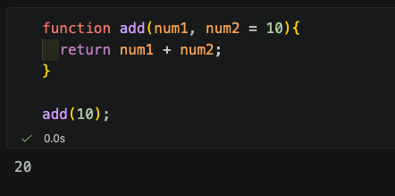

# DQ REVIEW

1. 생성자 함수 내부에서 this.area = function() {...} 형태로 메서드 정으할 때 가장 큰 구조적 문제점

- 객체 생성시에 메모리에 매번 생성됨, 생성자 함수 객체 안의 prototype을 통하는 방법이 더 효율적임

2. 객체에 존재하지 않는 프로퍼티나 메서드에 접근했을 때, 자바스크립트 엔진이 내부 링크(_proto_)를 따라 상위 객체들을 차례로 검색하는 연결 구조

- Prototype Chain

3. 클래스 구문과 일반 생성자 함수를 비교한 설명

- 클래스 구문 -> new 연산자 없이 호출 불가

4. 자식 클래스의 constructor 내부에서 부모 클래스의 속성을 초기화하고 this에 정상적으로 접근하기 위해 반드시 먼저 호출해야 하는 구문

- super()

5. 객체 내부에 중첩된 객체가 있을때, JSON.stringify와 JSON.parse를 연속으로 적용하여 참조 주소를 공유하지 않는 완전히 독립적인 복사번을 만드는 기법

- 깊은 복사

# 5-1

## 인수의 유연성 & 가변 매개변수

### 매개변수 기본값 ( Default Parameter )

