# DQ REVIEW

1. 생성자 함수 내부에서 this.area = function() {...} 형태로 메서드 정으할 때 가장 큰 구조적 문제점

- 객체 생성시에 메모리에 매번 생성됨, 생성자 함수 객체 안의 prototype을 통하는 방법이 더 효율적임

2. 객체에 존재하지 않는 프로퍼티나 메서드에 접근했을 때, 자바스크립트 엔진이 내부 링크(_proto_)를 따라 상위 객체들을 차례로 검색하는 연결 구조

- Prototype Chain

3. 클래스 구문과 일반 생성자 함수를 비교한 설명

- 클래스 구문 -> new 연산자 없이 호출 불가

4. 자식 클래스의 constructor 내부에서 부모 클래스의 속성을 초기화하고 this에 정상적으로 접근하기 위해 반드시 먼저 호출해야 하는 구문

- super()

5. 객체 내부에 중첩된 객체가 있을때, JSON.stringify와 JSON.parse를 연속으로 적용하여 참조 주소를 공유하지 않는 완전히 독립적인 복사번을 만드는 기법

- 깊은 복사

# 5-1

## 인수의 유연성 & 가변 매개변수

### 매개변수 기본값 ( Default Parameter )


### Arguments 객체를 이용한 가변 매개변수 입력받기

- 과거에 사용하던 방법

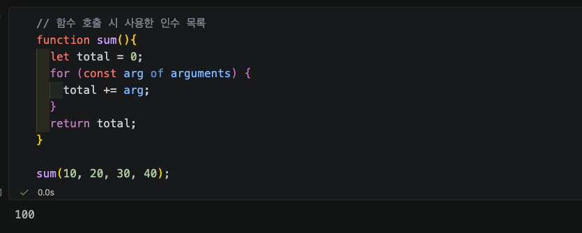

### Rest Parameter, 가변 매개변수, 나머지 매개변수

- Array 배열 형태로 값 반환

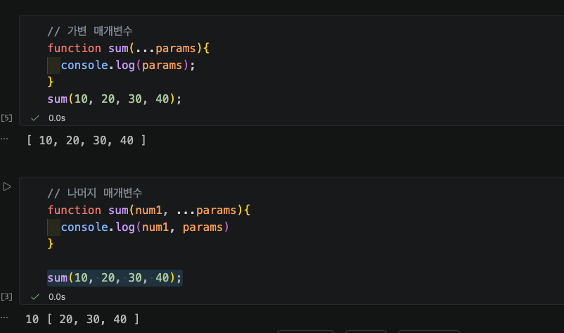
<br>
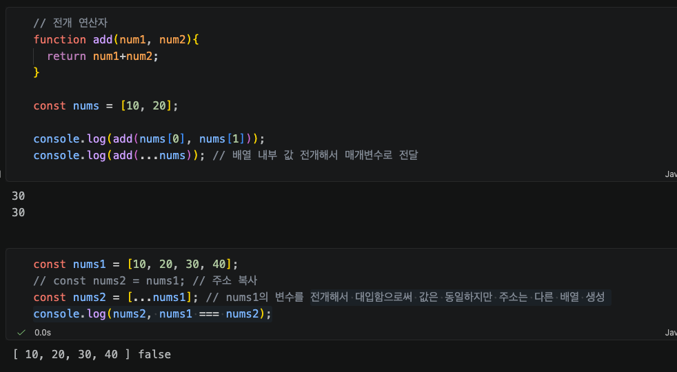
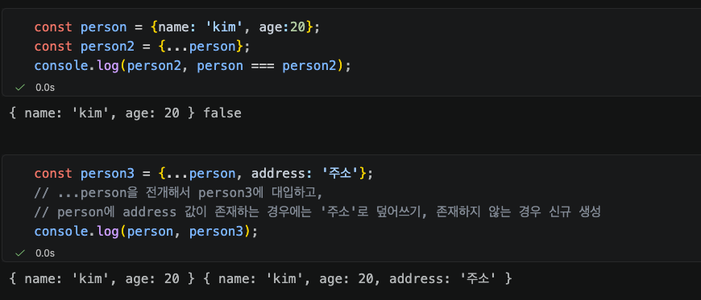

### 비구조화 할당

- 구조 -> 비구조화(구조 분해) -> 변수에 할당

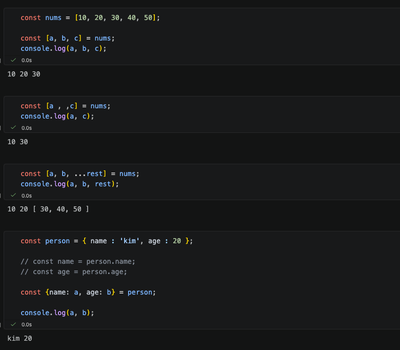

- 중첩 객체 비구조화

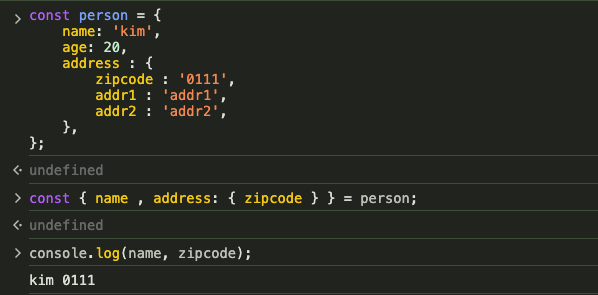

### 함수 선언문 방식

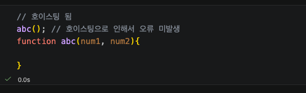

### 함수 리터럴(표현식) 방식

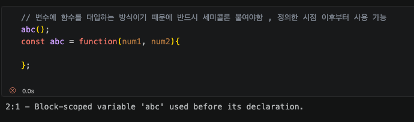

## 값으로서의 함수 (일급 객체) & 콜백

### 일급 객체로서의 3대 속성

- 변수 할당 ( Assignment )
- 매개변수 전달 ( Argument Passing ) == 콜백 함수 / 사용자 정의 함수 / 일회용 함수
- 변환값 활용 ( Return Value )

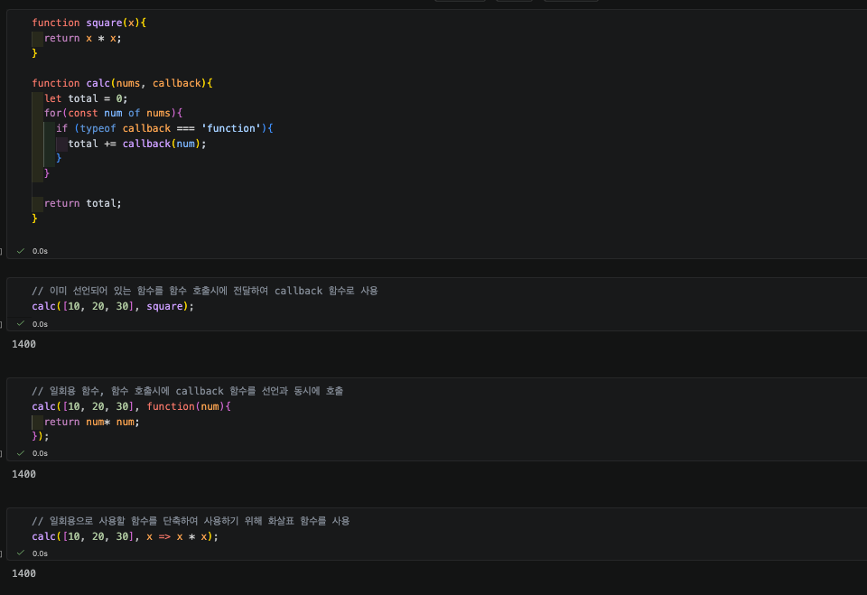

### 화살표 함수

- function 키워드 생략
- 매개변수 정의부와 코드 실행 영역({}) 사이에 => 로 표기

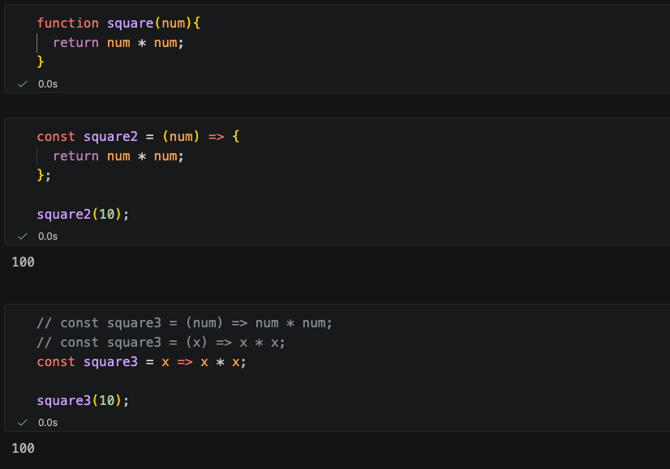

### 화살표 함수 제한사항

- 생성자 함수 사용 불가
- arguments 객체 미지원
- yield 사용 불가

### 화살표 함수의 this

- 일반 함수의 this : 함수가 호출되면 호출한 객체
- 화살표 함수의 this : 함수가 정의되는 시점에 이미 결정되어 있는 this로 정의

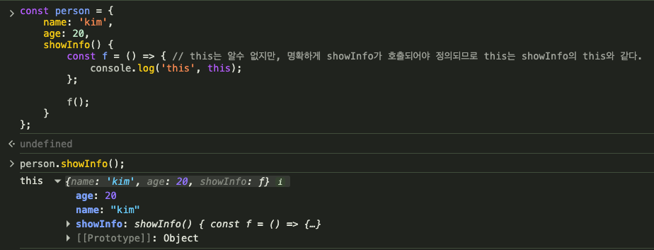

#

```
function abc(a, b){}
-> abc = new Function(...);
```

- 모든 함수 객체는 Function.prototype을 상속 받음
  - Function.prototype에 정의된 기능 사용 가능


## 명시적 this 바인딩

### call 메서드
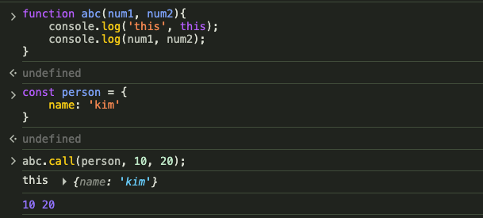

### apply 메서드


### bind 메서드
- 새로운 함수 생성
- 받게 되는 첫 인자의 value로 this 키워드 설정 이후 인자들은 바인드 된 함수의 인수에 제공

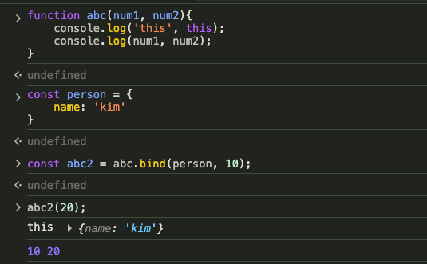

## 제너레이터


# 4-3

### JS 객체
- 네이티브 객체
  - 공통 객체
  - 내장 생성자, 표준 생성자 객체
    - 원시 래퍼 객체 
      - Object
      - String
      - Number
        - isNaN 보다 typeof 쓰는게 안정적
        - isNaN은 String 숫자도 받아들이는 경우 있음
        - parseInt : 정수로 변경
        - parseFloat : 소수로 변경
      - Boolean
    - Function, Date, Error, RegExp(정규표현식 사용 가능 객체)
  - 내장 객체
    - 처음부터 쓸 수 있는 편의 객체
    - JSON
      - Stringify (직렬화) : 자바스크립트 객체 -> JSON 문자열
      - Parse (역직렬화) : JSON 문자열 -> 자바스크립트 객체
    - Math
      - abs(..) : 절댓값
      - sqrt(..) : 제곱근
      - round(..) : 반올림
      - floor(..) : 버림
      - ceil(..) : 올림
      - trunc(..) : 절사 등
- 호스트 객체
  - 런타임 환경에 특화된 객체
  - 웹 브라우저 객체, Node.js 특화 객체

### Array 객체
- 모든 타입 값 지정 가능, 여러개 관리

<hr>

- Array 생성자 함수 생성
- Array Prototype 상속 여부 => 기준
- instanceof => 객체의 상속 관계 체크 ( Prototype Chain 관계 )
- [...] = new Array(...) 동일
- delete로 배열의 값을 삭제 했을 경우 index를 순서에 맞춰서 변경하진 않음
- 주요 메서드
  - 추가
    - push(..) : 요소 끝에 추가
    - unshift(..) : 요소 앞에 추가
    - splice(..): 지정된 위치의 요소를 추가 또는 삭제
      - 시작, 삭제 개수, ... 추가 요소
  - 삭제
    - pop(..) : 끝 요소를 꺼내기 (반환, 제거)
    - shift(..) : 앞 요소 꺼내기 (반환, 제거)
    - splice(..)
  - 수정
    - map(callback 함수) : callback 함수의 정의 내용대로 변경
    - filter(callback 함수) : callback 함수의 정의 내용대로 필터링
  - 조회
    - forEach(callback 함수)
    - indexof() : 요소의 위치 반환 ( 왼 -> 오 )
    - lastIndexof: 요소의 위치 번호 ( 오 -> 왼 )