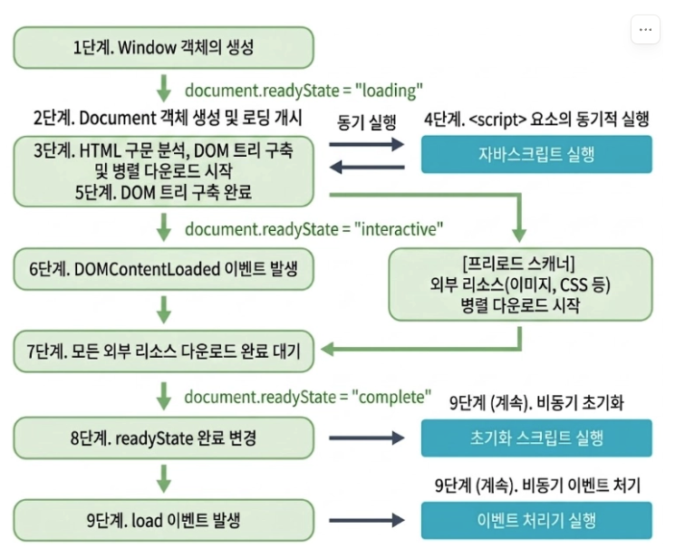

# DQ REVIEW

- 수정 메서드 : 배열 메서드 중 원본 배열 자체를 직접 변경하는 메서드와
- 접근자 메서드 : 원본은 그대로 두고 새로운 배열이나 값을 반환하는 메서드를 통칭하는 용어
- 화살표 함수의 특징
  - 함수 실행 자체 목적, 생성자 역할 불가능, prototype 미존재
- 클로저 : 내부 함수가 외부 함수의 실행 완료 후에도 소멸된 상위 렉시컬 환경의 변수를 지속적으로 참조하고 조작할 수 있는 메모리 구조

# 6-1
```
브라우저 -> 서버에게 요청
서버 -> 브라우저에 응답, html, 텍스트 전달
브라우저 - document 객체 변환 -> 트리 구조 구축 (DOM Tree) [ ->  script 태그 -> 동기 실행]
 -> DOMContentLoaded 이벤트 발생 -> Load 이벤트 발생 ( 자원 로드 완료 )
```

## 웹 브라우저의 자바스크립트 실행 9단계 순서




## 호스트 객체
- 런타임 마다 다르게 구성되어 있는 특화 객체
1. 웹브라우저 내에 탑재, 웹브라우저 객체
    - 브라우저의 기능과 밀접하게 관련
2.  window 
    - location 객체 : 주소창과 관련된 정보 / 기능을 제공
      - 실시간성, 변경내용이 실제 반영 ( 주소창 변화 )
      - assign(..) : 지정된 주소로 이동 ( 방문 기록 남김 ) -> location.href -> 속성 변경 시 페이지 이동
      - replace(..) : 지정된 주소로 이동 ( 방문 기록 남기지 않음 )
      - reload(..) : 새로고침
    - history 객체 : 방문기록과 관련된 정보 / 기능 제공
      - length : 방문 기록
        - back() : 뒤로 가기
        - forward() : 앞으로 가기
        - go() : 음수 = 수 만큼 뒤로 가기, 양수 = 수 만큼 앞으로 가기
      - scrollRestoration
        - auto : 스크롤 위치 기억 복구
        - manual : 복구 x
    - scroll 객체 : 브라우저 사용 화면 관련된 정보 / 기능 제공
    - navigator 객체 : 브라우저 OS 사용환경, 기타 API 관련 정보 / 기능 제공
    - document 객체 : 문서와 관련된 정보 / 기능 제공


##  Document 객체
- DOM Tree : 빠른 요소 탐색에 필요
- 요소(DOM)을 선택하는 방법
  - 아이디(id)로 선택 => document.getElementById(아이디명);  => 단일 선택
  - 클래스(class)로 선택 => document.getElementsByClassName(클래스명); => 복수 선택
  - 태그(tag)로 선택 => document.getElementsByTagName('태그명'); => 복수 선택
  - name 속성명으로 선택 => document.getElementsByName('Name 속성명'); => 복수
  - css 선택자로 선택 => document.querySelector('css 선택자'); => 첫번째 요소 단일 선택
    - document.querySelectorAll('css 선택자'); => 복수 선택
  - 문서 전체 (html) - window.document
    - head - window.document.head
    - body - window.document.body
  - 양식 (form) 이름 - frmNIDLogin
    - 양식 하위 입력 태그는 이름으로 바로 접근 가능 frmNIDLogin.id
  - 요소 노트 (상대적 접근)
    - parentElement : 부모 요소
    - children : 자식 요소
    - firstElementchild : 첫번째 자식
    - lastElementchild : 마지막 자식
    - nextElementSibling : 다음 근접 요소
    - previousElementSiblig : 이전 근접 요소

## 속성 (Attribute)
- document.getAttribute('속성명') => 속성 조회
- document.setAttribute('속성명', '속성값') => 속성 추가 / 변경
- document.removeAttribute('속성명') => 속성 제거
- document.hasAttribute('속성명') => 속성의 존재여부
- 많이 쓰는 속성 바로 접근 가능
  - id, type, src, href, target, action ...
  - className, style
<hr>

- 데이터 속성
  - 다른 속성들의 영향을 끼치지 않고, 데이터를 전달하기 위해
  - 실시간성 보장
  - document.dataset()
<hr>
  
- 클래스 속성
  - document.classList
    - 추가, 수정, 삭제, 조회
    